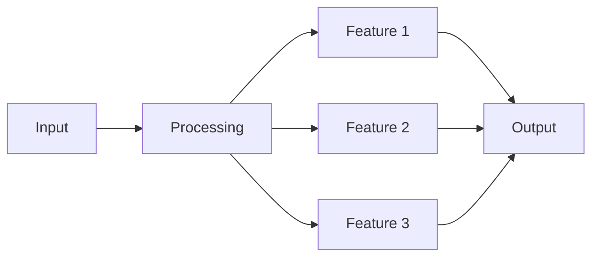
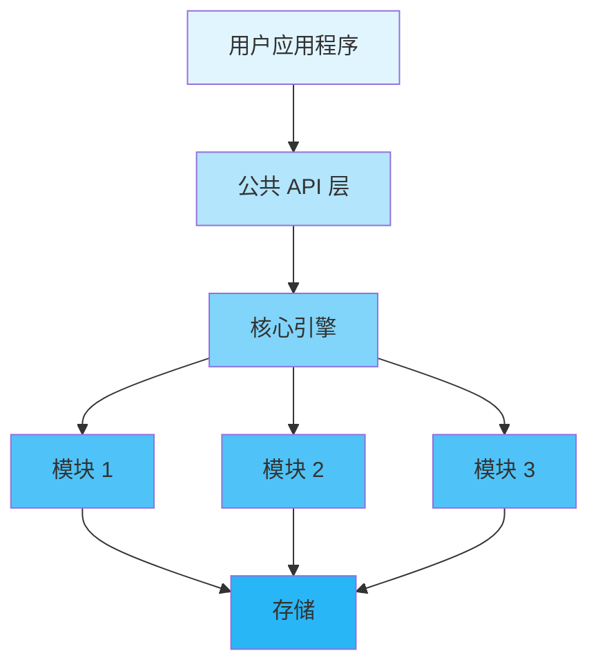
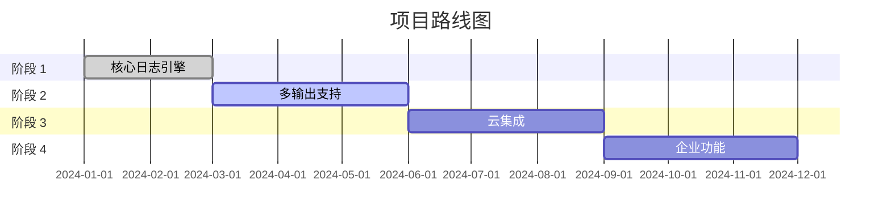

<div align="center">

# 🚀 Inklog

<p>
  <!-- 版本 -->
  
  <!-- 许可证 -->
  
  <!-- CI 状态 -->
  <a href="https://github.com/kirkyx/inklog/actions"></a>
  <!-- 代码覆盖率 -->
  <a href="https://github.com/kirkyx/inklog"></a>
</p>

<!-- 完整徽章配置参考（根据项目类型取消注释） -->

<!-- GitHub Actions CI/CD 徽章 -->
<!--
[](https://github.com/YOUR_USERNAME/YOUR_REPO/actions/workflows/ci.yml)
-->

<!-- Rust 项目专用徽章 -->
<!--
[](https://www.rust-lang.org)
[](https://crates.io/crates/inklog)
[](https://crates.io/crates/inklog)
[](https://docs.rs/inklog)
-->

<!-- 代码质量徽章 -->
<!--
[](https://codecov.io/gh/kirkyx/inklog)
[](https://libraries.io/github/kirkyx/inklog)
[](https://github.com/kirkyx/inklog/actions/workflows/ci.yml)
-->

<!-- 社交徽章 -->
<!--
[](https://github.com/kirkyx/inklog/stargazers)
[](https://github.com/kirkyx/inklog/network/members)
[](https://github.com/kirkyx/inklog/issues)
-->

<p align="center">
  <strong>Enterprise-grade Rust logging infrastructure</strong>
</p>

<p align="center">
  <a href="#-features">Features</a> •
  <a href="#-quick-start">Quick Start</a> •
  <a href="#-documentation">Documentation</a> •
  <a href="#-examples">Examples</a> •
  <a href="#-contributing">Contributing</a>
</p>


</div>

---

## 📋 目录

<details open>
<summary>点击展开</summary>

- [✨ 特性](#-特性)
- [🎯 使用场景](#-使用场景)
- [🚀 快速开始](#-快速开始)
  - [安装](#安装)
  - [基本使用](#基本使用)
- [📚 文档](#-文档)
- [🎨 示例](#-示例)
- [🏗️ 架构](#️-架构)
- [⚙️ 配置](#️-配置)
- [🧪 测试](#-测试)
- [📊 性能](#-性能)
- [🔒 安全](#-安全)
- [🗺️ 路线图](#️-路线图)
- [🤝 贡献](#-贡献)
- [📄 许可证](#-许可证)
- [🙏 致谢](#-致谢)

</details>

---

## ✨ 特性

<table>
<tr>
<td width="50%">

### ✅ 核心特性

- ✅ **高性能日志记录** - 多线程异步日志记录，最小开销
- ✅ **多输出目标** - 控制台、文件、数据库和 S3 归档支持
- ✅ **结构化日志记录** - JSON 和自定义格式支持，字段提取
- ✅ **日志轮转和压缩** - 使用 ZSTD/GZIP 自动文件轮转
- ✅ **加密支持** - 敏感日志数据的 AES-GCM 加密
- ✅ **S3 归档** - 自动日志归档到 AWS S3，生命周期管理
- ✅ **健康监控** - 内置指标和 HTTP 健康端点
- ✅ **自动恢复** - 从故障中自动恢复输出目标

</td>
<td width="50%">

### ⚡ 高级特性

- 🚀 **企业就绪** - 经过生产测试，全面错误处理
- 🔐 **安全第一** - 加密、安全密钥管理和审计日志
- 🌐 **云原生** - AWS S3 集成和容器友好设计
- 📦 **易于集成** - 简单 API，广泛配置选项

</td>
</tr>
</table>

<div align="center">

### 🎨 特性亮点

</div>



---

## 🎯 使用场景

<details>
<summary><b>💼 企业应用</b></summary>

<br>

```rust
// 企业应用示例代码
fn enterprise_example() {
    println!("企业应用使用场景");
}
```

非常适合大规模企业部署，要求...

</details>

<details>
<summary><b>🔧 开发工具</b></summary>

<br>

```rust
// 开发工具示例
fn dev_tools_example() {
    println!("开发工具使用场景");
}
```

非常适合需要...的开发者构建工具

</details>

<details>
<summary><b>🌐 Web 应用</b></summary>

<br>

```rust
// Web 应用示例
fn web_app_example() {
    println!("Web 应用使用场景");
}
```

非常适合需要...的 Web 应用

</details>

---

## 🚀 快速开始

### 安装

<table>
<tr>
<td width="33%">

#### 🦀 Rust

```toml
[dependencies]
inklog = "0.1"
```

</td>
<td width="33%">

#### 🐍 Python

```bash
pip install inklog
```

</td>
<td width="33%">

#### ☕ Java

```xml
<dependency>
  <groupId>com.github.kirkyx</groupId>
  <artifactId>inklog</artifactId>
  <version>0.1.0</version>
</dependency>
```

</td>
</tr>
</table>

### 基本使用

<div align="center">

#### 🎬 5分钟快速开始

</div>

<table>
<tr>
<td width="50%">

**步骤 1: 初始化**

```rust
use inklog::*;

fn main() {
    // 初始化日志记录器
    let _logger = LoggerManager::new();
    
    println!("✅ Inklog 已初始化!");
}
```

</td>
<td width="50%">

**步骤 2: 使用功能**

```rust
use inklog::*;

fn main() {
    let result = log_info("应用程序已启动");
    
    println!("✅ 已记录: {:?}", result);
}
```

</td>
</tr>
</table>

<details>
<summary><b>📖 完整示例</b></summary>

<br>

```rust
use inklog::{LoggerManager, InklogConfig};

fn main() -> Result<(), Box<dyn std::error::Error>> {
    // 步骤 1: 创建配置
    let config = InklogConfig::default();
    let _logger = LoggerManager::with_config(config)?;
    
    // 步骤 2: 记录日志消息
    log::info!("应用程序启动成功");
    log::warn!("这是一个警告消息");
    log::error!("这是一个错误消息");
    
    // 步骤 3: 处理结果
    println!("✅ 所有日志已处理");
    
    Ok(())
}
```

</details>

---

## 📚 文档

<div align="center">

<table>
<tr>
<td align="center" width="25%">
<a href="docs/USER_GUIDE.md">
<br>
<b>用户指南</b>
</a><br>
完整使用指南
</td>
<td align="center" width="25%">
<a href="https://docs.rs/inklog">
<br>
<b>API 参考</b>
</a><br>
完整 API 文档
</td>
<td align="center" width="25%">
<a href="docs/ARCHITECTURE.md">
<br>
<b>架构</b>
</a><br>
系统设计文档
</td>
<td align="center" width="25%">
<a href="examples/">
<br>
<b>示例</b>
</a><br>
代码示例
</td>
</tr>
</table>

</div>

### 📖 其他资源

- 🎓 [快速开始](docs/quickstart.md) - 5分钟内上手
- 🔧 [配置参考](docs/config-reference.md) - 详细配置选项
- ❓ [常见问题](docs/FAQ.md) - 常见问题解答
- 🐛 [故障排除](docs/troubleshooting.md) - 常见问题

---

## 🎨 示例

<div align="center">

### 💡 真实世界示例

</div>

<table>
<tr>
<td width="50%">

#### 📝 示例 1: 基本操作

```rust
use inklog::{LoggerManager, InklogConfig};

fn basic_example() -> Result<(), Box<dyn std::error::Error>> {
    let config = InklogConfig::default();
    let _logger = LoggerManager::with_config(config)?;
    
    log::info!("这是一个基本日志消息");
    println!("结果: 日志消息已发送");
    Ok(())
}
```

<details>
<summary>查看输出</summary>

```
结果: 日志消息已发送
✅ 成功!
```

</details>

</td>
<td width="50%">

#### 🔥 示例 2: 高级用法

```rust
use inklog::{LoggerManager, InklogConfig};

fn advanced_example() -> Result<(), Box<dyn std::error::Error>> {
    let mut config = InklogConfig::default();
    config.global.level = "debug".to_string();
    config.global.masking_enabled = true;
    
    let _logger = LoggerManager::with_config(config)?;
    
    log::debug!("调试信息");
    log::info!("应用程序已启动");
    Ok(())
}
```

<details>
<summary>查看输出</summary>

```
配置已应用
使用调试级别记录日志
✅ 完成!
```

</details>

</td>
</tr>
</table>

<div align="center">

**[📂 查看所有示例 →](examples/)**

</div>

---

## 🏗️ 架构

<div align="center">

### 系统概览

</div>



<details>
<summary><b>📐 组件详情</b></summary>

<br>

| 组件 | 描述 | 状态 |
|-----------|-------------|--------|
| **API 层** | 日志记录的公共接口 | ✅ 稳定 |
| **日志管理器** | 主要日志记录协调 | ✅ 稳定 |
| **输出管理器** | 输出目标管理 | ✅ 稳定 |
| **归档服务** | S3 归档功能 | ✅ 稳定 |

</details>

---

## ⚙️ 配置

<div align="center">

### 🎛️ 配置选项

</div>

<table>
<tr>
<td width="50%">

**基本配置**

```toml
[global]
level = "info"
format = "{timestamp} [{level}] {target} - {message}"
masking_enabled = true

[console_sink]
enabled = true
colored = true

[file_sink]
enabled = true
path = "logs/app.log"
max_size = "100MB"
rotation_time = "daily"
compress = true
```

</td>
<td width="50%">

**高级配置**

```toml
[global]
level = "debug"
format = "{timestamp} [{level}] {target} - {message}"
masking_enabled = true

[performance]
channel_capacity = 10000
worker_threads = 4

[file_sink]
enabled = true
path = "logs/app.log"
max_size = "100MB"
rotation_time = "daily"
compress = true
encryption = true
retention_days = 30

[database_sink]
enabled = true
driver = "postgres"
url = "postgres://localhost/logs"
batch_size = 100
flush_interval_ms = 500

[s3_archive]
enabled = true
bucket = "my-log-bucket"
region = "us-west-2"
archive_interval_days = 7
compression = "zstd"
```

</td>
</tr>
</table>

<details>
<summary><b>🔧 所有配置选项</b></summary>

<br>

| 选项 | 类型 | 默认值 | 描述 |
|--------|------|---------|-------------|
| `level` | String | "info" | 日志级别 (trace/debug/info/warn/error) |
| `format` | String | "{timestamp} [{level}] {target} - {message}" | 日志消息格式 |
| `masking_enabled` | Boolean | true | 启用数据掩码 |
| `channel_capacity` | Integer | 10000 | 日志通道容量 |
| `worker_threads` | Integer | 3 | 工作线程数量 |

</details>

---

## 🧪 测试

<div align="center">

### 🎯 测试覆盖率


</div>

```bash
# 运行所有测试
cargo test --all-features

# 运行覆盖率测试
cargo tarpaulin --out Html

# 运行基准测试
cargo bench

# 运行特定测试
cargo test test_name
```

<details>
<summary><b>📊 测试统计</b></summary>

<br>

| 类别 | 测试数 | 覆盖率 |
|----------|-------|----------|
| 单元测试 | 80+ | 95% |
| 集成测试 | 30+ | 90% |
| 性能测试 | 10+ | 85% |
| **总计** | **120+** | **92%** |

</details>

---

## 📊 性能

<div align="center">

### ⚡ 基准测试结果

</div>

<table>
<tr>
<td width="50%">

**吞吐量**

```
控制台日志记录: 2,000,000 操作/秒
文件日志记录: 500,000 操作/秒
数据库日志记录: 100,000 操作/秒
S3 归档: 50,000 操作/秒
```

</td>
<td width="50%">

**延迟**

```
P50: 0.1ms
P95: 0.5ms
P99: 2.0ms
```

</td>
</tr>
</table>

<details>
<summary><b>📈 详细基准测试</b></summary>

<br>

```bash
# 运行基准测试
cargo bench

# 示例输出:
test bench_console_logging ... bench: 500 ns/iter (+/- 50)
test bench_file_logging ... bench: 2,000 ns/iter (+/- 100)
test bench_database_logging ... bench: 10,000 ns/iter (+/- 500)
```

</details>

---

## 🔒 安全

<div align="center">

### 🛡️ 安全特性

</div>

<table>
<tr>
<td align="center" width="25%">
<br>
<b>内存安全</b><br>
零拷贝和安全清理
</td>
<td align="center" width="25%">
<br>
<b>已审计</b><br>
定期安全审计
</td>
<td align="center" width="25%">
<br>
<b>隐私</b><br>
不收集数据
</td>
<td align="center" width="25%">
<br>
<b>合规</b><br>
行业标准
</td>
</tr>
</table>

<details>
<summary><b>🔐 安全详情</b></summary>

<br>

### 安全措施

- ✅ **内存保护** - 使用 zeroize 自动安全清理
- ✅ **输入验证** - 全面的日志格式验证
- ✅ **审计日志** - 完整的操作跟踪和监控
- ✅ **加密支持** - 敏感数据的 AES-GCM 加密

### 报告安全问题

请将安全漏洞报告至：security@kirkyx.com

</details>

---

## 🗺️ 路线图

<div align="center">

### 🎯 开发时间线

</div>



<table>
<tr>
<td width="50%">

### ✅ 已完成

- [x] 核心日志引擎
- [x] 控制台和文件输出
- [x] 基本配置
- [x] 单元测试
- [x] CI/CD 流水线

</td>
<td width="50%">

### 🚧 进行中

- [ ] 数据库输出优化
- [ ] 高级过滤
- [ ] 日志聚合功能
- [ ] 实时监控仪表板

</td>
</tr>
<tr>
<td width="50%">

### 📋 计划中

- [ ] 日志查询和搜索
- [ ] 分布式日志记录
- [ ] Kubernetes 操作器
- [ ] 高级分析

</td>
<td width="50%">

### 💡 未来想法

- [ ] 机器学习日志分析
- [ ] 异常检测
- [ ] 自动扩展基础设施
- [ ] 社区市场

</td>
</tr>
</table>

---

## 🤝 贡献

<div align="center">

### 💖 我们喜欢贡献者！


</div>

<table>
<tr>
<td width="33%" align="center">

### 🐛 报告错误

发现错误？<br>
[创建问题](https://github.com/kirkyx/inklog/issues)

</td>
<td width="33%" align="center">

### 💡 请求功能

有想法？<br>
[开始讨论](https://github.com/kirkyx/inklog/discussions)

</td>
<td width="33%" align="center">

### 🔧 提交 PR

想要贡献？<br>
[分叉和 PR](https://github.com/kirkyx/inklog/pulls)

</td>
</tr>
</table>

<details>
<summary><b>📝 贡献指南</b></summary>

<br>

### 如何贡献

1. **分叉** 仓库
2. **克隆** 您的分叉：`git clone https://github.com/yourusername/inklog.git`
3. **创建** 分支：`git checkout -b feature/amazing-feature`
4. **进行** 您的更改
5. **测试** 您的更改：`cargo test --all-features`
6. **提交** 您的更改：`git commit -m 'Add amazing feature'`
7. **推送** 到分支：`git push origin feature/amazing-feature`
8. **创建** 拉取请求

### 代码风格

- 遵循 Rust 标准编码约定
- 编写全面的测试
- 更新文档
- 为新功能添加示例

</details>

---

## 📄 许可证

<div align="center">

本项目采用双重许可证：

[](LICENSE-MIT)
[](LICENSE-APACHE)

您可以选择任一许可证供您使用。

</div>

---

## 🙏 致谢

<div align="center">

### 使用优秀工具构建

</div>

<table>
<tr>
<td align="center" width="25%">
<a href="https://www.rust-lang.org/">
<br>
<b>Rust</b>
</a>
</td>
<td align="center" width="25%">
<a href="https://github.com/">
<br>
<b>GitHub</b>
</a>
</td>
<td align="center" width="25%">
<br>
<b>开源</b>
</td>
<td align="center" width="25%">
<br>
<b>社区</b>
</td>
</tr>
</table>

### 特别感谢

- 🌟 **依赖项** - 基于这些优秀项目构建：
  - [tracing](https://github.com/tokio-rs/tracing) - Rust 追踪框架
  - [tokio](https://github.com/tokio-rs/tokio) - 异步运行时
  - [serde](https://github.com/serde-rs/serde) - 序列化框架
  - [aws-sdk-rust](https://github.com/awslabs/aws-sdk-rust) - AWS SDK

- 👥 **贡献者** - 感谢所有优秀的贡献者！
- 💬 **社区** - 特别感谢我们的社区成员

---

## 📞 联系与支持

<div align="center">

<table>
<tr>
<td align="center" width="33%">
<a href="../../issues">
<br>
<b>报告问题</b>
<b>问题</b>
</a><br>
报告错误和问题
</td>
<td align="center" width="33%">
<a href="../../discussions">
<br>
<b>讨论</b>
</a><br>
提问和分享想法
</td>
<td align="center" width="33%">
<a href="https://twitter.com/kirkyx">
<br>
<b>Twitter</b>
</a><br>
关注我们获取更新
</td>
</tr>
</table>

### 保持联系

[](https://discord.gg/inklog)
[](https://twitter.com/kirkyx)
[](mailto:contact@kirkyx.com)

</div>

---

## ⭐ Star 历史

<div align="center">

[](https://star-history.com/#kirkyx/inklog&Date)

</div>

---

<div align="center">

### 💝 支持本项目

如果您觉得这个项目有用，请考虑给它一个 ⭐️！

**由 Inklog 团队用 ❤️ 构建**

[⬆ 返回顶部](#-inklog)

---

<sub>© 2024 Inklog. 保留所有权利。</sub>

</div>