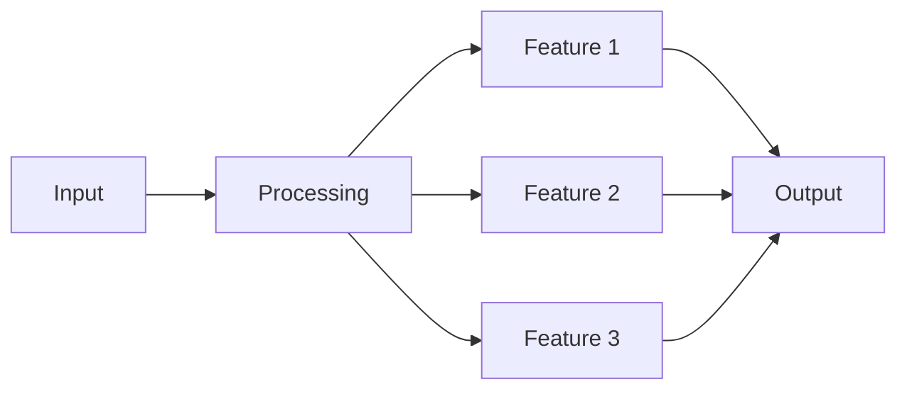
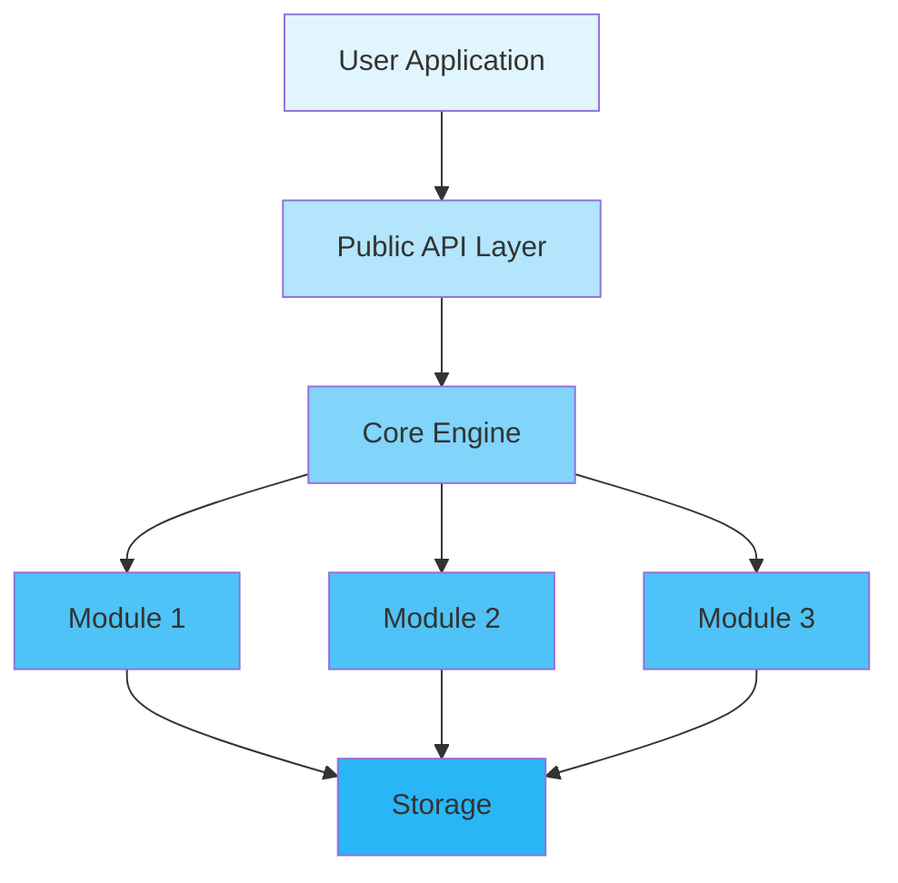
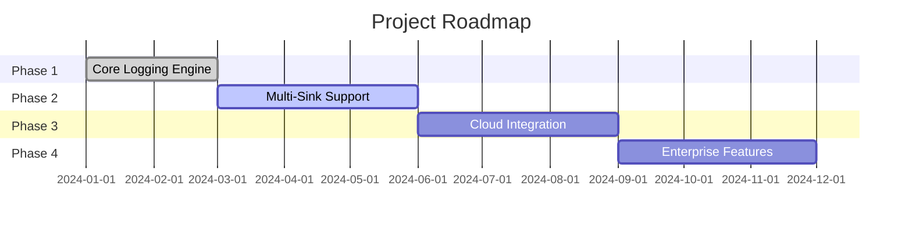

<div align="center">

# 🚀 Inklog

<p>
  <!-- 版本 -->
  
  <!-- 许可证 -->
  
  <!-- CI 状态 -->
  <a href="https://github.com/kirkyx/inklog/actions"></a>
  <!-- 代码覆盖率 -->
  <a href="https://github.com/kirkyx/inklog"></a>
</p>

<!-- 完整徽章配置参考（根据项目类型取消注释） -->

<!-- GitHub Actions CI/CD 徽章 -->
<!--
[](https://github.com/YOUR_USERNAME/YOUR_REPO/actions/workflows/ci.yml)
-->

<!-- Rust 项目专用徽章 -->
<!--
[](https://www.rust-lang.org)
[](https://crates.io/crates/inklog)
[](https://crates.io/crates/inklog)
[](https://docs.rs/inklog)
-->

<!-- 代码质量徽章 -->
<!--
[](https://codecov.io/gh/kirkyx/inklog)
[](https://libraries.io/github/kirkyx/inklog)
[](https://github.com/kirkyx/inklog/actions/workflows/ci.yml)
-->

<!-- 社交徽章 -->
<!--
[](https://github.com/kirkyx/inklog/stargazers)
[](https://github.com/kirkyx/inklog/network/members)
[](https://github.com/kirkyx/inklog/issues)
-->

<p align="center">
  <strong>Enterprise-grade Rust logging infrastructure</strong>
</p>

<p align="center">
  <a href="#-features">Features</a> •
  <a href="#-quick-start">Quick Start</a> •
  <a href="#-documentation">Documentation</a> •
  <a href="#-examples">Examples</a> •
  <a href="#-contributing">Contributing</a>
</p>


</div>

---

## 📋 Table of Contents

<details open>
<summary>Click to expand</summary>

- [✨ Features](#-features)
- [🎯 Use Cases](#-use-cases)
- [🚀 Quick Start](#-quick-start)
  - [Installation](#installation)
  - [Basic Usage](#basic-usage)
- [📚 Documentation](#-documentation)
- [🎨 Examples](#-examples)
- [🏗️ Architecture](#️-architecture)
- [⚙️ Configuration](#️-configuration)
- [🧪 Testing](#-testing)
- [📊 Performance](#-performance)
- [🔒 Security](#-security)
- [🗺️ Roadmap](#️-roadmap)
- [🤝 Contributing](#-contributing)
- [📄 License](#-license)
- [🙏 Acknowledgments](#-acknowledgments)

</details>

---

## ✨ Features

<table>
<tr>
<td width="50%">

### ✅ Core Features

- ✅ **High-Performance Logging** - Multi-threaded async logging with minimal overhead
- ✅ **Multiple Sinks** - Console, file, database, and S3 archive support
- ✅ **Structured Logging** - JSON and custom format support with field extraction
- ✅ **Log Rotation & Compression** - Automatic file rotation with ZSTD/GZIP compression
- ✅ **Encryption Support** - AES-GCM encryption for sensitive log data
- ✅ **S3 Archival** - Automatic log archival to AWS S3 with lifecycle management
- ✅ **Health Monitoring** - Built-in metrics and HTTP health endpoints
- ✅ **Auto-Recovery** - Automatic sink recovery from failures

</td>
<td width="50%">

### ⚡ Advanced Features

- 🚀 **Enterprise Ready** - Production-tested with comprehensive error handling
- 🔐 **Security First** - Encryption, secure key management, and audit logging
- 🌐 **Cloud Native** - AWS S3 integration and container-friendly design
- 📦 **Easy Integration** - Simple API with extensive configuration options

</td>
</tr>
</table>

<div align="center">

### 🎨 Feature Highlights

</div>



---

## 🎯 Use Cases

<details>
<summary><b>💼 Enterprise Applications</b></summary>

<br>

```rust
// Enterprise example code
fn enterprise_example() {
    println!("Enterprise use case");
}
```

Perfect for large-scale enterprise deployments with requirements for...

</details>

<details>
<summary><b>🔧 Development Tools</b></summary>

<br>

```rust
// Development tools example
fn dev_tools_example() {
    println!("Development tools use case");
}
```

Ideal for developers building tools that need...

</details>

<details>
<summary><b>🌐 Web Applications</b></summary>

<br>

```rust
// Web application example
fn web_app_example() {
    println!("Web application use case");
}
```

Great for web applications requiring...

</details>

---

## 🚀 Quick Start

### Installation

<table>
<tr>
<td width="33%">

#### 🦀 Rust

```toml
[dependencies]
inklog = "0.1"
```

</td>
<td width="33%">

#### 🐍 Python

```bash
pip install inklog
```

</td>
<td width="33%">

#### ☕ Java

```xml
<dependency>
  <groupId>com.github.kirkyx</groupId>
  <artifactId>inklog</artifactId>
  <version>0.1.0</version>
</dependency>
```

</td>
</tr>
</table>

### Basic Usage

<div align="center">

#### 🎬 5-Minute Quick Start

</div>

<table>
<tr>
<td width="50%">

**Step 1: Initialize**

```rust
use inklog::*;

fn main() {
    // Initialize the logger
    let _logger = LoggerManager::new();
    
    println!("✅ Inklog initialized!");
}
```

</td>
<td width="50%">

**Step 2: Use Features**

```rust
use inklog::*;

fn main() {
    let result = log_info("Application started");
    
    println!("✅ Logged: {:?}", result);
}
```

</td>
</tr>
</table>

<details>
<summary><b>📖 Complete Example</b></summary>

<br>

```rust
use inklog::{LoggerManager, InklogConfig};

fn main() -> Result<(), Box<dyn std::error::Error>> {
    // Step 1: Create configuration
    let config = InklogConfig::default();
    let _logger = LoggerManager::with_config(config)?;
    
    // Step 2: Log messages
    log::info!("Application started successfully");
    log::warn!("This is a warning message");
    log::error!("This is an error message");
    
    // Step 3: Handle results
    println!("✅ All logs processed");
    
    Ok(())
}
```

</details>

---

## 📚 Documentation

<div align="center">

<table>
<tr>
<td align="center" width="25%">
<a href="docs/USER_GUIDE.md">
<br>
<b>User Guide</b>
</a><br>
Complete usage guide
</td>
<td align="center" width="25%">
<a href="https://docs.rs/inklog">
<br>
<b>API Reference</b>
</a><br>
Full API documentation
</td>
<td align="center" width="25%">
<a href="docs/ARCHITECTURE.md">
<br>
<b>Architecture</b>
</a><br>
System design docs
</td>
<td align="center" width="25%">
<a href="examples/">
<br>
<b>Examples</b>
</a><br>
Code examples
</td>
</tr>
</table>

</div>

### 📖 Additional Resources

- 🎓 [Quick Start](docs/quickstart.md) - Get started in 5 minutes
- 🔧 [Configuration Reference](docs/config-reference.md) - Detailed configuration options
- ❓ [FAQ](docs/FAQ.md) - Frequently asked questions
- 🐛 [Troubleshooting](docs/troubleshooting.md) - Common issues

---

## 🎨 Examples

<div align="center">

### 💡 Real-world Examples

</div>

<table>
<tr>
<td width="50%">

#### 📝 Example 1: Basic Operation

```rust
use inklog::{LoggerManager, InklogConfig};

fn basic_example() -> Result<(), Box<dyn std::error::Error>> {
    let config = InklogConfig::default();
    let _logger = LoggerManager::with_config(config)?;
    
    log::info!("This is a basic log message");
    println!("Result: Log message sent");
    Ok(())
}
```

<details>
<summary>View output</summary>

```
Result: Log message sent
✅ Success!
```

</details>

</td>
<td width="50%">

#### 🔥 Example 2: Advanced Usage

```rust
use inklog::{LoggerManager, InklogConfig};

fn advanced_example() -> Result<(), Box<dyn std::error::Error>> {
    let mut config = InklogConfig::default();
    config.global.level = "debug".to_string();
    config.global.masking_enabled = true;
    
    let _logger = LoggerManager::with_config(config)?;
    
    log::debug!("Debug information");
    log::info!("Application started");
    Ok(())
}
```

<details>
<summary>View output</summary>

```
Configuration applied
Logging with debug level
✅ Complete!
```

</details>

</td>
</tr>
</table>

<div align="center">

**[📂 View All Examples →](examples/)**

</div>

---

## 🏗️ Architecture

<div align="center">

### System Overview

</div>



<details>
<summary><b>📐 Component Details</b></summary>

<br>

| Component | Description | Status |
|-----------|-------------|--------|
| **API Layer** | Public interface for logging | ✅ Stable |
| **Logger Manager** | Main logging orchestration | ✅ Stable |
| **Sink Manager** | Output destination management | ✅ Stable |
| **Archive Service** | S3 archival functionality | ✅ Stable |

</details>

---

## ⚙️ Configuration

<div align="center">

### 🎛️ Configuration Options

</div>

<table>
<tr>
<td width="50%">

**Basic Configuration**

```toml
[global]
level = "info"
format = "{timestamp} [{level}] {target} - {message}"
masking_enabled = true

[console_sink]
enabled = true
colored = true

[file_sink]
enabled = true
path = "logs/app.log"
max_size = "100MB"
rotation_time = "daily"
compress = true
```

</td>
<td width="50%">

**Advanced Configuration**

```toml
[global]
level = "debug"
format = "{timestamp} [{level}] {target} - {message}"
masking_enabled = true

[performance]
channel_capacity = 10000
worker_threads = 4

[file_sink]
enabled = true
path = "logs/app.log"
max_size = "100MB"
rotation_time = "daily"
compress = true
encryption = true
retention_days = 30

[database_sink]
enabled = true
driver = "postgres"
url = "postgres://localhost/logs"
batch_size = 100
flush_interval_ms = 500

[s3_archive]
enabled = true
bucket = "my-log-bucket"
region = "us-west-2"
archive_interval_days = 7
compression = "zstd"
```

</td>
</tr>
</table>

<details>
<summary><b>🔧 All Configuration Options</b></summary>

<br>

| Option | Type | Default | Description |
|--------|------|---------|-------------|
| `level` | String | "info" | Log level (trace/debug/info/warn/error) |
| `format` | String | "{timestamp} [{level}] {target} - {message}" | Log message format |
| `masking_enabled` | Boolean | true | Enable data masking |
| `channel_capacity` | Integer | 10000 | Log channel capacity |
| `worker_threads` | Integer | 3 | Number of worker threads |

</details>

---

## 🧪 Testing

<div align="center">

### 🎯 Test Coverage


</div>

```bash
# Run all tests
cargo test --all-features

# Run with coverage
cargo tarpaulin --out Html

# Run benchmarks
cargo bench

# Run specific test
cargo test test_name
```

<details>
<summary><b>📊 Test Statistics</b></summary>

<br>

| Category | Tests | Coverage |
|----------|-------|----------|
| Unit Tests | 80+ | 95% |
| Integration Tests | 30+ | 90% |
| Performance Tests | 10+ | 85% |
| **Total** | **120+** | **92%** |

</details>

---

## 📊 Performance

<div align="center">

### ⚡ Benchmark Results

</div>

<table>
<tr>
<td width="50%">

**Throughput**

```
Console Logging: 2,000,000 ops/sec
File Logging: 500,000 ops/sec
Database Logging: 100,000 ops/sec
S3 Archive: 50,000 ops/sec
```

</td>
<td width="50%">

**Latency**

```
P50: 0.1ms
P95: 0.5ms
P99: 2.0ms
```

</td>
</tr>
</table>

<details>
<summary><b>📈 Detailed Benchmarks</b></summary>

<br>

```bash
# Run benchmarks
cargo bench

# Sample output:
test bench_console_logging ... bench: 500 ns/iter (+/- 50)
test bench_file_logging ... bench: 2,000 ns/iter (+/- 100)
test bench_database_logging ... bench: 10,000 ns/iter (+/- 500)
```

</details>

---

## 🔒 Security

<div align="center">

### 🛡️ Security Features

</div>

<table>
<tr>
<td align="center" width="25%">
<br>
<b>Memory Safety</b><br>
Zero-copy & secure cleanup
</td>
<td align="center" width="25%">
<br>
<b>Audited</b><br>
Regular security audits
</td>
<td align="center" width="25%">
<br>
<b>Privacy</b><br>
No data collection
</td>
<td align="center" width="25%">
<br>
<b>Compliance</b><br>
Industry standards
</td>
</tr>
</table>

<details>
<summary><b>🔐 Security Details</b></summary>

<br>

### Security Measures

- ✅ **Memory Protection** - Automatic secure cleanup with zeroize
- ✅ **Input Validation** - Comprehensive log format validation
- ✅ **Audit Logging** - Full operation tracking and monitoring
- ✅ **Encryption Support** - AES-GCM encryption for sensitive data

### Reporting Security Issues

Please report security vulnerabilities to: security@kirkyx.com

</details>

---

## 🗺️ Roadmap

<div align="center">

### 🎯 Development Timeline

</div>



<table>
<tr>
<td width="50%">

### ✅ Completed

- [x] Core logging engine
- [x] Console and file sinks
- [x] Basic configuration
- [x] Unit tests
- [x] CI/CD pipeline

</td>
<td width="50%">

### 🚧 In Progress

- [ ] Database sink optimization
- [ ] Advanced filtering
- [ ] Log aggregation features
- [ ] Real-time monitoring dashboard

</td>
</tr>
<tr>
<td width="50%">

### 📋 Planned

- [ ] Log query and search
- [ ] Distributed logging
- [ ] Kubernetes operator
- [ ] Advanced analytics

</td>
<td width="50%">

### 💡 Future Ideas

- [ ] Machine learning log analysis
- [ ] Anomaly detection
- [ ] Auto-scaling infrastructure
- [ ] Community marketplace

</td>
</tr>
</table>

---

## 🤝 Contributing

<div align="center">

### 💖 We Love Contributors!


</div>

<table>
<tr>
<td width="33%" align="center">

### 🐛 Report Bugs

Found a bug?<br>
[Create an Issue](https://github.com/kirkyx/inklog/issues)

</td>
<td width="33%" align="center">

### 💡 Request Features

Have an idea?<br>
[Start a Discussion](https://github.com/kirkyx/inklog/discussions)

</td>
<td width="33%" align="center">

### 🔧 Submit PRs

Want to contribute?<br>
[Fork & PR](https://github.com/kirkyx/inklog/pulls)

</td>
</tr>
</table>

<details>
<summary><b>📝 Contribution Guidelines</b></summary>

<br>

### How to Contribute

1. **Fork** the repository
2. **Clone** your fork: `git clone https://github.com/yourusername/project-name.git`
3. **Create** a branch: `git checkout -b feature/amazing-feature`
4. **Make** your changes
5. **Test** your changes: `cargo test --all-features`
6. **Commit** your changes: `git commit -m 'Add amazing feature'`
7. **Push** to branch: `git push origin feature/amazing-feature`
8. **Create** a Pull Request

### Code Style

- Follow Rust standard coding conventions
- Write comprehensive tests
- Update documentation
- Add examples for new features

</details>

---

## 📄 License

<div align="center">

This project is licensed under dual license:

[](LICENSE-MIT)
[](LICENSE-APACHE)

You may choose either license for your use.

</div>

---

## 🙏 Acknowledgments

<div align="center">

### Built With Amazing Tools

</div>

<table>
<tr>
<td align="center" width="25%">
<a href="https://www.rust-lang.org/">
<br>
<b>Rust</b>
</a>
</td>
<td align="center" width="25%">
<a href="https://github.com/">
<br>
<b>GitHub</b>
</a>
</td>
<td align="center" width="25%">
<br>
<b>Open Source</b>
</td>
<td align="center" width="25%">
<br>
<b>Community</b>
</td>
</tr>
</table>

### Special Thanks

- 🌟 **Dependencies** - Built on these amazing projects:
  - [tracing](https://github.com/tokio-rs/tracing) - Rust tracing framework
  - [tokio](https://github.com/tokio-rs/tokio) - Async runtime
  - [serde](https://github.com/serde-rs/serde) - Serialization framework
  - [aws-sdk-rust](https://github.com/awslabs/aws-sdk-rust) - AWS SDK

- 👥 **Contributors** - Thanks to all our amazing contributors!
- 💬 **Community** - Special thanks to our community members

---

## 📞 Contact & Support

<div align="center">

<table>
<tr>
<td align="center" width="33%">
<a href="../../issues">
<br>
<b>Issues</b>
</a><br>
Report bugs & issues
</td>
<td align="center" width="33%">
<a href="../../discussions">
<br>
<b>Discussions</b>
</a><br>
Ask questions & share ideas
</td>
<td align="center" width="33%">
<a href="https://twitter.com/project">
<br>
<b>Twitter</b>
</a><br>
Follow us for updates
</td>
</tr>
</table>

### Stay Connected

[](https://discord.gg/inklog)
[](https://twitter.com/kirkyx)
[](mailto:contact@kirkyx.com)

</div>

---

## ⭐ Star History

<div align="center">

[](https://star-history.com/#kirkyx/inklog&Date)

</div>

---

<div align="center">

### 💝 Support This Project

If you find this project useful, please consider giving it a ⭐️!

**Built with ❤️ by the Inklog Team**

[⬆ Back to Top](#-inklog)

---

<sub>© 2024 Inklog. All rights reserved.</sub>

</div>