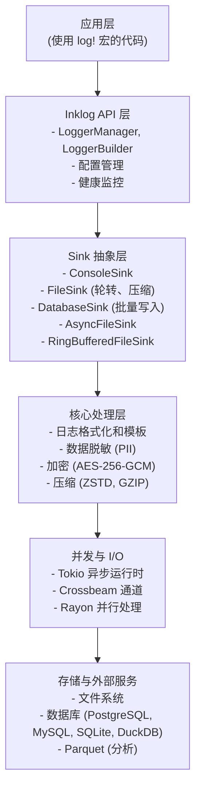

<div align="center">


[](https://github.com/Kirky-X/inklog/actions/workflows/ci.yml) [](https://crates.io/crates/inklog) [](https://docs.rs/inklog) [](https://crates.io/crates/inklog) [](LICENSE) [](https://www.rust-lang.org/) [](https://codecov.io/gh/Kirky-X/inklog)

**中文** | [English](README_EN.md)

**企业级 Rust 日志基础设施**

[✨ 功能特性](#-功能特性) • [🚀 快速开始](#-快速开始) • [📚 文档](#-文档) • [💻 示例](#-示例) • [🤝 参与贡献](#-参与贡献)

</div>

---

### 🎯 基于 Tokio 构建的高性能、安全、功能丰富的日志基础设施

Inklog 为企业级应用提供**全面**的日志解决方案：

| ⚡ 高性能 | 🔒 安全优先 | 🌐 多目标输出 | 📊 可观测性 |
|:---------:|:----------:|:--------------:|:--------:|
| Tokio 异步 I/O | AES-256-GCM 加密 | 控制台、文件、数据库 | 健康监控 |
| 批量写入与压缩 | 密钥内存安全清除 | 自动轮转 | 指标与追踪 |

```rust
use inklog::{InklogConfig, LoggerManager};
use std::path::PathBuf;

#[tokio::main]
async fn main() -> Result<(), Box<dyn std::error::Error>> {
    let config = InklogConfig {
        file_sink: Some(inklog::FileSinkConfig {
            enabled: true,
            path: "logs/app.log".into(),
            max_size: "100MB".into(),
            compress: true,
            ..Default::default()
        }),
        ..Default::default()
    };

    let _logger = LoggerManager::with_config(config).await?;

    log::info!("应用启动成功");
    log::error!("发生错误，详情如下");

    Ok(())
}
```

---

## 📋 目录

<details open>
<summary>📑 目录（点击展开）</summary>

- [✨ 功能特性](#-功能特性)
- [🚀 快速开始](#-快速开始)
  - [📦 安装](#-安装)
  - [💡 基本用法](#-基本用法)
  - [🔧 高级配置](#-高级配置)
- [🎨 特性标志](#-特性标志)
- [📚 文档](#-文档)
- [💻 示例](#-示例)
- [🏗️ 架构](#️-架构)
- [🧪 测试](#-测试)
- [📊 性能](#-性能)
- [🔒 安全](#-安全)
- [🗺️ 开发路线图](#️-开发路线图)
- [🤝 参与贡献](#-参与贡献)
- [📋 更新日志](#-更新日志)
- [📄 许可证](#-许可证)
- [🙏 致谢](#-致谢)
- [📞 联系与支持](#-联系与支持)
- [⭐ Star 历史](#-star-历史)

</details>

---

## ✨ 功能特性

| 🎯 核心功能 | ⚡ 企业功能 |
|:----------:|:----------:|
| 始终可用 | 可选特性 |

<table style="width:100%; border-collapse: collapse;">
<tr>
<td width="50%" style="vertical-align:top; padding: 16px; border-radius:8px; border:1px solid #E2E8F0;">

### 🎯 核心功能 (始终可用)

| 状态 | 功能 | 描述 |
|:----:|------|------|
| ✅ | **异步 I/O** | 基于 Tokio 的非阻塞日志记录 |
| ✅ | **多目标输出** | 控制台、文件、数据库、自定义 Sink |
| ✅ | **结构化日志** | tracing 生态系统集成 |
| ✅ | **自定义格式** | 基于模板的日志格式 |
| ✅ | **文件轮转** | 基于大小和时间的轮转 |
| ✅ | **数据脱敏** | 基于正则的 PII 数据脱敏 |
| ✅ | **健康监控** | Sink 状态和指标追踪 |
| ✅ | **命令行工具** | decrypt、generate、validate 命令（需 `cli` feature） |

</td>
<td width="50%" style="vertical-align:top; padding: 16px; border-radius:8px; border:1px solid #E2E8F0;">

### ⚡ 企业功能

| 状态 | 功能 | 描述 |
|:----:|------|------|
| 🔍 | **压缩** | ZSTD、GZIP 支持 |
| 🔒 | **加密** | AES-256-GCM 文件加密 |
| 🗄️ | **数据库 Sink** | PostgreSQL、MySQL、SQLite、DuckDB (dbnexus) |
| 📊 | **Parquet 导出** | 分析就绪的日志格式 |
| 🌐 | **HTTP 端点** | Axum 健康检查服务器 |
| 🔧 | **命令行工具** | 日志管理实用命令 |

</td>
</tr>
</table>

### 📦 功能预设

| 预设 | 功能 | 适用场景 |
|------|------|----------|
| <span style="color:#166534; padding:4px 8px; border-radius:4px;">minimal</span> | 无可选特性 | 仅核心日志功能 |
| <span style="color:#1E40AF; padding:4px 8px; border-radius:4px;">standard</span> | `http`, `cli` | 标准开发环境 |
| <span style="color:#991B1B; padding:4px 8px; border-radius:4px;">full</span> | 所有默认功能 | 生产环境日志 |
| <span style="color:#9333EA; padding:4px 8px; border-radius:4px;">test-utils</span> | `MockCache`/`MockConfig`/`MockDatabaseAdapter` | 外部测试消费者：默认公共 API 已移除三个 mock（BREAKING），集成测试已全部真实化（DbNexusAdapter + sqlite），仅外部测试代码需显式启用本 feature |

---

## 🚀 快速开始

### 📦 安装

在 `Cargo.toml` 中添加依赖：

```toml
[dependencies]
inklog = "0.3.0-rc.2"
```

完整功能集（显式启用）：

```toml
[dependencies]
inklog = { version = "0.3.0-rc.2", default-features = false, features = ["http", "cli", "sqlite"] }
```

### 💡 基本用法

<div align="center" style="margin: 24px 0;">

#### 🎬 5 分钟快速开始

</div>

<table style="width:100%; border-collapse: collapse;">
<tr>
<td width="50%" style="padding: 16px; vertical-align:top;">

**第一步：初始化日志系统**

```rust
use inklog::LoggerManager;

#[tokio::main]
async fn main() -> Result<(), Box<dyn std::error::Error>> {
    let _logger = LoggerManager::new().await?;

    log::info!("日志系统已初始化");
    Ok(())
}
```

</td>
<td width="50%" style="padding: 16px; vertical-align:top;">

**第二步：记录日志消息**

```rust
use inklog::LoggerManager;

#[tokio::main]
async fn main() -> Result<(), Box<dyn std::error::Error>> {
    let _logger = LoggerManager::new().await?;

    log::trace!("追踪消息");
    log::debug!("调试消息");
    log::info!("信息消息");
    log::warn!("警告消息");
    log::error!("错误消息");

    Ok(())
}
```

</td>
</tr>
<tr>
<td width="50%" style="padding: 16px; vertical-align:top;">

**第三步：文件日志**

```rust
use inklog::{FileSinkConfig, InklogConfig, LoggerManager};

let config = InklogConfig {
    file_sink: Some(FileSinkConfig {
        enabled: true,
        path: "logs/app.log".into(),
        max_size: "10MB".into(),
        rotation_time: "daily".into(),
        keep_files: 7,
        compress: true,
        ..Default::default()
    }),
    ..Default::default()
};

let _logger = LoggerManager::with_config(config).await?;
```

</td>
<td width="50%" style="padding: 16px; vertical-align:top;">

**第四步：数据库日志**

```rust
use inklog::{DatabaseSinkConfig, InklogConfig};

let config = InklogConfig {
    database_sink: Some(DatabaseSinkConfig {
        enabled: true,
        url: "sqlite://logs/app.db".to_string(),
        pool_size: 5,
        batch_size: 100,
        flush_interval_ms: 1000,
        ..Default::default()
    }),
    ..Default::default()
};

let _logger = LoggerManager::with_config(config).await?;
```

</td>
</tr>
</table>

### 🔧 高级配置

#### 加密文件日志

```rust
use inklog::{FileSinkConfig, InklogConfig};

// 从环境变量设置加密密钥
std::env::set_var("INKLOG_ENCRYPTION_KEY", "base64-encoded-32-byte-key");

let config = InklogConfig {
    file_sink: Some(FileSinkConfig {
        enabled: true,
        path: "logs/encrypted.log.enc".into(),
        max_size: "10MB".into(),
        encrypt: true,
        encryption_key_env: Some("INKLOG_ENCRYPTION_KEY".into()),
        compress: false, // 加密日志不压缩
        ..Default::default()
    }),
    ..Default::default()
};

let _logger = LoggerManager::with_config(config).await?;
```

#### 自定义日志格式

```rust
use inklog::{InklogConfig, config::GlobalConfig};

let format_string = "[{timestamp}] [{level:>5}] {target} - {message} | {file}:{line}";

let config = InklogConfig {
    global: GlobalConfig {
        level: "debug".into(),
        format: format_string.to_string(),
        masking_enabled: true,
        ..Default::default()
    },
    ..Default::default()
};

let _logger = LoggerManager::with_config(config).await?;
```

---

## 🎨 特性标志

### 默认功能

```toml
inklog = "0.3.0-rc.2"  # 默认不包含可选 feature (default = [])
```

### 可选功能

```toml
# HTTP 服务器
inklog = { version = "0.3.0-rc.2", features = [
    "http",       # Axum HTTP 健康端点
] }

# 命令行工具
inklog = { version = "0.3.0-rc.2", features = [
    "cli",        # decrypt, generate, validate 命令
] }

# 数据库 Sink (可选一个或多个)
inklog = { version = "0.3.0-rc.2", features = [
    "sqlite",     # SQLite 数据库 Sink
    "postgres",   # PostgreSQL 数据库 Sink
    "mysql",      # MySQL 数据库 Sink
] }

# 压缩与性能
inklog = { version = "0.3.0-rc.2", features = [
    "compression",  # ZSTD 压缩支持
    "parquet",      # Parquet 导出支持
    "fast-masking", # Aho-Corasick 多模式加速脱敏
] }
```

### 功能详情

| 功能 | 依赖 | 描述 |
|---------|-------------|-------------|
| **http** | axum | HTTP 健康检查端点 |
| **cli** | clap, glob | 命令行工具 |
| **sqlite** | dbnexus | SQLite 数据库 Sink |
| **postgres** | dbnexus | PostgreSQL 数据库 Sink |
| **mysql** | dbnexus | MySQL 数据库 Sink |
| **duckdb** | dbnexus | DuckDB 数据库 Sink |
| **compression** | zstd | ZSTD 压缩支持（轮转日志文件） |
| **parquet** | parquet, arrow-array, arrow-schema | Parquet 导出支持（分析场景） |
| **fast-masking** | aho-corasick | Aho-Corasick 多模式加速脱敏 |
| **kit** | trait-kit, dbnexus, oxcache | trait-kit AsyncKit 集成 (InklogModule) |
| **test-utils** | — | 测试面 mock 导出（MockCache/MockConfig/MockDatabaseAdapter），不入 default 与任何生产组合 |

> ⚠️ **数据库后端互斥**：`sqlite`/`postgres`/`mysql`/`duckdb` 后端 feature 互斥（经 dbnexus 强制），不适用 `--all-features`，请按后端分组启用。

---

## 📚 文档

| 文档 | 说明 |
|------|------|
| [📖 用户指南](docs/USER_GUIDE.md) | 从安装到进阶的完整使用教程 |
| [📘 API 参考](docs/API_REFERENCE.md) | 全部公开 API 的详细说明 |
| [🏗️ 架构文档](docs/ARCHITECTURE.md) | 设计理念与内部实现 |
| [🔒 安全文档](docs/SECURITY.md) | 安全设计与最佳实践 |
| [📋 更新日志](docs/CHANGELOG.md) | 每个版本的变更记录 |
| [🤝 贡献指南](docs/CONTRIBUTING.md) | 如何参与项目开发 |
| [📦 在线 API 文档](https://docs.rs/inklog) | docs.rs 自动生成的最新文档 |

---

## 💻 示例

<table style="width:100%; border-collapse: collapse;">
<tr>
<td width="50%" style="padding: 16px; border-radius:8px; border:1px solid #E2E8F0; vertical-align:top;">

#### 📝 基础日志

```rust
use inklog::LoggerManager;

#[tokio::main]
async fn main() -> Result<(), Box<dyn std::error::Error>> {
    let _logger = LoggerManager::new().await?;

    log::info!("应用已启动");
    log::error!("发生错误: {}", err);

    Ok(())
}
```

</td>
<td width="50%" style="padding: 16px; border-radius:8px; border:1px solid #E2E8F0; vertical-align:top;">

#### 📁 带轮转的文件日志

```rust
use inklog::{FileSinkConfig, InklogConfig, LoggerManager};

let config = InklogConfig {
    file_sink: Some(FileSinkConfig {
        enabled: true,
        path: "logs/app.log".into(),
        max_size: "10MB".into(),
        rotation_time: "daily".into(),
        keep_files: 7,
        compress: true,
        ..Default::default()
    }),
    ..Default::default()
};

let _logger = LoggerManager::with_config(config).await?;
```

</td>
</tr>
<tr>
<td width="50%" style="padding: 16px; border-radius:8px; border:1px solid #E2E8F0; vertical-align:top;">

#### 🔒 加密日志

```rust
use inklog::{FileSinkConfig, InklogConfig};

std::env::set_var("INKLOG_ENCRYPTION_KEY", "base64-encoded-key");

let config = InklogConfig {
    file_sink: Some(FileSinkConfig {
        enabled: true,
        path: "logs/encrypted.log".into(),
        encrypt: true,
        encryption_key_env: Some("INKLOG_ENCRYPTION_KEY".into()),
        ..Default::default()
    }),
    ..Default::default()
};

let _logger = LoggerManager::with_config(config).await?;
```

</td>
<td width="50%" style="padding: 16px; border-radius:8px; border:1px solid #E2E8F0; vertical-align:top;">

#### 🗄️ 数据库日志

```rust
use inklog::{DatabaseSinkConfig, InklogConfig};

let config = InklogConfig {
    database_sink: Some(DatabaseSinkConfig {
        enabled: true,
        url: "postgresql://localhost/logs".to_string(),
        pool_size: 10,
        batch_size: 100,
        flush_interval_ms: 1000,
        ..Default::default()
    }),
    ..Default::default()
};

let _logger = LoggerManager::with_config(config).await?;
```

</td>
</tr>
<tr>
<td width="50%" style="padding: 16px; border-radius:8px; border:1px solid #E2E8F0; vertical-align:top;">

#### 🏥 HTTP 健康端点

```rust
use axum::{routing::get, Json, Router};
use inklog::LoggerManager;
use std::sync::Arc;

let logger = Arc::new(LoggerManager::new().await?);

let app = Router::new().route(
    "/health",
    get({
        let logger = logger.clone();
        || async move { Json(logger.get_health_status()) }
    }),
);

// 启动 HTTP 服务器...
```

</td>
</tr>
<tr>
<td width="50%" style="padding: 16px; border-radius:8px; border:1px solid #E2E8F0; vertical-align:top;">

#### 🎨 自定义格式

```rust
use inklog::{InklogConfig, config::GlobalConfig};

let format_string = "[{timestamp}] [{level:>5}] {target} - {message}";

let config = InklogConfig {
    global: GlobalConfig {
        level: "debug".into(),
        format: format_string.to_string(),
        masking_enabled: true,
        ..Default::default()
    },
    ..Default::default()
};

let _logger = LoggerManager::with_config(config).await?;
```

</td>
<td width="50%" style="padding: 16px; border-radius:8px; border:1px solid #E2E8F0; vertical-align:top;">

#### 🔍 数据脱敏

```rust
use inklog::{InklogConfig, config::GlobalConfig};

let config = InklogConfig {
    global: GlobalConfig {
        level: "info".into(),
        format: "{timestamp} {level} {message}".to_string(),
        masking_enabled: true,  // 启用 PII 脱敏
        ..Default::default()
    },
    ..Default::default()
};

let _logger = LoggerManager::with_config(config).await?;

// 敏感数据将自动脱敏
log::info!("用户邮箱: user@example.com");
// 输出: 用户邮箱: ***@***.***
```

</td>
</tr>
</table>

### 📦 可运行示例

`examples/` 是 workspace 内的独立 crate（`inklog-examples`），按目录分为 7 类共 39 个示例。在仓库根目录使用 `cargo run --package inklog-examples --example <名称>` 运行（或进入 `examples/` 目录后 `cargo run --example <名称>`）。部分示例需启用对应 feature（如 `sqlite`、`postgres`、`compression`、`parquet`）。

#### 配置（config）

| 示例 | 描述 | 运行命令 |
|------|------|----------|
| `config_file` | 配置文件加载示例（Layer 1 本地资源） | `cargo run --package inklog-examples --example config_file` |
| `config_inspect` | 配置 inspect：`sinks_enabled()` + `LoggerManager::load()` | `cargo run --package inklog-examples --example config_inspect` |
| `env_overrides` | 环境变量覆盖加载示例 | `cargo run --package inklog-examples --example env_overrides` |

#### 核心（core）

| 示例 | 描述 | 运行命令 |
|------|------|----------|
| `basic` | 基础用法示例 | `cargo run --package inklog-examples --example basic` |
| `builder` | Builder 模式配置示例 | `cargo run --package inklog-examples --example builder` |
| `all_features` | 完整功能演示 | `cargo run --package inklog-examples --example all_features` |
| `production` | 生产环境配置示例 | `cargo run --package inklog-examples --example production` |
| `template` | 日志模板示例 | `cargo run --package inklog-examples --example template` |
| `error_handling` | 错误处理示例（Layer 0 零依赖） | `cargo run --package inklog-examples --example error_handling` |
| `i18n` | 国际化 (i18n) 格式化示例 | `cargo run --package inklog-examples --example i18n` |

#### Sink 与输出（sinks）

| 示例 | 描述 | 运行命令 |
|------|------|----------|
| `console` | Console Sink 示例 | `cargo run --package inklog-examples --example console` |
| `file` | File Sink 示例 | `cargo run --package inklog-examples --example file` |
| `rotation` | 日志轮转示例（Layer 1 本地资源） | `cargo run --package inklog-examples --example rotation` |
| `compression` | Zstd 压缩/解压缩示例（需 `compression` feature） | `cargo run --package inklog-examples --example compression` |
| `ring_buffered_file` | ChannelBufferedFileSink 示例（Layer 1 本地资源） | `cargo run --package inklog-examples --example ring_buffered_file` |
| `archive_format` | 归档格式示例（Layer 0 零依赖） | `cargo run --package inklog-examples --example archive_format` |
| `parquet_archive` | Parquet 归档示例（需 `parquet` feature） | `cargo run --package inklog-examples --example parquet_archive` |
| `partition_strategy` | 数据库分区策略示例 | `cargo run --package inklog-examples --example partition_strategy` |

#### 数据库（database）

| 示例 | 描述 | 运行命令 |
|------|------|----------|
| `database` | Database Sink 示例（SQLite 内存库，需 `sqlite` feature） | `cargo run --package inklog-examples --features sqlite --example database` |
| `database_pg_mysql` | PostgreSQL/MySQL 数据库驱动示例 | `cargo run --package inklog-examples --example database_pg_mysql` |
| `di_example` | DI (Dependency Injection) 模式示例 | `cargo run --package inklog-examples --example di_example` |

#### 基础设施（infra）

| 示例 | 描述 | 运行命令 |
|------|------|----------|
| `channel_strategy` | 自适应 Channel 策略示例 | `cargo run --package inklog-examples --example channel_strategy` |
| `circuit_breaker` | 断路器示例（Layer 2 外部服务） | `cargo run --package inklog-examples --example circuit_breaker` |
| `fallback` | Sink 降级机制示例 | `cargo run --package inklog-examples --example fallback` |
| `log_adapter` | `log` crate 适配器示例（Layer 0 零依赖） | `cargo run --package inklog-examples --example log_adapter` |
| `log_level` | LogLevel 类型解析/比较/Display 示例 | `cargo run --package inklog-examples --example log_level` |
| `metrics` | 健康监控与指标收集示例（Layer 2 外部服务） | `cargo run --package inklog-examples --example metrics` |
| `object_pool` | 对象池示例（Layer 0 零依赖） | `cargo run --package inklog-examples --example object_pool` |
| `output_format` | 输出格式示例（Layer 0 零依赖） | `cargo run --package inklog-examples --example output_format` |
| `performance` | 性能测试示例 | `cargo run --package inklog-examples --example performance` |
| `rate_limiter` | 速率限制器示例（Layer 0 零依赖） | `cargo run --package inklog-examples --example rate_limiter` |
| `runtime_ops` | LoggerManager 运行时操作 API 示例 | `cargo run --package inklog-examples --example runtime_ops` |

#### 网络（network）

| 示例 | 描述 | 运行命令 |
|------|------|----------|
| `http` | HTTP 健康检查和指标端点示例 | `cargo run --package inklog-examples --example http` |
| `http_auth` | HTTP 认证与 IP 白名单示例 | `cargo run --package inklog-examples --example http_auth` |
| `tls_config` | TLS 配置示例 | `cargo run --package inklog-examples --example tls_config` |

#### 安全（security）

| 示例 | 描述 | 运行命令 |
|------|------|----------|
| `encryption` | 日志加密示例 | `cargo run --package inklog-examples --example encryption` |
| `log_sanitizer` | 日志内容净化示例（Layer 0 零依赖） | `cargo run --package inklog-examples --example log_sanitizer` |
| `masking` | 数据脱敏示例 | `cargo run --package inklog-examples --example masking` |
| `path_validator` | 路径验证器示例（Layer 0 零依赖） | `cargo run --package inklog-examples --example path_validator` |

<div align="center" style="margin: 24px 0;">

**[📂 查看所有示例 →](examples/)**

</div>

---

## 🏗️ 架构

> 完整的架构设计、数据流与扩展点说明见 [🏗️ 架构文档](docs/ARCHITECTURE.md)。

<div align="center" style="margin: 24px 0;">

### 🏗️ 系统架构

</div>


```mermaid
flowchart TD
    App["应用层<br/>(使用 log! 宏的代码)"]
    API["Inklog API 层<br/>- LoggerManager, LoggerBuilder<br/>- 配置管理<br/>- 健康监控"]
    Sink["Sink 抽象层<br/>- ConsoleSink<br/>- FileSink (轮转、压缩)<br/>- DatabaseSink (批量写入)<br/>- AsyncFileSink<br/>- RingBufferedFileSink"]
    Core["核心处理层<br/>- 日志格式化和模板<br/>- 数据脱敏 (PII)<br/>- 加密 (AES-256-GCM)<br/>- 压缩 (ZSTD, GZIP)"]
    IO["并发与 I/O<br/>- Tokio 异步运行时<br/>- Crossbeam 通道<br/>- Rayon 并行处理"]
    Store["存储与外部服务<br/>- 文件系统<br/>- 数据库 (PostgreSQL, MySQL, SQLite, DuckDB)<br/>- Parquet (分析)"]

    App --> API --> Sink --> Core --> IO --> Store
```

### 分层说明

**应用层**
- 应用代码使用 `log` crate 的标准 `log!` 宏
- 与现有 Rust 日志模式兼容

**Inklog API 层**
- `LoggerManager`: 所有日志操作的主要协调器
- `LoggerBuilder`: 流式构建器模式配置
- 健康状态跟踪和指标收集

**Sink 抽象层**
- 多种 Sink 实现对应不同的输出目标
- 开发环境的控制台输出
- 带轮转、压缩和加密的文件输出
- 批量写入的数据库输出 (PostgreSQL, MySQL, SQLite, DuckDB)
- 高吞吐量场景的异步和缓冲文件 Sink

**核心处理层**
- 基于模板的日志格式化
- 基于正则的 PII 数据脱敏 (邮箱、身份证、信用卡等)
- 敏感日志的 AES-256-GCM 加密
- 多种压缩算法 (ZSTD, GZIP)

**并发与 I/O 层**
- Tokio 异步运行时用于非阻塞 I/O
- Crossbeam 通道用于任务间通信
- Rayon 用于 CPU 密集型并行处理

**存储与外部服务层**
- 本地文件系统访问
- 通过 Sea-ORM 的数据库连接
- 分析工作流的 Parquet 格式

---

## 🧪 测试

<div align="center" style="margin: 24px 0;">

### 🎯 运行测试

</div>

```bash
# ⚠️ 数据库后端 features（sqlite/postgres/mysql/duckdb）互斥（经 dbnexus 强制），
# 不适用 --all-features；请按后端分组运行：
cargo test --features "http,cli,compression,parquet,fast-masking"        # 无数据库后端
cargo test --features "sqlite,http,cli,compression,parquet,fast-masking,kit"  # SQLite 面

# 在发布模式下运行测试
cargo test --release

# 运行基准测试
cargo bench
```

> **本地化提示**：错误消息经 ICU/Fluent 按系统 locale 渲染。若测试断言英文消息文本，
> 请设置 `INKLOG_LOCALE=en`（如 CI 或非英文系统环境）以固定输出语言。

### 测试覆盖率

Inklog 目标是 **95%+ 代码覆盖率**：

```bash
# 生成覆盖率报告
cargo tarpaulin --out Html --all-features
```

### 代码检查和格式化

```bash
# 格式化代码
cargo fmt --all

# 检查格式而不修改
cargo fmt --all -- --check

# 运行 Clippy (警告视为错误)
cargo clippy --all-targets --all-features -- -D warnings
```

### 安全审计

```bash
# 运行 cargo deny 安全检查
cargo deny check

# 检查安全公告
cargo deny check advisories

# 检查禁止的许可证
cargo deny check bans
```

### 依赖注入测试

> ⚠️ 自 0.3.0-rc.2 起，`MockCache`/`MockConfig`/`MockDatabaseAdapter` 已从默认公共 API 移除（BREAKING），外部测试代码需显式启用 `test-utils` feature。

Inklog 提供 Mock 实现，支持无外部依赖的单元测试：

```rust
use inklog::{LoggerManager, LoggerDependencies};
use inklog::{MockCache, MockConfig, MockDatabaseAdapter};
use std::sync::Arc;

#[tokio::test]
async fn test_with_mocks() -> Result<(), Box<dyn std::error::Error>> {
    // 创建 Mock 依赖
    let deps = LoggerDependencies {
        cache: Some(Arc::new(MockCache::new())),
        config: Some(Arc::new(MockConfig::new())),
        #[cfg(any(feature = "sqlite", feature = "postgres", feature = "mysql"))]
        database: Some(Arc::new(MockDatabaseAdapter::new())),
        ..Default::default()
    };

    // 注入依赖创建 logger
    let logger = LoggerManager::with_dependencies(deps).await?;

    // 测试日志记录...
    log::info!("Test message");

    Ok(())
}
```

**Mock 实现特性**:
- **MockCache**: 内存 HashMap，支持延迟模拟
- **MockConfig**: 运行时可修改的配置
- **MockDatabaseAdapter**: 内存日志存储，支持健康状态控制

详细使用方法请参考 [用户指南](docs/USER_GUIDE.md#使用-mock-实现进行测试)。

### 集成测试

```bash
# 运行集成测试
cargo test --test '*'

# 使用 Docker 服务运行 (PostgreSQL, MySQL)
docker-compose up -d
cargo test --all-features
docker-compose down
```

---

## 📊 性能

Inklog 通过异步 I/O、批量写入、有界队列与内存池等设计优化日志路径。以下为[架构文档](docs/ARCHITECTURE.md)「性能考虑」章节中记录的设计要点与参考数据：

### 批量写入

- **FileSink**：行级写入 + `BufWriter` 减少系统调用
- **DatabaseSink**：缓冲批量刷新（`batch_size` 默认 100，刷新间隔默认 500ms）

| 策略 | 数据库事务 | I/O 开销 | 吞吐量（参考值） |
|------|-----------|---------|----------------|
| 逐条插入 | N（自动提交） | 高 | ~100/s |
| 批量 100 条 | 单次事务 | 低 | ~10,000/s |

> 上表为 docs/ARCHITECTURE.md 中记录的策略对比参考值，实际吞吐因硬件、数据库与配置而异。

### 队列与背压

- Crossbeam 有界通道（`channel_capacity` 默认 10000）防止内存溢出，队列满时发送端阻塞
- 默认 3 个工作线程（`worker_threads`，经 `PerformanceConfig` 调整）
- 通道使用率经健康指标暴露，可导出为 Prometheus 指标（`inklog_channel_usage`）

### 压缩

- ZSTD 压缩级别 0-22（默认 3，压缩比约 3.5x）；级别越高压缩比越高、速度越慢

### 基准测试

项目使用 Criterion 维护基准测试（`benches/inklog_bench.rs`）：

```bash
cargo bench
```

`examples/src/bin/infra/performance.rs` 提供了可运行的性能示例。

> 注：仓库内暂无正式发布的跨版本基准测试报告（docs/ 下暂无 PERFORMANCE.md 与 benchmarks/ 目录），欢迎基于上述工具在目标硬件上实测并反馈数据。

---

## 🔒 安全

Inklog 以安全为首要优先级构建，完整的安全设计、漏洞报告流程与最佳实践见 [🔒 安全文档](docs/SECURITY.md)。

#### 🔒 加密

- **AES-256-GCM**: 军用级日志文件加密
- **密钥管理**: 基于环境变量的密钥注入
- **内存安全清除**: 通过 `zeroize` crate 安全清除密钥
- **SHA-256 哈希**: 加密日志的完整性验证

#### 🎭 数据脱敏

- **基于正则的模式**: 自动 PII 检测和脱敏
- **邮箱脱敏**: `user@example.com` → `***@***.***`
- **身份证脱敏**: 信用卡和社会安全号脱敏
- **自定义模式**: 可配置的正则表达式模式

#### 🔐 密钥安全处理

```rust
// 从环境变量安全设置加密密钥
std::env::set_var("INKLOG_ENCRYPTION_KEY", "base64-encoded-32-byte-key");

// 密钥使用后自动清除
// 切勿在代码中硬编码密钥
```

#### 🛡️ 安全最佳实践

- **无硬编码密钥**: 密钥从环境变量加载
- **最小权限操作**: 仅必要的文件/数据库访问
- **审计日志**: 调试功能用于安全审计追踪
- **合规就绪**: 支持 GDPR、HIPAA、PCI-DSS 日志要求

---

## 🗺️ 开发路线图

以下为基于 [CHANGELOG](docs/CHANGELOG.md) 与当前发布安排整理的阶段性目标（具体节奏可能随工作区整体发布计划调整）：

### v0.3.0 正式发布

- [ ] 完成 0.3.0-rc.2 → 0.3.0 正式版发布
- [ ] 随工作区依赖传导表同步升级：trait-kit 0.5.0、oxcache 0.5.0、dbnexus 0.6.0

### 质量与 CI

- [ ] CI 测试矩阵按数据库后端分组（`sqlite`/`postgres`/`mysql`/`duckdb` 后端 feature 互斥，当前 `--all-features` 组合无法编译）
- [ ] 补齐 MySQL 集成测试环境（当前缺少 MySQL 服务导致该后端集成测试阻塞）
- [ ] 提升测试覆盖率（llvm-cov 基线约 80%，向 95%+ 目标提升）

---

## 🤝 参与贡献

欢迎贡献！请查看 [CONTRIBUTING.md](docs/CONTRIBUTING.md) 了解指南。

### 开发环境设置

```bash
# 克隆仓库
git clone https://github.com/Kirky-X/inklog.git
cd inklog

# 安装 pre-commit 钩子 (如果可用)
./scripts/install-pre-commit.sh

# 运行测试（按数据库后端分组，避免 --all-features）
cargo test --features "http,cli,compression,parquet,fast-masking"

# 运行 linter
cargo clippy --all-targets -- -D warnings

# 格式化代码
cargo fmt --all
```

### Pull Request 流程

1. Fork 仓库
2. 创建功能分支 (`git checkout -b feature/amazing-feature`)
3. 进行修改
4. 运行测试确保全部通过
5. 运行 clippy 并修复警告
6. 提交修改 (`git commit -m 'Add amazing feature'`)
7. 推送到分支 (`git push origin feature/amazing-feature`)
8. 打开 Pull Request

### 代码风格

- 遵循 Rust 命名约定 (变量 snake_case，类型 PascalCase)
- 使用 `thiserror` 定义错误类型
- 使用 `anyhow` 提供错误上下文
- 为所有公共 API 添加文档注释
- 提交前运行 `cargo fmt`

---

## 📋 更新日志

完整的版本变更记录见 [CHANGELOG](docs/CHANGELOG.md)。

### 最近版本

- **0.3.0-rc.2** (2026-09-03)：集成 trait-kit 0.5.0-rc.2 与 i18n 重构并升级版本号；默认公共 API 移除三个 Mock（BREAKING，外部测试消费者需启用 `test-utils`）；清理 S3 归档相关文档描述
- **0.2.0** (2026-08-05)：新增 `compression`/`parquet`/`fast-masking` feature 与 i18n 核心模块（fluent-bundle + ICU）；新增 ChannelBufferedFileSink、断路器保护与环形缓冲文件 Sink；edition 2024、MSRV 1.94
- **0.1.12** (2026-07-22)：新增 `tests/e2e_advanced.rs`（226 个测试），覆盖 19 个模块的边界与异常场景

---

## 📄 许可证

本项目基于 MIT + Commons Clause 许可证发布，商业使用需单独授权。详见 [LICENSE](LICENSE)。

---

## 🙏 致谢

Inklog 的实现离不开这些优秀的项目：

- [tracing](https://github.com/tokio-rs/tracing) - Rust 结构化日志基础
- [tokio](https://tokio.rs/) - Rust 异步运行时
- [Sea-ORM](https://www.sea-ql.org/SeaORM/) - 异步 ORM
- [axum](https://github.com/tokio-rs/axum) - HTTP 端点 Web 框架
- [serde](https://serde.rs/) - 序列化框架
- 整个 Rust 生态系统的优秀工具和库

---

## 📞 联系与支持

<div align="center" style="margin: 24px 0;">

<table style="width:100%; max-width: 600px;">
<tr>
<td align="center" width="33%">
<a href="https://github.com/Kirky-X/inklog/issues">
<div style="padding: 16px; border-radius:8px;">
<b style="color:#991B1B;">📋 Issues</b>
</div>
</a>
<br><span style="color:#64748B;">报告 bug 和问题</span>
</td>
<td align="center" width="33%">
<a href="https://github.com/Kirky-X/inklog/discussions">
<div style="padding: 16px; border-radius:8px;">
<b style="color:#1E40AF;">💬 Discussions</b>
</div>
</a>
<br><span style="color:#64748B;">提问和分享想法</span>
</td>
<td align="center" width="33%">
<a href="https://github.com/Kirky-X/inklog">
<div style="padding: 16px; border-radius:8px;">
<b style="color:#1E293B;">🐙 GitHub</b>
</div>
</a>
<br><span style="color:#64748B;">查看源代码</span>
</td>
</tr>
</table>

</div>

---

## ⭐ Star 历史

<div align="center">

[](https://star-history.com/#Kirky-X/inklog&Date)

### 💝 支持本项目

如果您觉得这个项目有用，请考虑给它一个 ⭐️！

**由 ❤️ Inklog 团队构建**

<sub>© 2026 Inklog Project. 版权所有。</sub>

**[⬆ 返回顶部](#-目录)**

</div>
