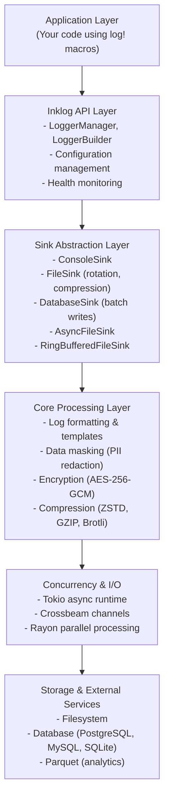

<div align="center">


<p>
  <a href="https://github.com/Kirky-X/inklog/actions/workflows/ci.yml"></a><a href="https://crates.io/crates/inklog"></a><a href="https://docs.rs/inklog"></a><a href="https://crates.io/crates/inklog"></a><a href="https://github.com/Kirky-X/inklog/blob/main/LICENSE"></a><a href="https://www.rust-lang.org/"></a>
</p>

<p align="center">
  <strong>企业级 Rust 日志基础设施</strong>
</p>

<p align="center">
  <a href="#features" style="color:#3B82F6;">✨ 特性</a> •
  <a href="#quick-start" style="color:#3B82F6;">🚀 快速开始</a> •
  <a href="#documentation" style="color:#3B82F6;">📚 文档</a> •
  <a href="#examples" style="color:#3B82F6;">💻 示例</a> •
  <a href="#contributing" style="color:#3B82F6;">🤝 贡献</a>
</p>

</div>

[中文](./README.md)

---

### 🎯 基于 Tokio 构建的高性能、安全、功能丰富的日志基础设施

Inklog 为企业级应用提供**全面**的日志解决方案：

| ⚡ 高性能 | 🔒 安全优先 | 🌐 多目标输出 | 📊 可观测性 |
|:---------:|:----------:|:--------------:|:--------:|
| 基于 Tokio 的异步 I/O | AES-256-GCM 加密 | 控制台、文件、数据库 | 健康监控 |
| 批量写入和压缩 | 密钥内存清零 | 自动轮转 | 指标和追踪 |

```rust
use inklog::{InklogConfig, LoggerManager};
use std::path::PathBuf;

#[tokio::main]
async fn main() -> Result<(), Box<dyn std::error::Error>> {
    let config = InklogConfig {
        file_sink: Some(inklog::FileSinkConfig {
            enabled: true,
            path: "logs/app.log".into(),
            max_size: "100MB".into(),
            compress: true,
            ..Default::default()
        }),
        ..Default::default()
    };

    let _logger = LoggerManager::with_config(config).await?;

    log::info!("Application started successfully");
    log::error!("Something went wrong with error details");

    Ok(())
}
```

---

## 📋 目录

<details open style="border-radius:8px; padding:16px; border:1px solid #E2E8F0;">
<summary style="cursor:pointer; font-weight:600; color:#1E293B;">📑 目录（点击展开）</summary>

- [✨ 特性](#features)
- [🚀 快速开始](#quick-start)
  - [📦 安装](#installation)
  - [💡 基础用法](#basic-usage)
  - [🔧 高级配置](#advanced-configuration)
- [🎨 特性标志](#feature-flags)
- [📚 文档](#documentation)
- [💻 示例](#examples)
- [🏗️ 架构](#architecture)
- [🔒 安全](#security)
- [🧪 测试](#testing)
- [🤝 贡献](#contributing)
- [📋 更新日志](#更新日志)
- [📄 许可证](#license)
- [🙏 致谢](#acknowledgments)

</details>

---

## <span id="features">✨ 特性</span>

<div align="center" style="margin: 24px 0;">

| 🎯 核心特性 | ⚡ 企业特性 |
|:----------:|:----------:|
| 始终可用 | 可选 |

</div>

<table style="width:100%; border-collapse: collapse;">
<tr>
<td width="50%" style="vertical-align:top; padding: 16px; border-radius:8px; border:1px solid #E2E8F0;">

### 🎯 核心特性（始终可用）

| 状态 | 特性 | 描述 |
|:----:|------|------|
| ✅ | **异步 I/O** | 基于 Tokio 的非阻塞日志 |
| ✅ | **多目标输出** | 控制台、文件、数据库、自定义 Sink |
| ✅ | **结构化日志** | 集成 tracing 生态系统 |
| ✅ | **自定义格式化** | 基于模板的日志格式 |
| ✅ | **文件轮转** | 基于大小和时间的轮转 |
| ✅ | **数据脱敏** | 基于正则的 PII 脱敏 |
| ✅ | **健康监控** | Sink 状态和指标追踪 |
| ✅ | **CLI 工具** | decrypt、generate、validate 命令 |

</td>
<td width="50%" style="vertical-align:top; padding: 16px; border-radius:8px; border:1px solid #E2E8F0;">

### ⚡ 企业特性

| 状态 | 特性 | 描述 |
|:----:|------|------|
| 🔍 | **压缩** | 支持 ZSTD、GZIP、Brotli、LZ4（`zstd`、`flate2` 等） |
| 🔒 | **加密** | AES-256-GCM 文件加密（`aes-gcm`） |
| 🗄️ | **数据库日志输出** | 通过 Sea-ORM 支持 PostgreSQL、MySQL、SQLite |
| 📊 | **Parquet 导出** | 适用于分析的日志格式（始终可用） |
| 🌐 | **HTTP 端点** | 基于 Axum 的健康检查服务器（`http` 特性） |
| 🔧 | **CLI 工具** | 日志管理实用命令（`cli` 特性） |

</td>
</tr>
</table>

### 📦 特性预设

| 预设 | 特性 | 使用场景 |
|------|------|----------|
| <span style="color:#166534; padding:4px 8px; border-radius:4px;">minimal</span> | 无可选特性 | 仅核心日志功能 |
| <span style="color:#1E40AF; padding:4px 8px; border-radius:4px;">standard</span> | `http`、`cli` | 标准开发环境 |
| <span style="color:#991B1B; padding:4px 8px; border-radius:4px;">full</span> | 所有默认特性 | 生产就绪日志 |

---

## <span id="quick-start">🚀 快速开始</span>

### <span id="installation">📦 安装</span>

将以下内容添加到你的 `Cargo.toml`：

```toml
[dependencies]
inklog = "0.1"
```

完整特性集：

```toml
[dependencies]
inklog = { version = "0.1", features = ["default"] }
```

### <span id="basic-usage">💡 基础用法</span>

<div align="center" style="margin: 24px 0;">

#### 🎬 5 分钟快速开始

</div>

<table style="width:100%; border-collapse: collapse;">
<tr>
<td width="50%" style="padding: 16px; vertical-align:top;">

**步骤 1：初始化日志器**

```rust
use inklog::LoggerManager;

#[tokio::main]
async fn main() -> Result<(), Box<dyn std::error::Error>> {
    let _logger = LoggerManager::new().await?;

    log::info!("Logger initialized");
    Ok(())
}
```

</td>
<td width="50%" style="padding: 16px; vertical-align:top;">

**步骤 2：记录日志**

```rust
use inklog::LoggerManager;

#[tokio::main]
async fn main() -> Result<(), Box<dyn std::error::Error>> {
    let _logger = LoggerManager::new().await?;

    log::trace!("Trace message");
    log::debug!("Debug message");
    log::info!("Info message");
    log::warn!("Warning message");
    log::error!("Error message");

    Ok(())
}
```

</td>
</tr>
<tr>
<td width="50%" style="padding: 16px; vertical-align:top;">

**步骤 3：文件日志**

```rust
use inklog::{FileSinkConfig, InklogConfig, LoggerManager};

let config = InklogConfig {
    file_sink: Some(FileSinkConfig {
        enabled: true,
        path: "logs/app.log".into(),
        max_size: "10MB".into(),
        rotation_time: "daily".into(),
        keep_files: 7,
        compress: true,
        ..Default::default()
    }),
    ..Default::default()
};

let _logger = LoggerManager::with_config(config).await?;
```

</td>
<td width="50%" style="padding: 16px; vertical-align:top;">

**步骤 4：数据库日志**

```rust
use inklog::{DatabaseSinkConfig, InklogConfig};

let config = InklogConfig {
    database_sink: Some(DatabaseSinkConfig {
        enabled: true,
        url: "sqlite://logs/app.db".to_string(),
        pool_size: 5,
        batch_size: 100,
        flush_interval_ms: 1000,
        ..Default::default()
    }),
    ..Default::default()
};

let _logger = LoggerManager::with_config(config).await?;
```

</td>
</tr>
</table>

### <span id="advanced-configuration">🔧 高级配置</span>

#### 加密文件日志

```rust
use inklog::{FileSinkConfig, InklogConfig};

// Set encryption key from environment
std::env::set_var("INKLOG_ENCRYPTION_KEY", "base64-encoded-32-byte-key");

let config = InklogConfig {
    file_sink: Some(FileSinkConfig {
        enabled: true,
        path: "logs/encrypted.log.enc".into(),
        max_size: "10MB".into(),
        encrypt: true,
        encryption_key_env: Some("INKLOG_ENCRYPTION_KEY".into()),
        compress: false, // Don't compress encrypted logs
        ..Default::default()
    }),
    ..Default::default()
};

let _logger = LoggerManager::with_config(config).await?;
```

#### 自定义日志格式

```rust
use inklog::{InklogConfig, config::GlobalConfig};

let format_string = "[{timestamp}] [{level:>5}] {target} - {message} | {file}:{line}";

let config = InklogConfig {
    global: GlobalConfig {
        level: "debug".into(),
        format: format_string.to_string(),
        masking_enabled: true,
        ..Default::default()
    },
    ..Default::default()
};

let _logger = LoggerManager::with_config(config).await?;
```

---

## <span id="feature-flags">🎨 特性标志</span>

### 默认特性

```toml
inklog = "0.1"  # Includes: http, cli
```

### 可选特性

```toml
# HTTP Server
inklog = { version = "0.1", features = [
    "http",       # Axum HTTP health endpoint
] }

# CLI Tools
inklog = { version = "0.1", features = [
    "cli",        # decrypt, generate, validate commands
] }

# Database Sinks (pick one or more)
inklog = { version = "0.1", features = [
    "sqlite",     # SQLite database sink
    "postgres",   # PostgreSQL database sink
    "mysql",      # MySQL database sink
] }

# Development
inklog = { version = "0.1", features = [
    "test-local", # Local testing mode
    "debug",     # Additional security audit logging
] }
```

### 特性详情

| 特性 | 依赖 | 描述 |
|---------|-------------|-------------|
| **http** | axum | HTTP 健康检查端点 |
| **cli** | clap, glob | 命令行工具 |
| **sqlite** | dbnexus, sea-orm | SQLite 数据库日志输出 |
| **postgres** | dbnexus, sea-orm | PostgreSQL 数据库日志输出 |
| **mysql** | dbnexus, sea-orm | MySQL 数据库日志输出 |
| **duckdb** | dbnexus, sea-orm | DuckDB 后端（仅用于 `--all-features` 测试；DatabaseSink 不直接支持 duckdb 驱动） |
| **test-local** | - | 本地测试模式 |
| **debug** | - | 安全审计日志 |
| **metrics** | - | 健康指标采集 |
| **kit** | trait-kit, dbnexus, oxcache | 依赖注入工具包集成 |

---

## <span id="documentation">📚 文档</span>

<div align="center" style="margin: 24px 0;">

<table style="width:100%; max-width: 800px;">
<tr>
<td align="center" width="33%" style="padding: 16px;">
<a href="https://docs.rs/inklog" style="text-decoration:none;">
<div style="padding: 24px; border-radius:12px; transition: transform 0.2s;">
<b style="color:#1E293B;">📘 API 参考</b>
</div>
</a>
<br><span style="color:#64748B;">完整的 API 文档</span>
</td>
<td align="center" width="33%" style="padding: 16px;">
<a href="examples/" style="text-decoration:none;">
<div style="padding: 24px; border-radius:12px; transition: transform 0.2s;">
<b style="color:#1E293B;">💻 示例</b>
</div>
</a>
<br><span style="color:#64748B;">可运行的代码示例</span>
</td>
<td align="center" width="33%" style="padding: 16px;">
<a href="docs/" style="text-decoration:none;">
<div style="padding: 24px; border-radius:12px; transition: transform 0.2s;">
<b style="color:#1E293B;">📖 指南</b>
</div>
</a>
<br><span style="color:#64748B;">深入指南</span>
</td>
</tr>
</table>

</div>

### 📖 附加资源

| 资源 | 描述 |
|----------|-------------|
| 📘 [API 参考](https://docs.rs/inklog) | docs.rs 上的完整 API 文档 |
| 🏗️ [架构](docs/ARCHITECTURE.md) | 系统架构和设计决策 |
| 🔒 [安全](docs/SECURITY.md) | 安全最佳实践和特性 |
| 📦 [示例](examples/) | 所有特性的可运行代码示例 |

---

## <span id="examples">💻 示例</span>

<div align="center" style="margin: 24px 0;">

### 💡 实际应用示例

</div>

<table style="width:100%; border-collapse: collapse;">
<tr>
<td width="50%" style="padding: 16px; border-radius:8px; border:1px solid #E2E8F0; vertical-align:top;">

#### 📝 基础日志

```rust
use inklog::LoggerManager;

#[tokio::main]
async fn main() -> Result<(), Box<dyn std::error::Error>> {
    let _logger = LoggerManager::new().await?;

    log::info!("Application started");
    log::error!("An error occurred: {}", err);

    Ok(())
}
```

</td>
<td width="50%" style="padding: 16px; border-radius:8px; border:1px solid #E2E8F0; vertical-align:top;">

#### 📁 带轮转的文件日志

```rust
use inklog::{FileSinkConfig, InklogConfig, LoggerManager};

let config = InklogConfig {
    file_sink: Some(FileSinkConfig {
        enabled: true,
        path: "logs/app.log".into(),
        max_size: "10MB".into(),
        rotation_time: "daily".into(),
        keep_files: 7,
        compress: true,
        ..Default::default()
    }),
    ..Default::default()
};

let _logger = LoggerManager::with_config(config).await?;
```

</td>
</tr>
<tr>
<td width="50%" style="padding: 16px; border-radius:8px; border:1px solid #E2E8F0; vertical-align:top;">

#### 🔒 加密日志

```rust
use inklog::{FileSinkConfig, InklogConfig};

std::env::set_var("INKLOG_ENCRYPTION_KEY", "base64-encoded-key");

let config = InklogConfig {
    file_sink: Some(FileSinkConfig {
        enabled: true,
        path: "logs/encrypted.log".into(),
        encrypt: true,
        encryption_key_env: Some("INKLOG_ENCRYPTION_KEY".into()),
        ..Default::default()
    }),
    ..Default::default()
};

let _logger = LoggerManager::with_config(config).await?;
```

</td>
<td width="50%" style="padding: 16px; border-radius:8px; border:1px solid #E2E8F0; vertical-align:top;">

#### 🗄️ 数据库日志

```rust
use inklog::{DatabaseSinkConfig, InklogConfig};

let config = InklogConfig {
    database_sink: Some(DatabaseSinkConfig {
        enabled: true,
        url: "postgresql://localhost/logs".to_string(),
        pool_size: 10,
        batch_size: 100,
        flush_interval_ms: 1000,
        ..Default::default()
    }),
    ..Default::default()
};

let _logger = LoggerManager::with_config(config).await?;
```

</td>
</tr>
<tr>
<td width="50%" style="padding: 16px; border-radius:8px; border:1px solid #E2E8F0; vertical-align:top;">

#### 🏥 HTTP 健康检查端点

```rust
use axum::{routing::get, Json, Router};
use inklog::LoggerManager;
use std::sync::Arc;

let logger = Arc::new(LoggerManager::new().await?);

let app = Router::new().route(
    "/health",
    get({
        let logger = logger.clone();
        || async move { Json(logger.get_health_status()) }
    }),
);

// Start HTTP server...
```

</td>
</tr>
<tr>
<td width="50%" style="padding: 16px; border-radius:8px; border:1px solid #E2E8F0; vertical-align:top;">

#### 🎨 自定义格式

```rust
use inklog::{InklogConfig, config::GlobalConfig};

let format_string = "[{timestamp}] [{level:>5}] {target} - {message}";

let config = InklogConfig {
    global: GlobalConfig {
        level: "debug".into(),
        format: format_string.to_string(),
        masking_enabled: true,
        ..Default::default()
    },
    ..Default::default()
};

let _logger = LoggerManager::with_config(config).await?;
```

</td>
<td width="50%" style="padding: 16px; border-radius:8px; border:1px solid #E2E8F0; vertical-align:top;">

#### 🔍 数据脱敏

```rust
use inklog::{InklogConfig, config::GlobalConfig};

let config = InklogConfig {
    global: GlobalConfig {
        level: "info".into(),
        format: "{timestamp} {level} {message}".to_string(),
        masking_enabled: true,  // Enable PII masking
        ..Default::default()
    },
    ..Default::default()
};

let _logger = LoggerManager::with_config(config).await?;

// Sensitive data will be automatically masked
log::info!("User email: user@example.com");
// Output: User email: ***@***.***
```

</td>
</tr>
</table>

### 📦 可运行示例

`examples/` crate 提供了 10 个专门的示例，演示特定功能。使用 `cargo run --example <name>` 运行（在 `examples/` 目录下或使用 `--package inklog-examples`）。

| 示例 | 描述 | 运行命令 |
|---------|-------------|-------------|
| `object_pool` | 对象池复用，适用于频繁分配的场景 | `cargo run --example object_pool` |
| `path_validator` | 路径验证，确保文件 Sink 目标安全 | `cargo run --example path_validator` |
| `log_sanitizer` | 日志输入净化，防止日志注入 | `cargo run --example log_sanitizer` |
| `log_adapter` | 桥接 `log` 和 `tracing` 生态系统 | `cargo run --example log_adapter` |
| `compression` | 文件 Sink 压缩（ZSTD/GZIP/Brotli/LZ4） | `cargo run --example compression` |
| `rotation` | 基于大小和时间的文件轮转 | `cargo run --example rotation` |
| `ring_buffered_file` | 环形缓冲文件 Sink，适用于高吞吐场景 | `cargo run --example ring_buffered_file` |
| `config_file` | TOML 配置文件加载 | `cargo run --example config_file` |
| `metrics` | 健康指标和 Prometheus 导出 | `cargo run --example metrics` |
| `circuit_breaker` | Sink 熔断器和故障恢复 | `cargo run --example circuit_breaker` |

<div align="center" style="margin: 24px 0;">

**[📂 查看所有示例 →](examples/)**

</div>

> **注意**：`inklog-examples` 现在是 workspace 的一部分。

---

## <span id="architecture">🏗️ 架构</span>

<div align="center" style="margin: 24px 0;">

### 🏗️ 系统架构

</div>



### 逐层说明

**应用层**
- 应用代码使用 `log` crate 的标准 `log!` 宏
- 兼容现有的 Rust 日志模式

**Inklog API 层**
- `LoggerManager`：所有日志操作的主要协调器
- `LoggerBuilder`：流式构建器模式用于配置
- 健康状态追踪和指标采集

**Sink 抽象层**
- 针对不同输出目标的多种 Sink 实现
- 用于开发环境的控制台输出
- 支持轮转、压缩和加密的文件输出
- 支持批量写入的数据库输出（PostgreSQL、MySQL、SQLite）
- 用于高吞吐场景的异步和缓冲文件 Sink

**核心处理层**
- 基于模板的日志格式化
- 基于正则的 PII 数据脱敏（邮箱、SSN、信用卡）
- 用于敏感日志的 AES-256-GCM 加密
- 多种压缩算法（ZSTD、GZIP、Brotli、LZ4）

**并发与 I/O 层**
- 用于非阻塞 I/O 的 Tokio 异步运行时
- 用于任务间通信的 Crossbeam 通道
- 用于 CPU 密集型并行处理的 Rayon

**存储与外部服务层**
- 本地文件系统访问
- 通过 Sea-ORM 实现的数据库连接
- 用于分析工作流的 Parquet 格式

---

## <span id="security">🔒 安全</span>

<div align="center" style="margin: 24px 0;">

### 🛡️ 安全特性

</div>

Inklog 将安全作为最高优先级来构建：

#### 🔒 加密

- **AES-256-GCM**：用于日志文件的军事级加密
- **密钥管理**：基于环境变量的密钥注入
- **内存清零**：通过 `zeroize` crate 在使用后安全清除密钥
- **SHA-256 哈希**：用于加密日志的完整性验证

#### 🎭 数据脱敏

- **基于正则的模式**：自动 PII 检测和脱敏
- **邮箱脱敏**：`user@example.com` → `***@***.***`
- **SSN 脱敏**：信用卡和社会安全号码脱敏
- **自定义模式**：可配置的正则表达式模式用于敏感数据

#### 🔐 安全密钥处理

```rust
// Set encryption key securely from environment
std::env::set_var("INKLOG_ENCRYPTION_KEY", "base64-encoded-32-byte-key");

// Key is automatically zeroized after use
// Never hardcode keys in your application
```

#### 🛡️ 安全最佳实践

- **无硬编码密钥**：密钥从环境变量加载
- **最小权限操作**：仅必要的文件/数据库访问
- **审计日志**：用于安全审计追踪的 Debug 特性
- **合规就绪**：支持 GDPR、HIPAA、PCI-DSS 日志要求

---

## <span id="testing">🧪 测试</span>

<div align="center" style="margin: 24px 0;">

### 🎯 运行测试

</div>

```bash
# Run all tests with default features
cargo test --all-features

# Run tests with specific features
cargo test --features "http,cli"

# Run tests in release mode
cargo test --release

# Run benchmarks
cargo bench
```

### 测试覆盖率

Inklog 目标是 **95%+ 代码覆盖率**：

```bash
# Generate coverage report
cargo tarpaulin --out Html --all-features
```

### 代码检查和格式化

```bash
# Format code
cargo fmt --all

# Check formatting without changes
cargo fmt --all -- --check

# Run Clippy (warnings as errors)
cargo clippy --all-targets --all-features -- -D warnings
```

### 安全审计

```bash
# Run cargo deny for security checks
cargo deny check

# Check for advisories
cargo deny check advisories

# Check for banned licenses
cargo deny check bans
```

### 依赖注入测试

Inklog 提供 Mock 实现，用于在没有外部依赖的情况下进行单元测试：

```rust
use inklog::{LoggerManager, LoggerDependencies};
use inklog::infrastructure::{MockCache, MockConfig, MockDatabaseAdapter};
use std::sync::Arc;

#[tokio::test]
async fn test_with_mocks() -> Result<(), Box<dyn std::error::Error>> {
    // Create Mock dependencies
    let deps = LoggerDependencies {
        cache: Some(Arc::new(MockCache::new())),
        config: Some(Arc::new(MockConfig::new())),
        database: Some(Arc::new(MockDatabaseAdapter::new())),
    };

    // Inject dependencies to create logger
    let logger = LoggerManager::with_dependencies(deps).await?;

    // Test logging...
    log::info!("Test message");

    Ok(())
}
```

**Mock 实现**：
- **MockCache**：内置 HashMap 的内存缓存，支持延迟模拟
- **MockConfig**：运行时可修改的配置
- **MockDatabaseAdapter**：内存日志存储，支持健康状态控制

详细用法请参阅 [用户指南](docs/USER_GUIDE.md#using-mock-implementations-for-testing)。

### 集成测试

```bash
# Run integration tests
cargo test --test '*'

# Run with Docker services (PostgreSQL, MySQL)
docker-compose up -d
cargo test --all-features
docker-compose down
```

---

## <span id="contributing">🤝 贡献</span>

<div align="center" style="margin: 24px 0;">

欢迎贡献！详见 [CONTRIBUTING.md](CONTRIBUTING.md)

</div>

### 开发环境设置

```bash
# Clone repository
git clone https://github.com/Kirky-X/inklog.git
cd inklog

# Install pre-commit hooks (if available)
./scripts/install-pre-commit.sh

# Run tests
cargo test --all-features

# Run linter
cargo clippy --all-features

# Format code
cargo fmt --all
```

### Pull Request 流程

1. Fork 仓库
2. 创建功能分支（`git checkout -b feature/amazing-feature`）
3. 进行修改
4. 运行测试并确保全部通过（`cargo test --all-features`）
5. 运行 clippy 并修复警告（`cargo clippy --all-features`）
6. 提交修改（`git commit -m 'Add amazing feature'`）
7. 推送到分支（`git push origin feature/amazing-feature`）
8. 发起 Pull Request

### 代码风格

- 遵循 Rust 命名规范（变量使用 snake_case，类型使用 PascalCase）
- 错误类型使用 `thiserror`
- 错误上下文使用 `anyhow`
- 为所有公共 API 添加文档注释
- 提交前运行 `cargo fmt`

---

## 📋 更新日志

详见 [CHANGELOG.md](CHANGELOG.md)

---

## <span id="license">📄 许可证</span>

<div align="center" style="margin: 24px 0;">

本项目基于 **MIT 许可证** 授权。

[](LICENSE)

</div>

MIT 许可证，版权所有 (c) 2026 Kirky.X

---

## <span id="acknowledgments">🙏 致谢</span>

<div align="center" style="margin: 24px 0;">

### 🌟 基于优秀工具构建

</div>

没有这些优秀的项目，Inklog 将无法实现：

- [tracing](https://github.com/tokio-rs/tracing) - Rust 结构化日志的基础
- [tokio](https://tokio.rs/) - Rust 的异步运行时
- [Sea-ORM](https://www.sea-ql.org/SeaORM/) - 用于数据库操作的异步 ORM
- [axum](https://github.com/tokio-rs/axum) - 用于 HTTP 端点的 Web 框架
- [serde](https://serde.rs/) - 序列化框架
- 整个 Rust 生态系统提供的优秀工具和库

---

## 📞 支持

<div align="center" style="margin: 24px 0;">

<table style="width:100%; max-width: 600px;">
<tr>
<td align="center" width="33%">
<a href="https://github.com/Kirky-X/inklog/issues">
<div style="padding: 16px; border-radius:8px;">
<b style="color:#991B1B;">📋 问题</b>
</div>
</a>
<br><span style="color:#64748B;">报告 Bug 和问题</span>
</td>
<td align="center" width="33%">
<a href="https://github.com/Kirky-X/inklog/discussions">
<div style="padding: 16px; border-radius:8px;">
<b style="color:#1E40AF;">💬 讨论</b>
</div>
</a>
<br><span style="color:#64748B;">提问和分享想法</span>
</td>
<td align="center" width="33%">
<a href="https://github.com/Kirky-X/inklog">
<div style="padding: 16px; border-radius:8px;">
<b style="color:#1E293B;">🐙 GitHub</b>
</div>
</a>
<br><span style="color:#64748B;">查看源代码</span>
</td>
</tr>
</table>

</div>

---

## ⭐ Star 历史

<div align="center">

[](https://star-history.com/#Kirky-X/inklog&Date)

</div>

---

<div align="center" style="margin: 32px 0; padding: 24px; border-radius: 12px;">

### 💝 支持本项目

如果你觉得这个项目有用，请考虑给它一个 ⭐️！

**由 Inklog 团队用 ❤️ 构建**

---

**[⬆ 返回顶部](#inklog)**

---

<sub>© 2026 Inklog 项目。保留所有权利。</sub>

</div>
