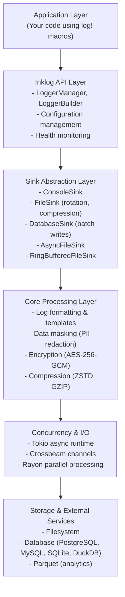

<div align="center">


[](https://github.com/Kirky-X/inklog/actions/workflows/ci.yml) [](https://crates.io/crates/inklog) [](https://docs.rs/inklog) [](https://crates.io/crates/inklog) [](LICENSE) [](https://www.rust-lang.org/) [](https://codecov.io/gh/Kirky-X/inklog)

**[中文](README.md)** | English

**Enterprise-grade Rust Logging Infrastructure**

[✨ Features](#-features) • [🚀 Quick Start](#-quick-start) • [📚 Documentation](#-documentation) • [💻 Examples](#-examples) • [🤝 Contributing](#-contributing)

</div>

---

### 🎯 A high-performance, secure, feature-rich logging infrastructure built on Tokio

Inklog provides a **comprehensive** logging solution for enterprise applications:

| ⚡ High Performance | 🔒 Security First | 🌐 Multi-Target Output | 📊 Observability |
|:---------:|:----------:|:--------------:|:--------:|
| Tokio-based async I/O | AES-256-GCM encryption | Console, file, database | Health monitoring |
| Batch writes and compression | Key memory zeroing | Auto-rotation | Metrics and tracing |

```rust
use inklog::{InklogConfig, LoggerManager};
use std::path::PathBuf;

#[tokio::main]
async fn main() -> Result<(), Box<dyn std::error::Error>> {
    let config = InklogConfig {
        file_sink: Some(inklog::FileSinkConfig {
            enabled: true,
            path: "logs/app.log".into(),
            max_size: "100MB".into(),
            compress: true,
            ..Default::default()
        }),
        ..Default::default()
    };

    let _logger = LoggerManager::with_config(config).await?;

    log::info!("Application started successfully");
    log::error!("Something went wrong with error details");

    Ok(())
}
```

---

## 📋 Table of Contents

<details open>
<summary>📑 Table of Contents (Click to expand)</summary>

- [✨ Features](#-features)
- [🚀 Quick Start](#-quick-start)
  - [📦 Installation](#-installation)
  - [💡 Basic Usage](#-basic-usage)
  - [🔧 Advanced Configuration](#-advanced-configuration)
- [🎨 Feature Flags](#-feature-flags)
- [📚 Documentation](#-documentation)
- [💻 Examples](#-examples)
- [🏗️ Architecture](#️-architecture)
- [🧪 Testing](#-testing)
- [📊 Performance](#-performance)
- [🔒 Security](#-security)
- [🗺️ Roadmap](#️-roadmap)
- [🤝 Contributing](#-contributing)
- [📋 Changelog](#-changelog)
- [📄 License](#-license)
- [🙏 Acknowledgments](#-acknowledgments)
- [📞 Contact & Support](#-contact--support)
- [⭐ Star History](#-star-history)

</details>

---

## ✨ Features

| 🎯 Core Features | ⚡ Enterprise Features |
|:----------:|:----------:|
| Always Available | Optional |

<table style="width:100%; border-collapse: collapse;">
<tr>
<td width="50%" style="vertical-align:top; padding: 16px; border-radius:8px; border:1px solid #E2E8F0;">

### 🎯 Core Features (Always Available)

| Status | Feature | Description |
|:----:|------|------|
| ✅ | **Async I/O** | Non-blocking logging based on Tokio |
| ✅ | **Multi-Target Output** | Console, file, database, custom Sink |
| ✅ | **Structured Logging** | Integrated with tracing ecosystem |
| ✅ | **Custom Formatting** | Template-based log format |
| ✅ | **File Rotation** | Size-based and time-based rotation |
| ✅ | **Data Masking** | Regex-based PII redaction |
| ✅ | **Health Monitoring** | Sink status and metrics tracking |
| ✅ | **CLI Tools** | decrypt, generate, validate commands (`cli` feature) |

</td>
<td width="50%" style="vertical-align:top; padding: 16px; border-radius:8px; border:1px solid #E2E8F0;">

### ⚡ Enterprise Features

| Status | Feature | Description |
|:----:|------|------|
| 🔍 | **Compression** | ZSTD, GZIP support |
| 🔒 | **Encryption** | AES-256-GCM file encryption |
| 🗄️ | **Database Sink** | PostgreSQL, MySQL, SQLite, DuckDB via dbnexus |
| 📊 | **Parquet Export** | Analytics-ready log format |
| 🌐 | **HTTP Endpoint** | Axum-based health check server (`http` feature) |
| 🔧 | **CLI Tools** | Log management utility commands (`cli` feature) |

</td>
</tr>
</table>

### 📦 Feature Presets

| Preset | Features | Use Case |
|------|------|----------|
| <span style="color:#166534; padding:4px 8px; border-radius:4px;">minimal</span> | No optional features | Core logging only |
| <span style="color:#1E40AF; padding:4px 8px; border-radius:4px;">standard</span> | `http`, `cli` | Standard development environment |
| <span style="color:#991B1B; padding:4px 8px; border-radius:4px;">full</span> | All default features | Production-ready logging |
| <span style="color:#9333EA; padding:4px 8px; border-radius:4px;">test-utils</span> | `MockCache`/`MockConfig`/`MockDatabaseAdapter` | External test consumers: the three mocks have been removed from the default public API (BREAKING); integration tests are fully real (DbNexusAdapter + sqlite) — only external test code needs to enable this feature explicitly |

---

## 🚀 Quick Start

### 📦 Installation

Add this to your `Cargo.toml`:

```toml
[dependencies]
inklog = "0.3.0-rc.2"
```

Full feature set (explicit opt-in):

```toml
[dependencies]
inklog = { version = "0.3.0-rc.2", default-features = false, features = ["http", "cli", "sqlite"] }
```

### 💡 Basic Usage

<div align="center" style="margin: 24px 0;">

#### 🎬 5-Minute Quick Start

</div>

<table style="width:100%; border-collapse: collapse;">
<tr>
<td width="50%" style="padding: 16px; vertical-align:top;">

**Step 1: Initialize Logger**

```rust
use inklog::LoggerManager;

#[tokio::main]
async fn main() -> Result<(), Box<dyn std::error::Error>> {
    let _logger = LoggerManager::new().await?;

    log::info!("Logger initialized");
    Ok(())
}
```

</td>
<td width="50%" style="padding: 16px; vertical-align:top;">

**Step 2: Record Logs**

```rust
use inklog::LoggerManager;

#[tokio::main]
async fn main() -> Result<(), Box<dyn std::error::Error>> {
    let _logger = LoggerManager::new().await?;

    log::trace!("Trace message");
    log::debug!("Debug message");
    log::info!("Info message");
    log::warn!("Warning message");
    log::error!("Error message");

    Ok(())
}
```

</td>
</tr>
<tr>
<td width="50%" style="padding: 16px; vertical-align:top;">

**Step 3: File Logging**

```rust
use inklog::{FileSinkConfig, InklogConfig, LoggerManager};

let config = InklogConfig {
    file_sink: Some(FileSinkConfig {
        enabled: true,
        path: "logs/app.log".into(),
        max_size: "10MB".into(),
        rotation_time: "daily".into(),
        keep_files: 7,
        compress: true,
        ..Default::default()
    }),
    ..Default::default()
};

let _logger = LoggerManager::with_config(config).await?;
```

</td>
<td width="50%" style="padding: 16px; vertical-align:top;">

**Step 4: Database Logging**

```rust
use inklog::{DatabaseSinkConfig, InklogConfig};

let config = InklogConfig {
    database_sink: Some(DatabaseSinkConfig {
        enabled: true,
        url: "sqlite://logs/app.db".to_string(),
        pool_size: 5,
        batch_size: 100,
        flush_interval_ms: 1000,
        ..Default::default()
    }),
    ..Default::default()
};

let _logger = LoggerManager::with_config(config).await?;
```

</td>
</tr>
</table>

### 🔧 Advanced Configuration

#### Encrypted File Logging

```rust
use inklog::{FileSinkConfig, InklogConfig};

// Set encryption key from environment
std::env::set_var("INKLOG_ENCRYPTION_KEY", "base64-encoded-32-byte-key");

let config = InklogConfig {
    file_sink: Some(FileSinkConfig {
        enabled: true,
        path: "logs/encrypted.log.enc".into(),
        max_size: "10MB".into(),
        encrypt: true,
        encryption_key_env: Some("INKLOG_ENCRYPTION_KEY".into()),
        compress: false, // Don't compress encrypted logs
        ..Default::default()
    }),
    ..Default::default()
};

let _logger = LoggerManager::with_config(config).await?;
```

#### Custom Log Format

```rust
use inklog::{InklogConfig, config::GlobalConfig};

let format_string = "[{timestamp}] [{level:>5}] {target} - {message} | {file}:{line}";

let config = InklogConfig {
    global: GlobalConfig {
        level: "debug".into(),
        format: format_string.to_string(),
        masking_enabled: true,
        ..Default::default()
    },
    ..Default::default()
};

let _logger = LoggerManager::with_config(config).await?;
```

---

## 🎨 Feature Flags

### Default Features

```toml
inklog = "0.3.0-rc.2"  # default = [] (no optional features)
```

### Optional Features

```toml
# HTTP Server
inklog = { version = "0.3.0-rc.2", features = [
    "http",       # Axum HTTP health endpoint
] }

# CLI Tools
inklog = { version = "0.3.0-rc.2", features = [
    "cli",        # decrypt, generate, validate commands
] }

# Database Sinks (pick one or more)
inklog = { version = "0.3.0-rc.2", features = [
    "sqlite",     # SQLite database sink
    "postgres",   # PostgreSQL database sink
    "mysql",      # MySQL database sink
] }

# Compression & Performance
inklog = { version = "0.3.0-rc.2", features = [
    "compression",  # ZSTD compression support
    "parquet",      # Parquet export support
    "fast-masking", # Aho-Corasick accelerated masking
] }
```

### Feature Details

| Feature | Dependencies | Description |
|---------|-------------|-------------|
| **http** | axum | HTTP health check endpoint |
| **cli** | clap, glob | CLI tools |
| **sqlite** | dbnexus | SQLite database sink |
| **postgres** | dbnexus | PostgreSQL database sink |
| **mysql** | dbnexus | MySQL database sink |
| **duckdb** | dbnexus | DuckDB database Sink |
| **compression** | zstd | ZSTD compression for rotated log files |
| **parquet** | parquet, arrow-array, arrow-schema | Parquet export support (analytics) |
| **fast-masking** | aho-corasick | Aho-Corasick accelerated multi-pattern masking |
| **kit** | trait-kit, dbnexus, oxcache | trait-kit AsyncKit integration (InklogModule) |
| **test-utils** | — | Test-facing mock exports (MockCache/MockConfig/MockDatabaseAdapter); excluded from default and all production combinations |

> ⚠️ **Database backend exclusivity**: the `sqlite`/`postgres`/`mysql`/`duckdb` backend features are mutually exclusive (enforced via dbnexus). `--all-features` is not supported; enable features grouped by backend instead.

---

## 📚 Documentation

| Document | Description |
|----------|-------------|
| [📖 User Guide](docs/USER_GUIDE.md) | Complete tutorial from installation to advanced usage |
| [📘 API Reference](docs/API_REFERENCE.md) | Detailed description of all public APIs |
| [🏗️ Architecture](docs/ARCHITECTURE.md) | Design philosophy and internal implementation |
| [🔒 Security](docs/SECURITY.md) | Security design and best practices |
| [📋 Changelog](docs/CHANGELOG.md) | Change records for every version |
| [🤝 Contributing](docs/CONTRIBUTING.md) | How to participate in project development |
| [📦 Online API Docs](https://docs.rs/inklog) | Latest docs auto-generated on docs.rs |

---

## 💻 Examples

<table style="width:100%; border-collapse: collapse;">
<tr>
<td width="50%" style="padding: 16px; border-radius:8px; border:1px solid #E2E8F0; vertical-align:top;">

#### 📝 Basic Logging

```rust
use inklog::LoggerManager;

#[tokio::main]
async fn main() -> Result<(), Box<dyn std::error::Error>> {
    let _logger = LoggerManager::new().await?;

    log::info!("Application started");
    log::error!("An error occurred: {}", err);

    Ok(())
}
```

</td>
<td width="50%" style="padding: 16px; border-radius:8px; border:1px solid #E2E8F0; vertical-align:top;">

#### 📁 File Logging with Rotation

```rust
use inklog::{FileSinkConfig, InklogConfig, LoggerManager};

let config = InklogConfig {
    file_sink: Some(FileSinkConfig {
        enabled: true,
        path: "logs/app.log".into(),
        max_size: "10MB".into(),
        rotation_time: "daily".into(),
        keep_files: 7,
        compress: true,
        ..Default::default()
    }),
    ..Default::default()
};

let _logger = LoggerManager::with_config(config).await?;
```

</td>
</tr>
<tr>
<td width="50%" style="padding: 16px; border-radius:8px; border:1px solid #E2E8F0; vertical-align:top;">

#### 🔒 Encrypted Logging

```rust
use inklog::{FileSinkConfig, InklogConfig};

std::env::set_var("INKLOG_ENCRYPTION_KEY", "base64-encoded-key");

let config = InklogConfig {
    file_sink: Some(FileSinkConfig {
        enabled: true,
        path: "logs/encrypted.log".into(),
        encrypt: true,
        encryption_key_env: Some("INKLOG_ENCRYPTION_KEY".into()),
        ..Default::default()
    }),
    ..Default::default()
};

let _logger = LoggerManager::with_config(config).await?;
```

</td>
<td width="50%" style="padding: 16px; border-radius:8px; border:1px solid #E2E8F0; vertical-align:top;">

#### 🗄️ Database Logging

```rust
use inklog::{DatabaseSinkConfig, InklogConfig};

let config = InklogConfig {
    database_sink: Some(DatabaseSinkConfig {
        enabled: true,
        url: "postgresql://localhost/logs".to_string(),
        pool_size: 10,
        batch_size: 100,
        flush_interval_ms: 1000,
        ..Default::default()
    }),
    ..Default::default()
};

let _logger = LoggerManager::with_config(config).await?;
```

</td>
</tr>
<tr>
<td width="50%" style="padding: 16px; border-radius:8px; border:1px solid #E2E8F0; vertical-align:top;">

#### 🏥 HTTP Health Check Endpoint

```rust
use axum::{routing::get, Json, Router};
use inklog::LoggerManager;
use std::sync::Arc;

let logger = Arc::new(LoggerManager::new().await?);

let app = Router::new().route(
    "/health",
    get({
        let logger = logger.clone();
        || async move { Json(logger.get_health_status()) }
    }),
);

// Start HTTP server...
```

</td>
</tr>
<tr>
<td width="50%" style="padding: 16px; border-radius:8px; border:1px solid #E2E8F0; vertical-align:top;">

#### 🎨 Custom Format

```rust
use inklog::{InklogConfig, config::GlobalConfig};

let format_string = "[{timestamp}] [{level:>5}] {target} - {message}";

let config = InklogConfig {
    global: GlobalConfig {
        level: "debug".into(),
        format: format_string.to_string(),
        masking_enabled: true,
        ..Default::default()
    },
    ..Default::default()
};

let _logger = LoggerManager::with_config(config).await?;
```

</td>
<td width="50%" style="padding: 16px; border-radius:8px; border:1px solid #E2E8F0; vertical-align:top;">

#### 🔍 Data Masking

```rust
use inklog::{InklogConfig, config::GlobalConfig};

let config = InklogConfig {
    global: GlobalConfig {
        level: "info".into(),
        format: "{timestamp} {level} {message}".to_string(),
        masking_enabled: true,  // Enable PII masking
        ..Default::default()
    },
    ..Default::default()
};

let _logger = LoggerManager::with_config(config).await?;

// Sensitive data will be automatically masked
log::info!("User email: user@example.com");
// Output: User email: ***@***.***
```

</td>
</tr>
</table>

### 📦 Runnable Examples

`examples/` is a standalone workspace crate (`inklog-examples`) organized into 7 categories with 39 examples in total. Run them from the repository root with `cargo run --package inklog-examples --example <name>` (or `cargo run --example <name>` from inside `examples/`). Some examples require the corresponding feature (e.g. `sqlite`, `postgres`, `compression`, `parquet`).

#### Configuration (config)

| Example | Description | Run Command |
|---------|-------------|-------------|
| `config_file` | Configuration file loading (Layer 1, local resources) | `cargo run --package inklog-examples --example config_file` |
| `config_inspect` | Config inspect: `sinks_enabled()` + `LoggerManager::load()` | `cargo run --package inklog-examples --example config_inspect` |
| `env_overrides` | Environment variable override loading | `cargo run --package inklog-examples --example env_overrides` |

#### Core (core)

| Example | Description | Run Command |
|---------|-------------|-------------|
| `basic` | Basic usage | `cargo run --package inklog-examples --example basic` |
| `builder` | Builder pattern configuration | `cargo run --package inklog-examples --example builder` |
| `all_features` | Full feature demonstration | `cargo run --package inklog-examples --example all_features` |
| `production` | Production environment configuration | `cargo run --package inklog-examples --example production` |
| `template` | Log templates | `cargo run --package inklog-examples --example template` |
| `error_handling` | Error handling (Layer 0, zero dependencies) | `cargo run --package inklog-examples --example error_handling` |
| `i18n` | Internationalization (i18n) formatting | `cargo run --package inklog-examples --example i18n` |

#### Sinks & Output (sinks)

| Example | Description | Run Command |
|---------|-------------|-------------|
| `console` | Console Sink | `cargo run --package inklog-examples --example console` |
| `file` | File Sink | `cargo run --package inklog-examples --example file` |
| `rotation` | Log rotation (Layer 1, local resources) | `cargo run --package inklog-examples --example rotation` |
| `compression` | Zstd compression/decompression (requires `compression` feature) | `cargo run --package inklog-examples --example compression` |
| `ring_buffered_file` | ChannelBufferedFileSink (Layer 1, local resources) | `cargo run --package inklog-examples --example ring_buffered_file` |
| `archive_format` | Archive format (Layer 0, zero dependencies) | `cargo run --package inklog-examples --example archive_format` |
| `parquet_archive` | Parquet archival (requires `parquet` feature) | `cargo run --package inklog-examples --example parquet_archive` |
| `partition_strategy` | Database partitioning strategies | `cargo run --package inklog-examples --example partition_strategy` |

#### Database (database)

| Example | Description | Run Command |
|---------|-------------|-------------|
| `database` | Database Sink with in-memory SQLite (requires `sqlite` feature) | `cargo run --package inklog-examples --features sqlite --example database` |
| `database_pg_mysql` | PostgreSQL/MySQL database drivers | `cargo run --package inklog-examples --example database_pg_mysql` |
| `di_example` | DI (Dependency Injection) pattern | `cargo run --package inklog-examples --example di_example` |

#### Infrastructure (infra)

| Example | Description | Run Command |
|---------|-------------|-------------|
| `channel_strategy` | Adaptive channel strategy | `cargo run --package inklog-examples --example channel_strategy` |
| `circuit_breaker` | Circuit breaker (Layer 2, external services) | `cargo run --package inklog-examples --example circuit_breaker` |
| `fallback` | Sink fallback/degradation | `cargo run --package inklog-examples --example fallback` |
| `log_adapter` | `log` crate adapter bridge (Layer 0, zero dependencies) | `cargo run --package inklog-examples --example log_adapter` |
| `log_level` | LogLevel parsing/comparison/Display | `cargo run --package inklog-examples --example log_level` |
| `metrics` | Health monitoring and metrics collection (Layer 2, external services) | `cargo run --package inklog-examples --example metrics` |
| `object_pool` | Object pool (Layer 0, zero dependencies) | `cargo run --package inklog-examples --example object_pool` |
| `output_format` | Output formats (Layer 0, zero dependencies) | `cargo run --package inklog-examples --example output_format` |
| `performance` | Performance testing | `cargo run --package inklog-examples --example performance` |
| `rate_limiter` | Rate limiter (Layer 0, zero dependencies) | `cargo run --package inklog-examples --example rate_limiter` |
| `runtime_ops` | LoggerManager runtime operations API | `cargo run --package inklog-examples --example runtime_ops` |

#### Network (network)

| Example | Description | Run Command |
|---------|-------------|-------------|
| `http` | HTTP health check and metrics endpoints | `cargo run --package inklog-examples --example http` |
| `http_auth` | HTTP authentication and IP allowlist | `cargo run --package inklog-examples --example http_auth` |
| `tls_config` | TLS configuration | `cargo run --package inklog-examples --example tls_config` |

#### Security (security)

| Example | Description | Run Command |
|---------|-------------|-------------|
| `encryption` | Log encryption | `cargo run --package inklog-examples --example encryption` |
| `log_sanitizer` | Log content sanitization (Layer 0, zero dependencies) | `cargo run --package inklog-examples --example log_sanitizer` |
| `masking` | Data masking | `cargo run --package inklog-examples --example masking` |
| `path_validator` | Path validator (Layer 0, zero dependencies) | `cargo run --package inklog-examples --example path_validator` |

<div align="center" style="margin: 24px 0;">

**[📂 View all examples →](examples/)**

</div>

---

## 🏗️ Architecture

> For the complete architecture design, data flow, and extension points, see the [🏗️ Architecture document](docs/ARCHITECTURE.md).

<div align="center" style="margin: 24px 0;">

### 🏗️ System Architecture

</div>


```mermaid
flowchart TD
    App["Application Layer<br/>(Your code using log! macros)"]
    API["Inklog API Layer<br/>- LoggerManager, LoggerBuilder<br/>- Configuration management<br/>- Health monitoring"]
    Sink["Sink Abstraction Layer<br/>- ConsoleSink<br/>- FileSink (rotation, compression)<br/>- DatabaseSink (batch writes)<br/>- AsyncFileSink<br/>- RingBufferedFileSink"]
    Core["Core Processing Layer<br/>- Log formatting & templates<br/>- Data masking (PII redaction)<br/>- Encryption (AES-256-GCM)<br/>- Compression (ZSTD, GZIP)"]
    IO["Concurrency & I/O<br/>- Tokio async runtime<br/>- Crossbeam channels<br/>- Rayon parallel processing"]
    Store["Storage & External Services<br/>- Filesystem<br/>- Database (PostgreSQL, MySQL, SQLite, DuckDB)<br/>- Parquet (analytics)"]

    App --> API --> Sink --> Core --> IO --> Store
```

### Layer Descriptions

**Application Layer**
- Application code uses the standard `log!` macros from the `log` crate
- Compatible with existing Rust logging patterns

**Inklog API Layer**
- `LoggerManager`: Main coordinator for all log operations
- `LoggerBuilder`: Fluent builder pattern for configuration
- Health status tracking and metrics collection

**Sink Abstraction Layer**
- Multiple Sink implementations for different output targets
- Console output for development environments
- File output with rotation, compression, and encryption
- Database output with batch writes (PostgreSQL, MySQL, SQLite, DuckDB)
- Async and buffered file sinks for high-throughput scenarios

**Core Processing Layer**
- Template-based log formatting
- Regex-based PII data masking (email, SSN, credit cards)
- AES-256-GCM encryption for sensitive logs
- Multiple compression algorithms (ZSTD, GZIP)

**Concurrency & I/O Layer**
- Tokio async runtime for non-blocking I/O
- Crossbeam channels for inter-task communication
- Rayon for CPU-intensive parallel processing

**Storage & External Services Layer**
- Local filesystem access
- Database connections via Sea-ORM
- Parquet format for analytics workflows

---

## 🧪 Testing

<div align="center" style="margin: 24px 0;">

### 🎯 Run Tests

</div>

```bash
# ⚠️ Database backend features (sqlite/postgres/mysql/duckdb) are mutually
# exclusive (enforced via dbnexus); --all-features is NOT supported.
# Run tests grouped by backend instead:
cargo test --features "http,cli,compression,parquet,fast-masking"             # no DB backend
cargo test --features "sqlite,http,cli,compression,parquet,fast-masking,kit"  # SQLite backend

# Run tests in release mode
cargo test --release

# Run benchmarks
cargo bench
```

> **Locale note**: error messages are localized via ICU/Fluent based on the system
> locale. If tests assert English message text, set `INKLOG_LOCALE=en` (e.g. in CI
> or non-English environments) to pin the output language.

### Test Coverage

Inklog targets **95%+ code coverage**:

```bash
# Generate coverage report
cargo tarpaulin --out Html --all-features
```

### Code Checking and Formatting

```bash
# Format code
cargo fmt --all

# Check formatting without changes
cargo fmt --all -- --check

# Run Clippy (warnings as errors)
cargo clippy --all-targets --all-features -- -D warnings
```

### Security Audit

```bash
# Run cargo deny for security checks
cargo deny check

# Check for advisories
cargo deny check advisories

# Check for banned licenses
cargo deny check bans
```

### Dependency Injection Testing

> ⚠️ Since 0.3.0-rc.2, `MockCache`/`MockConfig`/`MockDatabaseAdapter` have been removed from the default public API (BREAKING); external test code must enable the `test-utils` feature explicitly.

Inklog provides Mock implementations for unit testing without external dependencies:

```rust
use inklog::{LoggerManager, LoggerDependencies};
use inklog::{MockCache, MockConfig, MockDatabaseAdapter};
use std::sync::Arc;

#[tokio::test]
async fn test_with_mocks() -> Result<(), Box<dyn std::error::Error>> {
    // Create Mock dependencies
    let deps = LoggerDependencies {
        cache: Some(Arc::new(MockCache::new())),
        config: Some(Arc::new(MockConfig::new())),
        #[cfg(any(feature = "sqlite", feature = "postgres", feature = "mysql"))]
        database: Some(Arc::new(MockDatabaseAdapter::new())),
        ..Default::default()
    };

    // Inject dependencies to create logger
    let logger = LoggerManager::with_dependencies(deps).await?;

    // Test logging...
    log::info!("Test message");

    Ok(())
}
```

**Mock Implementations**:
- **MockCache**: In-memory cache backed by HashMap, supports latency simulation
- **MockConfig**: Runtime-modifiable configuration
- **MockDatabaseAdapter**: In-memory log storage with health status control

See the [User Guide](docs/USER_GUIDE.md#使用-mock-实现进行测试) for detailed usage.

### Integration Testing

```bash
# Run integration tests
cargo test --test '*'

# Run with Docker services (PostgreSQL, MySQL)
docker-compose up -d
cargo test --all-features
docker-compose down
```

---

## 📊 Performance

Inklog optimizes the logging path through async I/O, batch writes, bounded queues, and memory pooling. The following design highlights and reference figures are recorded in the "Performance Considerations" chapter of the [architecture document](docs/ARCHITECTURE.md):

### Batch Writes

- **FileSink**: line-level writes + `BufWriter` to reduce syscalls
- **DatabaseSink**: buffered batch flushing (`batch_size` defaults to 100, flush interval defaults to 500ms)

| Strategy | DB Transactions | I/O Cost | Throughput (reference) |
|----------|----------------|----------|------------------------|
| Per-record insert | N (auto-commit) | High | ~100/s |
| Batch of 100 | Single transaction | Low | ~10,000/s |

> The table above reproduces the strategy comparison recorded in docs/ARCHITECTURE.md; actual throughput varies with hardware, database, and configuration.

### Queue & Backpressure

- Bounded Crossbeam channel (`channel_capacity` defaults to 10,000) prevents memory exhaustion; senders block when the queue is full
- 3 worker threads by default (`worker_threads`, tunable via `PerformanceConfig`)
- Channel usage is exposed through health metrics and exportable as a Prometheus metric (`inklog_channel_usage`)

### Compression

- ZSTD compression levels 0–22 (default 3, compression ratio ~3.5x); higher levels compress more but run slower

### Benchmarks

The project maintains Criterion benchmarks (`benches/inklog_bench.rs`):

```bash
cargo bench
```

`examples/src/bin/infra/performance.rs` provides a runnable performance example.

> Note: no official cross-version benchmark report is published in the repository yet (there is no PERFORMANCE.md or benchmarks/ directory under docs/). You are welcome to benchmark on your target hardware with the tools above and share the results.

---

## 🔒 Security

Inklog is built with security as the highest priority. For the complete security design, vulnerability reporting process, and best practices, see the [🔒 Security document](docs/SECURITY.md).

#### 🔒 Encryption

- **AES-256-GCM**: Military-grade encryption for log files
- **Key Management**: Environment variable-based key injection
- **Memory Zeroing**: Secure key clearing via `zeroize` crate after use
- **SHA-256 Hashing**: Integrity verification for encrypted logs

#### 🎭 Data Masking

- **Regex-based Patterns**: Automated PII detection and masking
- **Email Masking**: `user@example.com` → `***@***.***`
- **ID Masking**: Credit card and social security number masking
- **Custom Patterns**: Configurable regex patterns for sensitive data

#### 🔐 Secure Key Handling

```rust
// Set encryption key securely from environment
std::env::set_var("INKLOG_ENCRYPTION_KEY", "base64-encoded-32-byte-key");

// Key is automatically zeroized after use
// Never hardcode keys in your application
```

#### 🛡️ Security Best Practices

- **No Hardcoded Keys**: Keys loaded from environment variables
- **Least Privilege**: Only necessary file/database access
- **Audit Logging**: Debug feature for security audit trails
- **Compliance Ready**: Supporting GDPR, HIPAA, PCI-DSS logging requirements

---

## 🗺️ Roadmap

The following phased goals are compiled from the [CHANGELOG](docs/CHANGELOG.md) and the current release plan (timing may adjust with the overall workspace release schedule):

### v0.3.0 Stable Release

- [ ] Complete the 0.3.0-rc.2 → 0.3.0 stable release
- [ ] Upgrade in lockstep with the workspace dependency chain: trait-kit 0.5.0, oxcache 0.5.0, dbnexus 0.6.0

### Quality & CI

- [ ] Group the CI test matrix by database backend (`sqlite`/`postgres`/`mysql`/`duckdb` backend features are mutually exclusive; the current `--all-features` combination does not compile)
- [ ] Provision the MySQL integration test environment (integration tests for that backend are currently blocked by the missing MySQL service)
- [ ] Raise test coverage (llvm-cov baseline is about 80%, moving toward the 95%+ target)

---

## 🤝 Contributing

Contributions are welcome! See [CONTRIBUTING.md](docs/CONTRIBUTING.md) for guidelines.

### Development Setup

```bash
# Clone repository
git clone https://github.com/Kirky-X/inklog.git
cd inklog

# Install pre-commit hooks (if available)
./scripts/install-pre-commit.sh

# Run tests (grouped by database backend, avoid --all-features)
cargo test --features "http,cli,compression,parquet,fast-masking"

# Run linter
cargo clippy --all-targets -- -D warnings

# Format code
cargo fmt --all
```

### Pull Request Process

1. Fork the repository
2. Create a feature branch (`git checkout -b feature/amazing-feature`)
3. Make your changes
4. Run tests and ensure all pass
5. Run clippy and fix warnings
6. Commit your changes (`git commit -m 'Add amazing feature'`)
7. Push to the branch (`git push origin feature/amazing-feature`)
8. Open a Pull Request

### Code Style

- Follow Rust naming conventions (snake_case for variables, PascalCase for types)
- Use `thiserror` for error types
- Use `anyhow` for error context
- Add doc comments for all public APIs
- Run `cargo fmt` before committing

---

## 📋 Changelog

See [CHANGELOG](docs/CHANGELOG.md) for the complete change record.

### Recent Releases

- **0.3.0-rc.2** (2026-09-03): integrated trait-kit 0.5.0-rc.2 and the i18n refactor with a version bump; removed the three mocks from the default public API (BREAKING — external test consumers must enable `test-utils`); cleaned up S3 archival references in docs
- **0.2.0** (2026-08-05): added `compression`/`parquet`/`fast-masking` features and the i18n core module (fluent-bundle + ICU); added ChannelBufferedFileSink, circuit-breaker protection, and the ring-buffered file sink; edition 2024, MSRV 1.94
- **0.1.12** (2026-07-22): added `tests/e2e_advanced.rs` (226 tests) covering boundary and error scenarios across 19 modules

---

## 📄 License

This project is licensed under the [MIT License](LICENSE).

MIT License, Copyright (c) 2026 Kirky.X

---

## 🙏 Acknowledgments

Inklog would not be possible without these outstanding projects:

- [tracing](https://github.com/tokio-rs/tracing) - The foundation of Rust structured logging
- [tokio](https://tokio.rs/) - Rust's asynchronous runtime
- [Sea-ORM](https://www.sea-ql.org/SeaORM/) - Async ORM for database operations
- [axum](https://github.com/tokio-rs/axum) - Web framework for HTTP endpoints
- [serde](https://serde.rs/) - Serialization framework
- The entire Rust ecosystem for amazing tools and libraries

---

## 📞 Contact & Support

<div align="center" style="margin: 24px 0;">

<table style="width:100%; max-width: 600px;">
<tr>
<td align="center" width="33%">
<a href="https://github.com/Kirky-X/inklog/issues">
<div style="padding: 16px; border-radius:8px;">
<b style="color:#991B1B;">📋 Issues</b>
</div>
</a>
<br><span style="color:#64748B;">Report bugs and issues</span>
</td>
<td align="center" width="33%">
<a href="https://github.com/Kirky-X/inklog/discussions">
<div style="padding: 16px; border-radius:8px;">
<b style="color:#1E40AF;">💬 Discussions</b>
</div>
</a>
<br><span style="color:#64748B;">Ask questions and share ideas</span>
</td>
<td align="center" width="33%">
<a href="https://github.com/Kirky-X/inklog">
<div style="padding: 16px; border-radius:8px;">
<b style="color:#1E293B;">🐙 GitHub</b>
</div>
</a>
<br><span style="color:#64748B;">View source code</span>
</td>
</tr>
</table>

</div>

---

## ⭐ Star History

<div align="center">

[](https://star-history.com/#Kirky-X/inklog&Date)

### 💝 Support This Project

If you find this project useful, please consider giving it a ⭐️!

**Built with ❤️ by the Inklog Team**

<sub>© 2026 Inklog Project. All rights reserved.</sub>

**[⬆ Back to Top](#-table-of-contents)**

</div>
