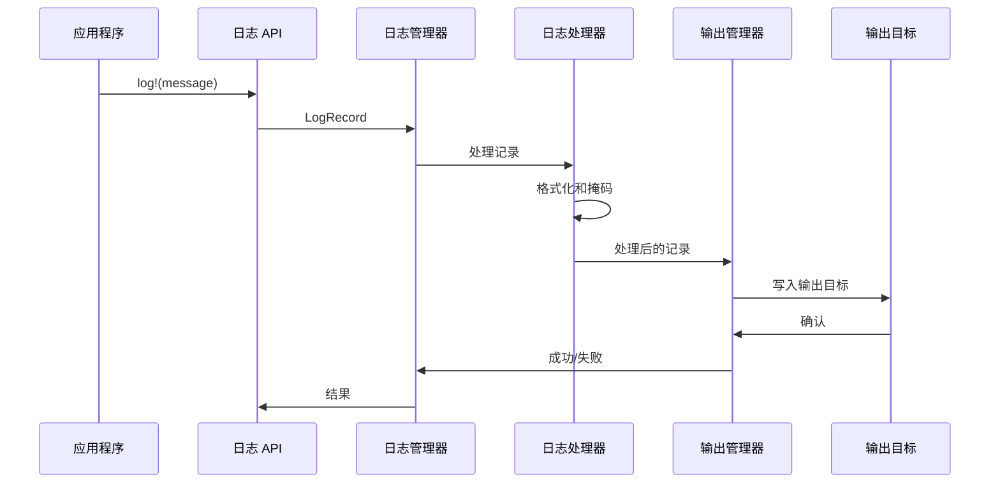
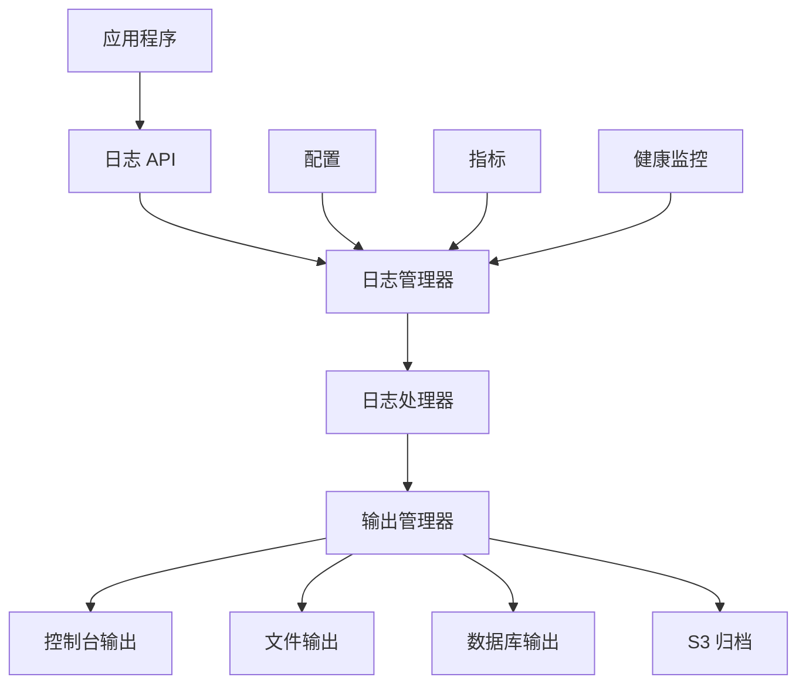
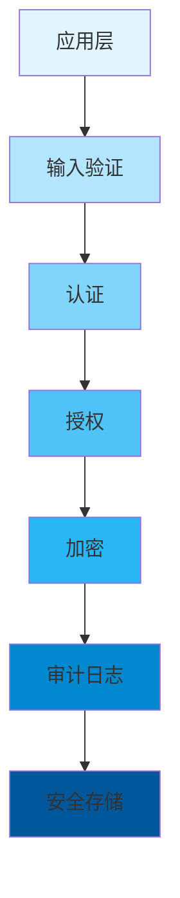
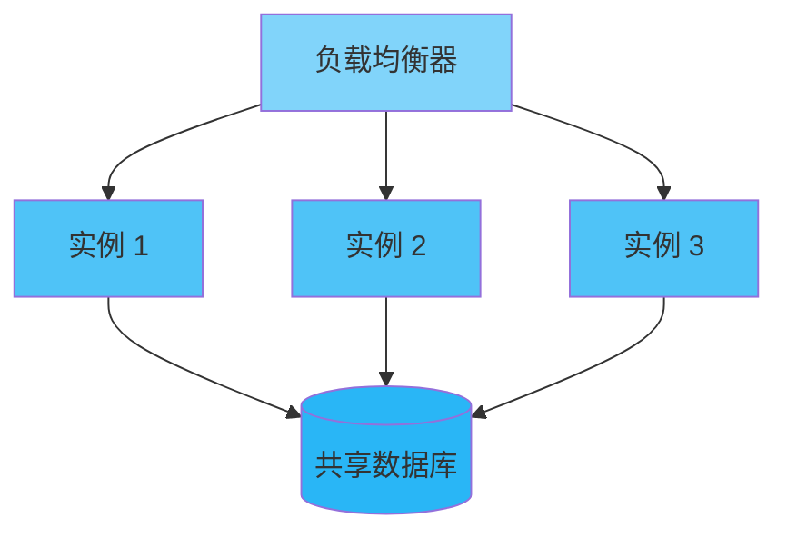

<div align="center">

# 🏗️ 架构设计

### Inklog 的技术架构

[🏠 首页](../README.md) • [📖 用户指南](USER_GUIDE.md) • [🔧 API 参考](API_REFERENCE.md)

---

</div>

## 可扩展性

### 水平扩展

**多实例部署:**
- 每个实例写入共享存储
- 负载均衡器分配日志流量
- 实例之间无共享状态

**存储扩展:**
- 数据库连接池
- S3 用于无限归档存储
- 文件系统分片用于高容量写入

### 垂直扩展

**资源利用:**
- CPU: 多线程日志处理
- 内存: 可配置缓冲区大小
- I/O: 带批处理的异步操作

**性能调优:**
- 通道容量调整
- 工作线程优化
- 批处理大小配置

---

## 组件设计

### 1️⃣ 核心引擎

<details open>
<summary><b>🔧 组件概览</b></summary>

核心引擎是系统的心脏，协调所有操作。

```rust
pub struct CoreEngine {
    config: InklogConfig,
    sender: Sender<LogRecord>,
    metrics: Arc<Metrics>,
    // ...
}
```

**职责:**
- 初始化和配置所有输出目标
- 管理日志记录路由
- 处理错误恢复和回退
- 提供健康监控

#### 日志处理器

处理日志记录的转换和丰富：

```rust
pub struct LogProcessor {
    template: LogTemplate,
    masking_enabled: bool,
    // ...
}
```

**职责:**
- 应用日志格式化模板
- 执行数据掩码
- 添加元数据和时间戳
- 验证日志记录结构

#### 输出管理器

管理多个输出目标并确保可靠交付：

```rust
pub struct SinkManager {
    sinks: HashMap<String, Box<dyn LogSink>>,
    fallback_strategy: FallbackStrategy,
    // ...
}
```

**职责:**
- 管理多个输出目标实例
- 处理输出目标健康监控
- 实现回退策略
- 提供负载均衡

#### 归档服务

处理日志数据的长期存储和归档：

```rust
pub struct ArchiveService {
    s3_client: S3Client,
    config: S3ArchiveConfig,
    scheduler: JobScheduler,
    // ...
}
```

**职责:**
- 调度和执行归档任务
- 管理压缩和加密
- 处理 S3 生命周期策略
- 提供归档元数据

---

## 数据流

### 日志处理流水线



---

## 设计决策

### 1. 多输出目标设计

**决策:** 同时支持多个输出目标

**理由:**
- 为不同部署场景提供灵活性
- 冗余性和可靠性
- 输出目标间的渐进式迁移
- 开发与生产环境配置

**权衡:**
- 增加资源使用
- 跨输出目标的复杂错误处理
- 可能出现不一致状态

### 2. 配置驱动行为

**决策:** 通过 TOML 文件和环境变量进行广泛配置

**理由:**
- 配置更新无需代码更改
- 环境特定配置
- 简化部署自动化
- 清晰的配置与代码分离

**权衡:**
- 配置验证复杂性
- 可能配置错误
- 配置解析的运行时开销

---

## 技术栈

<div align="center">

### 🛠️ 核心技术

</div>

<table>
<tr>
<th>类别</th>
<th>技术</th>
<th>版本</th>
<th>目的</th>
</tr>
<tr>
<td rowspan="2"><b>语言</b></td>
<td>Rust</td>
<td>1.75+</td>
<td>主要语言</td>
</tr>
<tr>
<td>C (FFI)</td>
<td>C11</td>
<td>外部函数接口</td>
</tr>
<tr>
<td><b>日志记录</b></td>
<td>tracing</td>
<td>0.1</td>
<td>日志框架</td>
</tr>
<tr>
<td><b>序列化</b></td>
<td>serde</td>
<td>1.0</td>
<td>数据序列化</td>
</tr>
<tr>
<td><b>错误处理</b></td>
<td>thiserror</td>
<td>1.0</td>
<td>错误类型</td>
</tr>
<tr>
<td><b>测试</b></td>
<td>criterion</td>
<td>0.5</td>
<td>基准测试</td>
</tr>
</table>

### 依赖关系图



---

## 性能考虑

### 吞吐量优化

**通道配置:**
- 默认容量: 10,000 条日志记录
- 基于预期负载可配置
- 满时背压处理

**批处理:**
- 数据库输出: 每批 100 条记录
- 可配置批处理大小
- 超时时自动刷新

### 内存管理

**缓冲区管理:**
- 日志格式化的可重用缓冲区
- 高频分配的内存池

**压缩策略:**
- ZSTD 级别 3 平衡速度/比率
- 大文件的流式压缩
- 高效访问的内存映射文件

---

## 安全架构

<div align="center">

### 🔒 纵深防御

</div>



### 安全层

<table>
<tr>
<th>层</th>
<th>控制</th>
<th>目的</th>
</tr>
<tr>
<td><b>1. 输入验证</b></td>
<td>类型检查、清理</td>
<td>防止注入攻击</td>
</tr>
<tr>
<td><b>2. 认证</b></td>
<td>身份验证</td>
<td>验证用户身份</td>
</tr>
<tr>
<td><b>3. 授权</b></td>
<td>权限检查</td>
<td>控制对资源的访问</td>
</tr>
<tr>
<td><b>4. 加密</b></td>
<td>数据加密、TLS</td>
<td>保护数据机密性</td>
</tr>
<tr>
<td><b>5. 审计日志</b></td>
<td>活动日志记录</td>
<td>检测和取证</td>
</tr>
<tr>
<td><b>6. 安全存储</b></td>
<td>静态加密</td>
<td>保护存储数据</td>
</tr>
</table>

### 威胁模型

<details>
<summary><b>🎯 威胁和缓解措施</b></summary>

| 威胁 | 影响 | 缓解措施 | 状态 |
|--------|--------|------------|--------|
| 内存泄露 | 高 | 丢弃时清零 | ✅ |
| 时序攻击 | 中 | 恒定时间操作 | ✅ |
| 密钥提取 | 高 | 内存锁定 | ✅ |
| 算法替换 | 中 | 算法验证 | ✅ |
| 未授权访问 | 高 | RBAC + 审计 | ✅ |

</details>

---

## 可扩展性

### 水平扩展



**关键点:**
- 🔹 无状态设计便于扩展
- 🔹 共享密钥存储保证一致性
- 🔹 不需要会话亲和性

### 垂直扩展

<table>
<tr>
<th>资源</th>
<th>扩展策略</th>
<th>影响</th>
</tr>
<tr>
<td>CPU</td>
<td>增加核心，使用并行性</td>
<td>⬆️ 吞吐量</td>
</tr>
<tr>
<td>内存</td>
<td>增加 RAM，更大的缓存</td>
<td>⬆️ 性能</td>
</tr>
<tr>
<td>存储</td>
<td>使用 SSD，增加 IOPS</td>
<td>⬇️ 延迟</td>
</tr>
</table>

---

## 未来改进

### 计划中的增强

**性能:**
- 日志格式的 SIMD 优化
- 高频操作的自定义分配器
- 无锁数据结构

**功能:**
- 实时日志流
- 机器学习日志分析
- 分布式查询能力

**基础设施:**
- Kubernetes 操作器
- 服务网格集成
- 自动扩展支持

### 架构演进

**阶段 1: 基础** (当前)
- 核心日志功能
- 多输出目标支持
- 基本监控

**阶段 2: 智能** (2024 年第二季度)
- 日志聚合和分析
- 异常检测
- 自动告警

**阶段 3: 生态系统** (2024 年第四季度)
- 插件系统
- 第三方集成
- 社区市场

---

<div align="center">

**[📖 用户指南](USER_GUIDE.md)** • **[🔧 API 文档](https://docs.rs/inklog)** • **[🏠 首页](../README.md)**

由架构团队用 ❤️ 制作

[⬆ 返回顶部](#-架构设计)

</div>