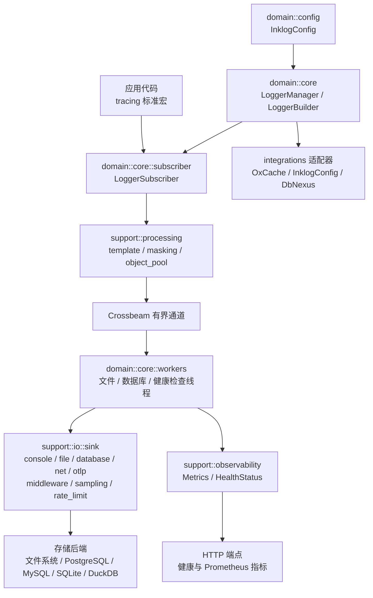
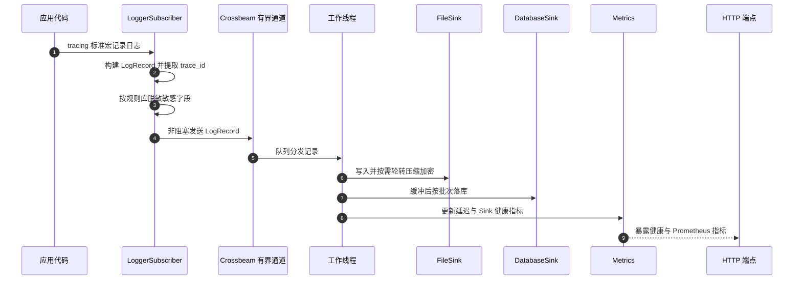
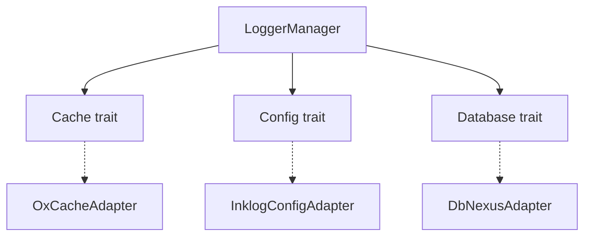
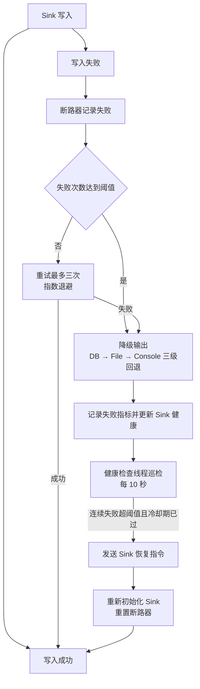

# 🏗️ inklog 架构设计

本文档介绍 inklog 的整体架构、设计原则、核心组件、数据流、并发模型与扩展点，帮助使用者和贡献者理解其内部实现。使用视角的内容见 [📖 用户指南](USER_GUIDE.md)，API 细节见 [📘 API 参考](API_REFERENCE.md)。

<details open>
<summary>📑 目录</summary>

- [🧭 概述](#-概述)
- [🗺️ 分层架构](#️-分层架构)
- [🔀 核心执行链路](#-核心执行链路)
- [🧩 核心组件](#-核心组件)
- [🔌 依赖注入架构](#-依赖注入架构)
- [🚰 Sink 系统](#-sink-系统)
- [🧵 并发模型](#-并发模型)
- [💾 存储层](#-存储层)
- [🔐 安全架构](#-安全架构)
- [⚡ 性能考虑](#-性能考虑)
- [🧷 扩展点](#-扩展点)
- [📦 依赖](#-依赖)

</details>

---

## 🧭 概述

inklog 是企业级 Rust 日志基础设施，为生产环境设计。应用代码使用 `log` / `tracing` 标准宏，inklog 接管订阅、脱敏、分发与落盘。

### 设计目标

| 目标 | 实现手段 |
|------|----------|
| **高性能** | Crossbeam 有界通道 + 专用工作线程池，发送端非阻塞、模板渲染 ~320 ns/条（见 [⚡ 性能基线](PERFORMANCE.md)） |
| **可靠性** | 断路器、DB → File → Console 三级降级、健康检查自动恢复、shutdown 超时保护 |
| **安全性** | AES-256-GCM 加密、PII 自动脱敏、密钥内存清零、路径与 SQL 注入防护 |
| **可观测性** | Prometheus 指标、健康检查端点、延迟直方图 |
| **可扩展性** | `LogSink` trait 自定义输出，`add_sink` 动态注册零核心改动 |

## 🗺️ 分层架构

inklog 采用分层异步架构：`domain` 层持有 `LoggerManager` / `LoggerBuilder` 与配置模型，`domain::core::subscriber` 实现 tracing Subscriber 并构建 `LogRecord`；记录经 `support::processing` 完成模板渲染与脱敏后进入 Crossbeam 有界通道，由 `domain::core::workers` 的专用线程分发给 `support::io::sink` 中的各 Sink；`integrations` 层以依赖倒置方式把缓存（oxcache）、配置（confers）、数据库（dbnexus）适配到 `Cache` / `Config` / `Database` trait 上；`support::observability` 汇聚健康状态与指标，并经 `http` feature 暴露端点。


```mermaid
flowchart TD
    APP["应用代码<br/>tracing 标准宏"] --> SUB["domain::core::subscriber<br/>LoggerSubscriber"]
    CFG["domain::config<br/>InklogConfig"] --> MGR["domain::core<br/>LoggerManager / LoggerBuilder"]
    MGR --> SUB
    MGR --> INT["integrations 适配器<br/>OxCache / InklogConfig / DbNexus"]
    SUB --> PROC["support::processing<br/>template / masking / object_pool"]
    PROC --> CH["Crossbeam 有界通道"]
    CH --> W["domain::core::workers<br/>文件 / 数据库 / 健康检查线程"]
    W --> SINK["support::io::sink<br/>console / file / database / net / otlp<br/>middleware / sampling / rate_limit"]
    SINK --> STORE["存储后端<br/>文件系统 / PostgreSQL / MySQL / SQLite / DuckDB"]
    W --> OBS["support::observability<br/>Metrics / HealthStatus"]
    OBS --> HTTP["HTTP 端点<br/>健康与 Prometheus 指标"]
```

| 分层 | 职责 |
|------|------|
| `domain` | 日志管理器、构建器、DI 容器、Subscriber、工作线程与配置模型 |
| `support` | Sink 实现、模板与脱敏处理、对象池、指标、校验、查询、审计链 |
| `integrations` | 以 trait 适配 oxcache / confers / dbnexus / trait-kit，隔离外部依赖 |
| `i18n` | Fluent + ICU 消息本地化（zh-CN / en 资源位于 `locales/`） |
| `cli` | `inklog-cli` 二进制：decrypt / generate / validate / query |

## 🔀 核心执行链路

一条日志从记录到落盘的完整路径：


```mermaid
sequenceDiagram
    autonumber
    participant App as 应用代码
    participant Sub as LoggerSubscriber
    participant Chan as Crossbeam 有界通道
    participant Worker as 工作线程
    participant FS as FileSink
    participant DS as DatabaseSink
    participant Met as Metrics
    participant HTTP as HTTP 端点

    App->>Sub: tracing 标准宏记录日志
    Sub->>Sub: 构建 LogRecord 并提取 trace_id
    Sub->>Sub: 按规则库脱敏敏感字段
    Sub->>Chan: 非阻塞发送 LogRecord
    Chan->>Worker: 队列分发记录
    Worker->>FS: 写入并按需轮转压缩加密
    Worker->>DS: 缓冲后按批次落库
    Worker->>Met: 更新延迟与 Sink 健康指标
    Met-->>HTTP: 暴露健康与 Prometheus 指标
```

要点：

- 发送端只在通道满时阻塞（背压），默认容量 10000、3 个工作线程，可经 `PerformanceConfig` 调整；
- 文件线程为阻塞 I/O，数据库线程持有独立 tokio 运行时；
- 加密、压缩与轮转按轮转文件触发，不占用单条记录的写入热路径。

## 🧩 核心组件

### LoggerManager

核心协调器，负责日志系统的初始化、运行与生命周期管理。

**初始化流程**：

1. 验证配置（`InklogConfig::validate()`）；
2. 创建 Crossbeam 通道（主通道与控制台通道默认容量 10000，控制通道容量 10）；
3. 初始化 ConsoleSink 与 LoggerSubscriber；
4. 启动工作线程（文件、数据库、健康检查，另为每个动态 Sink 启动专用线程）；
5. 安装全局 tracing subscriber 与 `log` crate 前端（已安装时降级跳过）；
6. 【可选，`http` feature】启动 HTTP 健康与指标端点。

**关闭流程**：`shutdown()` 对停止信号采用 2 秒超时发送（`send_timeout`），超时后继续轮询 worker handles，保证永不挂死；随后排空通道并关闭全部 Sink。

### LoggerSubscriber

实现 `tracing::Subscriber`，挂载于 `tracing_subscriber::Registry` 之上：

- 从事件构建 `LogRecord`（时间戳、级别、target、消息、结构化字段、file/line、thread_id）；
- 提取 `trace_id` / `span_id`（从当前 tracing span；无 OTel 时沿 parent 链以根 span id 派生 32/16 位 hex）；
- 按脱敏规则处理消息与字段；
- 经 `EnvFilter`（reload 包装）支持运行时级别热调；
- 非阻塞发送到通道，队列满时背压。

### 配置系统（InklogConfig）

集中式配置结构，支持 TOML 文件加载与环境变量覆盖。

**配置优先级**（从高到低）：

1. 环境变量（`INKLOG_*`）；
2. 配置文件（`inklog_config.toml`）；
3. 默认值。

**验证规则**：

- 日志级别必须有效（trace/debug/info/warn/error/fatal）；
- 文件路径不能为空；
- 数据库 URL 不能为空；
- 启用加密必须提供密钥环境变量名。

配置结构逐字段说明见 [📘 API 参考](API_REFERENCE.md)。

## 🔌 依赖注入架构

inklog 通过 trait 抽象实现模块解耦与可测试性。


```mermaid
flowchart TD
    LM["LoggerManager"] --> CT["Cache trait"]
    LM --> CFT["Config trait"]
    LM --> DT["Database trait"]
    CT -.-> OA["OxCacheAdapter"]
    CFT -.-> IA["InklogConfigAdapter"]
    DT -.-> DA["DbNexusAdapter"]
```

### 核心设计原则

1. **依赖倒置（DIP）**：高层模块（LoggerManager）依赖 trait 抽象，低层模块（适配器）实现接口；
2. **接口隔离（ISP）**：每个 trait 职责单一，Cache 负责缓存、Config 负责配置、Database 负责存储；
3. **依赖注入**：构造器注入（`LoggerDependencies`），所有依赖均为 `Option<Arc<dyn Trait>>`，未注入时使用默认适配器。

### Infrastructure Traits

| trait | 职责 | 生产实现 | 测试实现 |
|-------|------|----------|----------|
| `Cache` | 缓存日志元数据与配置值（`get`/`set`/`delete`/`exists`，返回 `Result`） | `OxCacheAdapter`（oxcache） | `MockCache`（`RwLock<HashMap>`，`test-utils`） |
| `Config` | 配置访问（`get_string`/`get_int`/`get_bool`/`get_float`） | `InklogConfigAdapter`（内建） | `MockConfig`（`RwLock<HashMap>`，`test-utils`） |
| `Database` | 批量持久化（`insert_batch`/`is_healthy`） | `DbNexusAdapter`（dbnexus） | `MockDatabaseAdapter`（`RwLock<Vec<LogRecord>>`，`test-utils`） |

trait 签名逐项见 [📘 API 参考](API_REFERENCE.md)「依赖注入类型」。

### 依赖注入使用模式

| 模式 | 用法 | 场景 |
|------|------|------|
| 纯默认 | `LoggerManager::new().await?` | 零依赖起步 |
| 配置文件 | `LoggerManager::from_file("config.toml").await?` | 生产部署 |
| 依赖注入 | `LoggerManager::with_dependencies(deps).await?` | 测试与自定义实现 |

### 设计优势

- **可测试性**：注入 Mock 即可隔离测试，无需启动真实缓存/数据库；
- **可扩展性**：实现对应 trait 即可替换底层实现（如 Redis 缓存、Consul 配置中心、TimescaleDB）；
- **解耦性**：核心不直接依赖外部库 API，经 adapter 隔离（oxcache / confers / dbnexus / trait-kit）。

### 配置键映射

`InklogConfigAdapter` 支持完整的点分配置键路径，供外部配置系统对齐：

| 键前缀 | 键 |
|--------|-----|
| `global.*` | level、format、masking_enabled、auto_fallback、fallback_initial_delay_ms、fallback_max_delay_ms、fallback_max_retries、output_format |
| `file_sink.*` | enabled、path、max_size、rotation_time、keep_files、compress、compression_level、encrypt、encryption_key_env、retention_days、max_total_size、cleanup_interval_minutes、batch_size、flush_interval_ms、masking_enabled、output_format |
| `console_sink.*` | enabled、colored、stderr_levels、masking_enabled |

## 🚰 Sink 系统

### LogSink 抽象

所有输出目标实现统一接口 `LogSink`（方法均为 `&self`，内部可变性由实现方保证）；`AsyncSink` 为其标记子 trait（blanket impl），用于动态注册与 trait 上转型：

```rust
#[async_trait]
pub trait LogSink: Send + Sync {
    async fn write(&self, record: &LogRecord) -> Result<(), InklogError>;
    async fn flush(&self) -> Result<(), InklogError>;
    fn is_healthy(&self) -> bool { true }  // 默认恒健康，建议覆写
    async fn shutdown(&self) -> Result<(), InklogError>;
}

pub trait AsyncSink: LogSink {}
impl<T: LogSink + ?Sized> AsyncSink for T {}
```

### 内置 Sink

| Sink | feature | 特性 |
|------|---------|------|
| ConsoleSink | 无 | ANSI 颜色（ERROR=红 / WARN=黄 / INFO=绿 / DEBUG=蓝）、stderr 级别路由（默认 error/warn）、`NO_COLOR` / `TERM=dumb` 检测 |
| FileSink | 压缩/加密按 feature | 轮转（大小+时间）、Zstd/Gzip 压缩、AES-256-GCM 加密、断路器、磁盘空间检查与旧日志清理 |
| DatabaseSink | 四后端之一 | 经 dbnexus 裸 SQL 批量落库、连接池、分区表、断路器 |
| ChannelBufferedFileSink | 无 | 通道缓冲高吞吐文件 Sink |
| TcpSink / UdpSink | `net-sink` | TCP（可 TLS，rustls）+ UDP（NDJSON），断线缓冲、半开探测、自动重连按序补发 |
| OtlpSink | `otlp` | OTLP/HTTP JSON 导出（手写传输，零新增依赖） |

### 装饰器与中间件

装饰器包装任意 Sink，作用于**每 Sink 线程**，不叠加到 subscriber 热路径：

| 装饰器 | 类型 | 说明 |
|--------|------|------|
| `SamplingSink` + `Sampler` | 采样 | 级别阈值 + N 取 1 + 关键词白名单豁免；`should_emit` 为原子计数 |
| `RateLimitedSink` + `TokenBucketRateLimit` | 限流 | 对象安全 `SinkRateLimit` 端口 + `NoOpRateLimit` 默认，`try_acquire` 为 CAS 无锁 |
| `MiddlewareSink` + `MiddlewareChain` | 中间件 | filter（`LevelFilterMiddleware`）/ transform（`RecordMiddleware` / `EnrichMiddleware`）组合 |

### 动态 Sink 注册（add_sink）

第三方 Sink 实现 `LogSink` 后经 `LoggerBuilder::add_sink(Arc<dyn AsyncSink>)` 注册，零核心改动接入：

- 每个动态 Sink 获得独立有界通道与一条通用 SinkWorker 消费线程，互不抢占；
- 关闭时随全局 shutdown 排空各自通道。

### Console Sink 工作流程

```text
LogRecord
  ↓
检查是否为 stderr 级别（默认 error / warn）
  ↓ [是]            [否]
stderr             stdout
  ↓                  ↓
应用颜色           不着色（或 Json 格式禁用彩色）
  ↓
写入终端
```

### FileSink 写入流程

```text
LogRecord
  ↓
检查断路器状态
  ↓ [开启]            [关闭]
降级到 Console       继续处理
                      ↓
检查磁盘空间（< 5% 或 < 100MB 警告，自动清理最旧的 20%）
  ↓ [不足]            [充足]
降级到 Console       继续处理
                      ↓
写入 BufWriter<File>
  ↓
检查轮转条件（max_size / rotation_time）
  ↓ [需轮转]           [无需轮转]
轮转：重命名为 {stem}_{YYYYMMDD_HHMMSS}{ext}
      → 压缩 .zst → 后台加密 .enc     更新文件大小
```

### DatabaseSink 工作流程

数据库操作经 dbnexus 以**裸 SQL（无 ORM）**执行：

- **表结构**：`id`（自增主键）、`timestamp`、`level`、`target`、`message`、`fields`（JSON 文本）、`file`、`line`、`thread_id`；DDL 按驱动生成（SQLite `INTEGER PRIMARY KEY AUTOINCREMENT`、PostgreSQL `BIGSERIAL`、MySQL `BIGINT AUTO_INCREMENT`、DuckDB `BIGINT AUTOINCREMENT`）；
- **批量写入**：缓冲至 `batch_size`（默认 100）或 `flush_interval_ms`（默认 500ms）即批量 INSERT；DuckDB 使用预编译语句参数绑定；
- **动态批大小**：断路器半开状态下批大小减半；
- **分区表**：按 `PartitionStrategy`（Monthly / Yearly）创建分区，表名与分区名经白名单校验后拼入 DDL（防 SQL 注入）；
- **归档导出**：`archive_format` 支持 Json / Parquet（Arrow 列式，Zstd 压缩）/ Csv。

## 🧵 并发模型

### 运行时混合架构

| 组件 | 运行时类型 | 用途 |
|------|------------|------|
| 应用代码 | tokio（多线程） | 异步日志 API |
| LoggerSubscriber | tokio | 非阻塞通道发送 |
| 文件线程 | 阻塞（`spawn_blocking` OS 线程） | 文件 I/O 与轮转 |
| 数据库线程 | 阻塞 + 独立 tokio runtime | 数据库批量操作 |
| 健康检查线程 | 阻塞（`spawn_blocking` OS 线程） | 每 10 秒巡检 |
| 动态 Sink 线程 | 阻塞（`spawn_blocking` OS 线程，每 Sink 一条） | 第三方 Sink 消费 |

数据库线程的独立运行时构建方式：

```rust
let rt = tokio::runtime::Builder::new_multi_thread()
    .thread_name("inklog-db-worker")
    .enable_all()  // 包括 I/O 和时间驱动器
    .build()?;
```

### 通道拓扑

| 通道 | 容量 | 用途 |
|------|------|------|
| 主日志通道 | `channel_capacity`（默认 10000） | `Arc<LogRecord>` 从 subscriber 到工作线程 |
| 控制台通道 | `channel_capacity` | 控制台输出专用，与文件/数据库路径隔离 |
| 控制通道 | 10 | `SinkControlMessage`（恢复指令等）从健康检查线程到工作线程 |
| 动态 Sink 通道 | `channel_capacity`（每 Sink 一条） | 第三方 Sink 独立消费 |
| 停止通道 | 1 | `shutdown()` 的停止信号（2 秒超时发送） |

```rust
let (sender, receiver) = bounded(capacity);           // 主通道
let (console_sender, console_receiver) = bounded(capacity);
let (control_tx, control_rx) = bounded(10);           // 控制通道
```

**队列行为**：

- 有界通道提供背压：队列满时发送端阻塞，防止内存溢出；
- 接收端使用 `recv_timeout` 周期性醒来执行 flush；
- 通道水位（使用率）经 Metrics 暴露，`Adaptive` 策略按水位自动扩缩容。

### 断路器

```rust
pub struct CircuitBreaker {
    state: CircuitState,      // Closed | Open | HalfOpen
    failure_count: u32,
    failure_threshold: u32,   // 默认 5
    reset_timeout: Duration,  // 默认 30 秒
}
```

失败达到阈值进入 Open；冷却期满进入 HalfOpen（动态批大小减半试探）；成功则回到 Closed。

### 故障降级与自愈


```mermaid
flowchart TD
    W["Sink 写入"] --> OK["写入成功"]
    W --> ERR["写入失败"]
    ERR --> CB["断路器记录失败"]
    CB --> THR{"失败次数达到阈值"}
    THR -->|"是"| DEG["降级输出<br/>DB → File → Console 三级回退"]
    THR -->|"否"| RETRY["重试最多三次<br/>指数退避"]
    RETRY -->|"成功"| OK
    RETRY -->|"失败"| DEG
    DEG --> MET["记录失败指标并更新 Sink 健康"]
    MET --> HC["健康检查线程巡检<br/>每 10 秒"]
    HC -->|"连续失败超阈值且冷却期已过"| RECOVER["发送 Sink 恢复指令"]
    RECOVER --> REINIT["重新初始化 Sink<br/>重置断路器"]
    REINIT --> OK
```

- **三级降级**：数据库不可用时回退文件，文件不可用时回退控制台；
- **自动恢复**：健康检查线程检测不健康 Sink（连续失败超阈值且冷却期已过），发送 `SinkControlMessage::RecoverSink` 触发重建，恢复结果回写指标；
- **手动恢复**：`recover_sink("file")` / `trigger_recovery_for_unhealthy_sinks()`。

## 💾 存储层

### 文件存储

**文件组织**（时间戳格式 `%Y%m%d_%H%M%S`）：

```text
logs/
├── app.log                        # 当前活动文件（明文）
├── app_20260913_143022.log        # 已轮转
├── app_20260912_080000.log.zst    # 已压缩（compression / gzip feature）
└── app_20260911_080000.log.zst.enc  # 已压缩并加密
```

**轮转策略**：达到 `max_size` 立即轮转；`hourly` / `daily` / `weekly` 定时轮转；同一秒内二次轮转时目标已存在则追加 `.1`、`.2` 序号后缀，保证永不覆盖。

**压缩算法**：

| 算法 | feature | 压缩比 | 速度 |
|------|---------|--------|------|
| Zstd | `compression` | ~3.5x（默认级别 3） | 快 |
| Gzip | `gzip`（未启用 compression 时 FileSink 回退 gzip） | ~2.5x | 中等 |

### 数据库存储

| 数据库 | feature | 特性 |
|--------|---------|------|
| PostgreSQL | `postgres` | 分区表、连接池、rustls 运行时 |
| MySQL | `mysql` | 分区表、连接池 |
| SQLite | `sqlite` | 单表（无分区）、embedded、零部署 |
| DuckDB | `duckdb` | 分析型、参数化批量插入（预编译语句） |

数据库后端互斥（dbnexus 禁止 embedded 与 server-side 驱动混用）。

**表结构**（以 PostgreSQL 为例，各驱动类型映射见上文）：

```sql
CREATE TABLE IF NOT EXISTS logs (
    id BIGSERIAL PRIMARY KEY,
    timestamp TIMESTAMPTZ NOT NULL,
    level TEXT NOT NULL,
    target TEXT NOT NULL,
    message TEXT NOT NULL,
    fields TEXT,          -- 结构化字段（JSON 文本）
    file TEXT,
    line INTEGER,
    thread_id TEXT NOT NULL
);
```

**分区表**（PostgreSQL，按月）：

```sql
CREATE TABLE IF NOT EXISTS logs_2026_09 PARTITION OF logs
FOR VALUES FROM ('2026-09-01') TO ('2026-10-01');
```

## 🔐 安全架构

安全设计的完整说明（密钥格式、脱敏规则库、上报流程与合规）见 [🔒 安全文档](SECURITY.md)，本节聚焦架构位置。

| 机制 | 架构位置 | 说明 |
|------|----------|------|
| 静态加密 | `support::io::sink::encryption` | AES-256-GCM，密文格式 `[nonce][ciphertext]`，仅作用于轮转归档 |
| 密钥派生 | 同上 | PBKDF2-HMAC-SHA256 600k 迭代（每次轮转至多一次），600,000 为安全审查认可的最低迭代数 |
| 密钥内存安全 | `zeroize` | 密钥离开作用域自动清零 |
| 数据脱敏 | `support::processing::masking` | 21 条内置正则规则（优先级分组）+ 敏感字段名检测 + 注册表扩展 |
| 路径安全 | `validation::path`（PathValidator） | 防路径穿越，禁止写入用户主目录与密钥文件 |
| 内容净化 | `validation::sanitize`（LogSanitizer） | 日志注入与控制字符防护 |
| SQL 注入防护 | DatabaseSink | 表名/分区名白名单校验 + 参数化查询 |
| 访问控制 | HTTP 端点 | 认证 token 启动期缓存、失败 fail-closed；IP 白名单；文件权限 0600 |
| 归档防篡改 | `support::audit_chain` | `ArchiveChain` HMAC-SHA256 归档链（随机链首盐），防删除、重排与伪造 |
| KMS 密钥提供 | `support::security` | `KeyProvider` 端口 + `EnvKeyProvider` / `ConfersKeyProvider` / Vault transit（`kms` feature） |

**加密文件格式 v2**：文件头 `[MAGIC 8][version 2][algo 2][salt 16][nonce 12]`（MAGIC 为 `ENCLOG1\0`）；Base64/原始 32 字节密钥直接使用（盐存而不用），普通密码经 PBKDF2 以头中盐确定性派生；v1（无盐）文件仍可解密。

## ⚡ 性能考虑

### 主链路成本

写入主链路（模板渲染）约 320 ns/条，正式基准与测试环境见 [⚡ 性能基线](PERFORMANCE.md)。

### 批量处理

| 策略 | 数据库事务 | 吞吐量（参考值） |
|------|------------|------------------|
| 逐条插入 | N（自动提交） | ~100 行/s |
| 批量 100 条 | 单次 | ~10,000 行/s |

批量触发条件：缓冲达到 `batch_size`（默认 100）或距上次刷新超过 `flush_interval_ms`（默认 500ms）。

### 压缩策略

| 级别 | 定位 | 压缩比 |
|------|------|--------|
| 0 | 最快 | ~2.5x |
| 3（默认） | 平衡 | ~3.5x |
| 19 | 最大压缩 | ~4.5x，慢 |

### 队列管理

- 有界通道提供背压，防止内存溢出；
- 通道水位经 Metrics 暴露（Prometheus `inklog_channel_blocked_total` 等）；
- `Adaptive` 通道策略按 `expand_threshold_percent`（默认 80%）扩容、`shrink_threshold_percent`（默认 20%）缩容，缩容前等待 `shrink_wait_seconds`（默认 30 秒）。

## 🧷 扩展点

### 自定义 Sink（动态注册，推荐）

实现 `LogSink` trait 后经 `add_sink` 注册，零核心改动：

```rust
use async_trait::async_trait;
use inklog::{AsyncSink, LogRecord, LoggerBuilder, LogSink};
use std::sync::Arc;

pub struct SlackSink {
    webhook_url: String,
    buffer: std::sync::Mutex<Vec<LogRecord>>,
}

#[async_trait]
impl LogSink for SlackSink {
    async fn write(&self, record: &LogRecord) -> Result<(), inklog::InklogError> {
        self.buffer.lock().unwrap().push(record.clone());
        if self.buffer.lock().unwrap().len() >= 10 {
            self.flush().await?;
        }
        Ok(())
    }

    async fn flush(&self) -> Result<(), inklog::InklogError> {
        let payload = serde_json::json!({
            "text": self.buffer.lock().unwrap().iter()
                .filter(|r| r.level == "ERROR" || r.level == "WARN")
                .map(|r| format!("{}: {}", r.target, r.message))
                .collect::<Vec<_>>()
                .join("\n")
        });
        self.buffer.lock().unwrap().clear();
        // 发送到远程 API（示意）
        let _ = (self.webhook_url.clone(), payload);
        Ok(())
    }

    fn is_healthy(&self) -> bool {
        !self.webhook_url.is_empty()
    }

    async fn shutdown(&self) -> Result<(), inklog::InklogError> {
        self.flush().await
    }
}

#[tokio::main]
async fn main() -> Result<(), Box<dyn std::error::Error>> {
    let logger = LoggerBuilder::new()
        .level("info")
        .add_sink(Arc::new(SlackSink {
            webhook_url: "https://hooks.example.com/xxx".to_string(),
            buffer: std::sync::Mutex::new(Vec::new()),
        }))
        .build()
        .await?;
    logger.shutdown()?;
    Ok(())
}
```

每个动态 Sink 获得独立通道与消费线程；也可组合装饰器（采样、限流、中间件）再注册。

### 自定义基础设施实现

实现 `Cache` / `Config` / `Database` trait 并经 `LoggerBuilder::cache()` / `config()` / `with_database()` 注入，即可替换缓存、配置中心或数据库后端（如 Redis Cluster、Consul、TimescaleDB）。trait 签名见 [📘 API 参考](API_REFERENCE.md)。

### 中间件扩展

实现 `RecordMiddleware` / `EnrichMiddleware` / `LevelFilterMiddleware` 并组装 `MiddlewareChain`，可对进入 Sink 前的记录做过滤、富化与变换。

## 📦 依赖

### 核心依赖

| 依赖 | 版本 | 用途 |
|------|------|------|
| tokio | 1.53 | 异步运行时 |
| tracing / tracing-subscriber | 0.1 / 0.3 | 结构化日志与 Subscriber |
| crossbeam-channel | 0.5 | 高性能有界通道 |
| serde / serde_json | 1.0 | 序列化 |
| chrono | 0.4 | 时间戳 |
| regex | 1.13 | 数据脱敏 |
| thiserror | 2.0 | 错误类型 |
| log | 0.4 | `log` crate 前端桥接 |

### 可选依赖（feature 门控）

| feature | 依赖 | 用途 |
|---------|------|------|
| `sqlite` / `postgres` / `mysql` / `duckdb` | dbnexus 0.6.0-rc.3 | 数据库连接池与裸 SQL 执行（后端互斥） |
| `http` | axum 0.8、axum-server 0.8 | HTTP 端点（TLS 走 rustls） |
| `cli` | clap、glob | `inklog-cli` |
| `compression` / `gzip` | zstd / flate2 | Zstd / Gzip 压缩 |
| `parquet` | parquet、arrow-array、arrow-schema | Parquet/Arrow 归档 |
| `fast-masking` | aho-corasick | 多模式脱敏加速 |
| `net-sink` | rustls | TCP/UDP 转发 Sink |
| `config-confers` / `kms` | confers | 配置加载与 watch、KMS 密钥提供 |
| `kit` | trait-kit | 生命周期与可观测集成 |

### 测试依赖

| 依赖 | 用途 |
|------|------|
| tempfile | 临时文件 |
| assert_cmd | CLI 命令测试 |
| criterion | 基准测试（`benches/`） |

---

**文档版本**: 3.1（对应 inklog 0.3.0-rc.3）
**[⬆ 返回顶部](#️-inklog-架构设计)**
