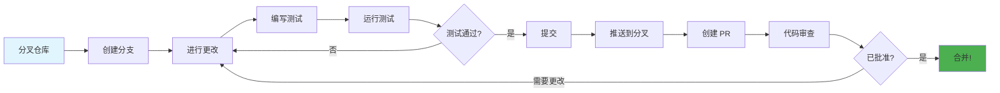
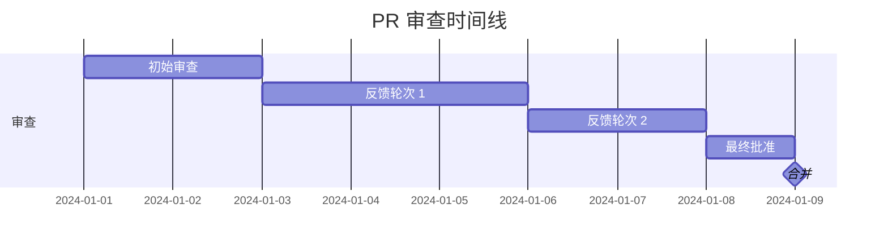

<div align="center">

# 🤝 贡献指南

### 与我们一同构建伟大的项目！

[🏠 首页](../README.md) • [📖 文档](USER_GUIDE.md) • [💬 讨论](https://github.com/kirkyx/inklog/discussions)

---

</div>

## 🎯 欢迎贡献者！

感谢您对 **Inklog** 项目的关注！我们很高兴您的加入。无论您是修复错误、添加功能、改进文档还是帮助他人，您的贡献都是宝贵和值得赞赏的。

<div align="center">

### 🌟 贡献方式

<table>
<tr>
<td width="25%" align="center">
<br>
<b>代码</b><br>
修复错误和添加功能
</td>
<td width="25%" align="center">
<br>
<b>文档</b><br>
改进文档和指南
</td>
<td width="25%" align="center">
<br>
<b>测试</b><br>
编写测试和发现错误
</td>
<td width="25%" align="center">
<br>
<b>社区</b><br>
帮助和支持他人
</td>
</tr>
</table>

</div>

---

## 📋 目录

- [行为准则](#行为准则)
- [快速开始](#快速开始)
- [开发工作流](#开发工作流)
- [编码标准](#编码标准)
- [测试指南](#测试指南)
- [文档](#文档)
- [提交更改](#提交更改)
- [审查流程](#审查流程)
- [社区](#社区)

---

## 行为准则

<div align="center">

### 🤗 友善和尊重

</div>

我们致力于提供一个热情和包容的环境。通过参与，您同意：

<table>
<tr>
<td width="50%">

**✅ 应该做**
- 尊重和体贴
- 欢迎新手
- 接受建设性批评
- 专注于对社区最有利的事情
- 对他人表现出同理心

</td>
<td width="50%">

**❌ 不应该做**
- 使用冒犯性语言
- 骚扰或侮辱他人
- 发布私人信息
- 进行人身攻击
- 扰乱讨论

</td>
</tr>
</table>

> 📜 **完整行为准则**: 遵循 Rust 社区的 [行为准则](https://www.rust-lang.org/conduct)

---

## 快速开始

### 前置要求

在开始之前，请确保您拥有：

- ✅ **Git** - 版本控制
- ✅ **Rust 1.75+** - 编程语言
- ✅ **Cargo** - Rust 包管理器
- ✅ **IDE** - VS Code、IntelliJ 或类似工具

<details>
<summary><b>🔧 设置您的环境</b></summary>

**1. 安装 Rust:**
```bash
curl --proto '=https' --tlsv1.2 -sSf https://sh.rustup.rs | sh
```

**2. 安装额外工具:**
```bash
# 代码格式化工具
rustup component add rustfmt

# 代码检查工具
rustup component add clippy

# 代码覆盖率工具（可选）
cargo install cargo-tarpaulin
```

**3. 验证安装:**
```bash
rustc --version
cargo --version
```

</details>

### 分叉和克隆

<table>
<tr>
<td width="50%">

**1. 分叉仓库**

点击 GitHub 上的 "Fork" 按钮

</td>
<td width="50%">

**2. 克隆您的分叉**

```bash
git clone https://github.com/kirkyx/inklog.git
cd inklog
```

</td>
</tr>
<tr>
<td width="50%">

**3. 添加上游远程仓库**

```bash
git remote add upstream \
  https://github.com/kirkyx/inklog
```

</td>
<td width="50%">

**4. 验证远程仓库**

```bash
git remote -v
# origin    您的分叉
# upstream  原始仓库
```

</td>
</tr>
</table>

### 构建和测试

```bash
# 构建项目
cargo build

# 运行测试
cargo test

# 运行示例
cargo run --example basic
```

✅ **成功！** 您已准备好贡献！

---

## 开发工作流

<div align="center">

### 🔄 标准贡献流程

</div>



### 分步指南

#### 1️⃣ 创建分支

```bash
# 更新您的分叉
git fetch upstream
git checkout main
git merge upstream/main

# 创建功能分支
git checkout -b feature/your-feature-name

# 或修复错误
git checkout -b fix/issue-123
```

**分支命名:**
- `feature/` - 新功能
- `fix/` - 错误修复
- `docs/` - 文档
- `test/` - 测试改进
- `refactor/` - 代码重构

#### 2️⃣ 进行您的更改

<table>
<tr>
<td width="50%">

**编写代码:**
```rust
// 添加您的实现
pub fn new_logging_feature() -> Result<()> {
    // 您的代码在这里
    Ok(())
}
```

**添加测试:**
```rust
#[test]
fn test_new_logging_feature() {
    let result = new_logging_feature();
    assert!(result.is_ok());
}
```

</td>
<td width="50%">

**编写代码:**
```rust
// 添加您的实现
pub fn new_logging_feature() -> Result<()> {
    // 您的代码在这里
    Ok(())
}
```

**添加测试:**
```rust
#[test]
fn test_new_logging_feature() {
    let result = new_logging_feature();
    assert!(result.is_ok());
}
```

</td>
</tr>
</table>

#### 3️⃣ 测试您的更改

```bash
# 格式化代码
cargo fmt

# 运行检查工具
cargo clippy -- -D warnings

# 运行所有测试
cargo test --all-features

# 运行特定测试
cargo test test_new_logging_feature

# 检查覆盖率（可选）
cargo tarpaulin --out Html
```

#### 4️⃣ 提交您的更改

**好的提交消息:**

```bash
# 格式: <type>(<scope>): <description>

git commit -m "feat(logging): add structured logging support"
git commit -m "fix(sink): resolve file rotation issue"
git commit -m "docs(readme): update installation instructions"
git commit -m "test(config): add configuration validation tests"
```

**提交类型:**
- `feat` - 新功能
- `fix` - 错误修复
- `docs` - 文档
- `style` - 格式化
- `refactor` - 代码重构
- `test` - 添加测试
- `chore` - 维护

<details>
<summary><b>📝 提交消息模板</b></summary>

```
<type>(<scope>): <简短描述>

<详细描述>

<页脚>
```

**示例:**
```
feat(logging): add batch processing support

Implement batch processing for multiple log operations.
This improves performance by 40% for high-volume logging.

Closes #123
```

</details>

#### 5️⃣ 推送到您的分叉

```bash
git push origin feature/your-feature-name
```

#### 6️⃣ 创建拉取请求

1. 访问您在 GitHub 上的分叉
2. 点击 "Compare & pull request"
3. 填写 PR 模板
4. 链接相关问题
5. 提交！

---

## 编码标准

<div align="center">

### ✨ 编写干净、可维护的代码

</div>

### Rust 风格指南

遵循 [Rust 风格指南](https://rust-lang.github.io/api-guidelines/):

<table>
<tr>
<td width="50%">

**✅ 好的**

```rust
// 描述性名称
pub fn encrypt_data(
    plaintext: &[u8],
    key: &Key,
) -> Result<Vec<u8>> {
    // 实现
}

// 适当的错误处理
match operation() {
    Ok(result) => result,
    Err(e) => return Err(e),
}
```

</td>
<td width="50%">

**❌ 不好的**

```rust
// 模糊的名称
pub fn enc(d: &[u8], k: &Key)
    -> Result<Vec<u8>> {
    // 实现
}

// 忽略错误
let result = operation().unwrap();
```

</td>
</tr>
</table>

### 代码组织

```
src/
├── lib.rs           # 公共 API
├── core/            # 核心功能
│   ├── mod.rs
│   ├── engine.rs
│   └── manager.rs
├── algorithms/      # 算法实现
│   ├── mod.rs
│   ├── aes.rs
│   └── ecdsa.rs
├── error.rs         # 错误类型
└── utils/           # 工具
    ├── mod.rs
    └── helpers.rs
```

### 文档

<details>
<summary><b>📖 文档标准</b></summary>

**每个公共项目都必须有文档:**

```rust
/// 使用指定算法加密数据。
///
/// # 参数
///
/// * `data` - 要加密的明文数据
/// * `key` - 加密密钥
///
/// # 返回值
///
/// 成功时返回加密的密文。
///
/// # 错误
///
/// 如果加密失败则返回 `Error::EncryptionFailed`。
///
/// # 示例
///
/// ```
/// use inklog::{encrypt, Key};
///
/// let key = Key::generate()?;
/// let ciphertext = encrypt(b"secret", &key)?;
/// ```
pub fn encrypt(data: &[u8], key: &Key) -> Result<Vec<u8>> {
    // 实现
}
```

</details>

### 错误处理

```rust
// ✅ 使用 Result 类型
pub fn fallible_operation() -> Result<Value, Error> {
    // 实现
}

// ✅ 提供上下文
Err(Error::EncryptionFailed {
    reason: "Invalid key size",
    context: format!("Expected {}, got {}", expected, actual),
})

// ❌ 不要在库代码中 panic
// panic!("Something went wrong");  // 不好!
```

---

## 测试指南

<div align="center">

### 🧪 测试所有内容！

</div>

### 测试类别

<table>
<tr>
<th>类型</th>
<th>目的</th>
<th>位置</th>
</tr>
<tr>
<td><b>单元测试</b></td>
<td>测试单个函数</td>
<td><code>src/*.rs</code> (内联)</td>
</tr>
<tr>
<td><b>集成测试</b></td>
<td>测试公共 API</td>
<td><code>tests/</code></td>
</tr>
<tr>
<td><b>文档测试</b></td>
<td>测试文档中的示例</td>
<td>文档注释</td>
</tr>
<tr>
<td><b>基准测试</b></td>
<td>性能测试</td>
<td><code>benches/</code></td>
</tr>
</table>

### 编写测试

**单元测试示例:**

```rust
#[cfg(test)]
mod tests {
    use super::*;

    #[test]
    fn test_encrypt_decrypt() {
        let key = Key::generate().unwrap();
        let plaintext = b"Hello, World!";

        let ciphertext = encrypt(plaintext, &key).unwrap();
        let decrypted = decrypt(&ciphertext, &key).unwrap();

        assert_eq!(plaintext, &decrypted[..]);
    }

    #[test]
    fn test_invalid_key() {
        let result = encrypt(b"data", &InvalidKey);
        assert!(result.is_err());
    }
}
```

**集成测试示例:**

```rust
// tests/integration_test.rs
use inklog::{LoggerManager, InklogConfig};

#[test]
fn test_full_logging_workflow() {
    let config = InklogConfig::default();
    let _logger = LoggerManager::with_config(config).unwrap();

    // 测试基本日志记录
    log::info!("集成测试消息");
    log::warn!("测试警告");
    log::error!("测试错误");

    // 验证日志已处理
    // 根据您的日志记录系统添加断言
    assert!(true); // 占位符
}
```

### 测试覆盖率

**目标 ≥90% 覆盖率:**

```bash
# 生成覆盖率报告
cargo tarpaulin --out Html --output-dir coverage

# 查看报告
open coverage/index.html
```

---

## 文档

<div align="center">

### 📚 文档很重要！

</div>

### 需要文档化的内容

<table>
<tr>
<td width="50%">

**代码文档:**
- ✅ 公共函数
- ✅ 公共类型
- ✅ 复杂算法
- ✅ 不明显的行为

</td>
<td width="50%">

**用户文档:**
- ✅ README 更新
- ✅ 用户指南更改
- ✅ API 参考
- ✅ 示例

</td>
</tr>
</table>

### 文档检查清单

- [ ] 所有公共项目都有文档注释
- [ ] 示例编译并运行
- [ ] README 已更新（如需要）
- [ ] CHANGELOG 已更新
- [ ] 用户指南反映更改
- [ ] 迁移指南（针对破坏性更改）

---

## 提交更改

<div align="center">

### 📤 拉取请求流程

</div>

### PR 模板

<details>
<summary><b>📋 拉取请求模板</b></summary>

```markdown
## 描述
更改的简要描述

## 更改类型
- [ ] 错误修复
- [ ] 新功能
- [ ] 文档更新
- [ ] 性能改进
- [ ] 代码重构

## 所做的更改
- 更改 1
- 更改 2
- 更改 3

## 测试
- [ ] 单元测试通过
- [ ] 集成测试通过
- [ ] 手动测试完成

## 检查清单
- [ ] 代码遵循风格指南
- [ ] 自我审查完成
- [ ] 为复杂代码添加注释
- [ ] 文档已更新
- [ ] 没有新警告
- [ ] 测试已添加/更新

## 相关问题
关闭 #123
```

</details>

### PR 最佳实践

<table>
<tr>
<td width="50%">

**✅ 好的 PR:**
- 专注于单个问题
- 小的、可审查的大小
- 清晰的描述
- 包含测试
- 文档已更新

</td>
<td width="50%">

**❌ 避免:**
- 多个不相关的更改
- 巨大的差异（>500 行）
- 缺少上下文
- 没有测试
- 未记录的更改

</td>
</tr>
</table>

---

## 审查流程

<div align="center">

### 👀 预期内容

</div>

### 时间线



**典型时间线:**
- 📧 初始审查: 1-3 天
- 💬 反馈轮次: 每次 2-5 天
- ✅ 批准和合并: 1-2 天

### 审查标准

审查者将检查：

- ✅ **功能性**: 是否按预期工作？
- ✅ **代码质量**: 是否干净和可维护？
- ✅ **测试**: 是否有足够的测试？
- ✅ **文档**: 是否有良好的文档？
- ✅ **性能**: 是否有性能影响？
- ✅ **安全性**: 是否有安全问题？

### 响应反馈

```bash
# 处理反馈
git add .
git commit -m "Address review comments"
git push origin feature/your-feature

# PR 自动更新！
```

---

## 社区

<div align="center">

### 💬 与我们联系

</div>

<table>
<tr>
<td width="33%" align="center">
<a href="https://github.com/kirkyx/inklog/issues">
<br>
<b>问题</b>
</a><br>
报告错误和问题
</td>
<td width="33%" align="center">
<a href="https://github.com/kirkyx/inklog/discussions">
<br>
<b>讨论</b>
</a><br>
提问和分享想法
</td>
<td width="33%" align="center">
<a href="https://discord.gg/inklog">
<br>
<b>Discord</b>
</a><br>
实时聊天和新闻
</td>
</tr>
</table>

### 认可

我们重视所有贡献！贡献者将：

- 🎖️ 列在 [CONTRIBUTORS.md](CONTRIBUTORS.md) 中
- 🌟 显示在 README 贡献者部分
- 💝 在发布说明中提及

---

<div align="center">

## 🎉 谢谢您！

您的贡献让这个项目对每个人都更好。

**准备贡献？** [打开您的第一个问题](https://github.com/kirkyx/inklog/issues/new) 或 [开始讨论](https://github.com/kirkyx/inklog/discussions/new)！

---

**[🏠 首页](../README.md)** • **[📖 用户指南](USER_GUIDE.md)** • **[🔧 API 文档](https://docs.rs/inklog)** • **[🏠 首页](../README.md)**

由我们优秀的社区用 ❤️ 制作

[⬆ 返回顶部](#-贡献指南)

</div>
