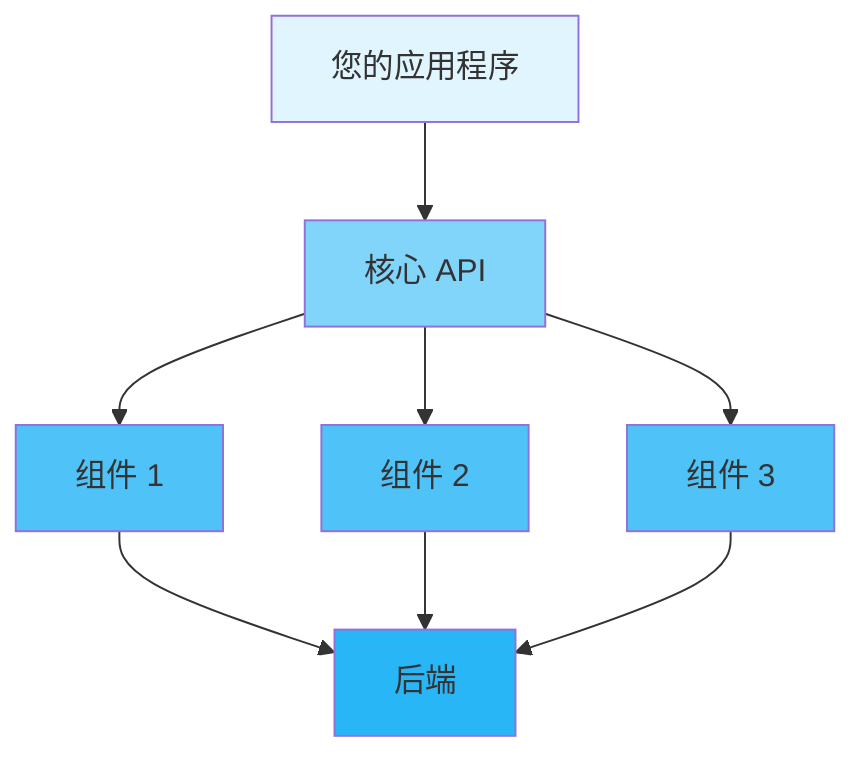

<div align="center">

# 📖 用户指南

### Inklog 完整使用指南

[🏠 首页](../README.md) • [📚 文档](README.md) • [🎯 示例](../examples/) • [❓ 常见问题](FAQ.md)

---

</div>

## 📋 目录

- [简介](#简介)
- [快速开始](#快速开始)
  - [前置要求](#前置要求)
  - [安装](#安装)
  - [第一步](#第一步)
- [核心概念](#核心概念)
- [基础用法](#基础用法)
  - [初始化](#初始化)
  - [配置](#配置)
  - [基本操作](#基本操作)
- [高级用法](#高级用法)
  - [自定义配置](#自定义配置)
  - [性能调优](#性能调优)
  - [错误处理](#错误处理)
- [最佳实践](#最佳实践)
- [常见模式](#常见模式)
- [故障排除](#故障排除)
- [后续步骤](#后续步骤)

---

## 简介

<div align="center">

### 🎯 您将学到什么

</div>

<table>
<tr>
<td width="25%" align="center">
<br>
<b>快速开始</b><br>
5分钟内上手运行
</td>
<td width="25%" align="center">
<br>
<b>配置</b><br>
根据需求自定义
</td>
<td width="25%" align="center">
<br>
<b>最佳实践</b><br>
学习正确的方法
</td>
<td width="25%" align="center">
<br>
<b>高级主题</b><br>
掌握细节
</td>
</tr>
</table>

**Inklog** 旨在帮助您实现企业级日志基础设施。本指南将引导您从基础设置到高级使用模式的所有内容。

> 💡 **提示**: 本指南假设您具备 Rust 基础知识。如果您是 Rust 新手，请先查看 [Rust Book](https://doc.rust-lang.org/book/)。

---

## 快速开始

### 前置要求

在开始之前，请确保已安装以下内容：

<table>
<tr>
<td width="50%">

**必需**
- ✅ Rust 1.75+ (稳定版)
- ✅ Cargo (随 Rust 一起安装)
- ✅ Git

</td>
<td width="50%">

**可选**
- 🔧 支持 Rust 的 IDE
- 🔧 Docker (用于容器化部署)
- 🔧 [其他工具]

</td>
</tr>
</table>

<details>
<summary><b>🔍 验证您的安装</b></summary>

```bash
# 检查 Rust 版本
rustc --version
# 预期: rustc 1.75.0 或更高版本

# 检查 Cargo 版本
cargo --version
# 预期: cargo 1.75.0 或更高版本

# 检查 Git 版本
git --version
# 预期: git version 2.x.x
```

</details>

### 安装

<div align="center">

#### 选择您的安装方式

</div>

<table>
<tr>
<td width="50%">

**📦 使用 Cargo (推荐)**

```bash
# 添加到 Cargo.toml
[dependencies]
inklog = "0.1"

# 或通过命令安装
cargo add inklog
```

</td>
<td width="50%">

**🐙 从源码安装**

```bash
git clone https://github.com/kirkyx/inklog
cd inklog
cargo build --release
```

</td>
</tr>
</table>

<details>
<summary><b>🌐 其他安装方法</b></summary>

**使用 Docker**
```bash
docker pull inklog:latest
docker run -it inklog
```

**使用 Homebrew (macOS)**
```bash
brew install inklog
```

**使用 Chocolatey (Windows)**
```powershell
choco install inklog
```

</details>

### 第一步

让我们用一个简单的 "Hello World" 来验证您的安装：

```rust
use inklog::{LoggerManager, InklogConfig};

fn main() -> Result<(), Box<dyn std::error::Error>> {
    // 初始化日志记录器
    let _logger = LoggerManager::new().await?;

    println!("✅ Inklog 已准备就绪!");

    Ok(())
}
```

<details>
<summary><b>🎬 运行示例</b></summary>

```bash
# 创建新项目
cargo new hello-inklog
cd hello-inklog

# 添加依赖
cargo add inklog

# 将上面的代码复制到 src/main.rs

# 运行!
cargo run
```

**预期输出:**
```
✅ Inklog 已准备就绪!
```

</details>

---

## 核心概念

理解这些核心概念将帮助您有效地使用该库。

<div align="center">

### 🧩 关键组件

</div>



### 1️⃣ 概念一：LoggerManager

**它是什么**: 日志系统的核心管理器，负责协调所有日志操作。

**为什么重要**: 提供统一的日志接口，管理多个输出目标，处理错误恢复。

**示例:**
```rust
// 演示代码
let logger = LoggerManager::new()?;
log::info!("应用程序已启动");
```

<details>
<summary><b>📚 了解更多</b></summary>

该概念的详细解释，包括：
- 内部工作原理
- 何时使用它
- 常见陷阱
- 相关概念

</details>

### 2️⃣ 概念二：InklogConfig

**它是什么**: 配置结构，用于自定义日志行为。

**主要功能:**
- ✅ 设置日志级别
- ✅ 配置输出目标
- ✅ 性能调优
- ✅ 安全设置

**示例:**
```rust
let config = InklogConfig::builder()
    .level("debug")
    .enable_file_sink(true)
    .build()?;
```

### 3️⃣ 概念三：LogSink

<table>
<tr>
<td width="50%">

**传统方法**
```rust
// 旧方法
println!("信息");
eprintln!("错误");
```

</td>
<td width="50%">

**我们的方法**
```rust
// 更好的方法
log::info!("信息");
log::error!("错误");
```

</td>
</tr>
</table>

---

## 基础用法

### 初始化

每个应用程序在使用前必须初始化该库：

```rust
use inklog::{LoggerManager, InklogConfig};

fn main() -> Result<(), Box<dyn std::error::Error>> {
    // 简单初始化
    let _logger = LoggerManager::new().await?;

    // 或使用自定义配置
    let config = InklogConfig::default();
    let _logger = LoggerManager::with_config(config).await?;

    Ok(())
}
```

<div align="center">

| 方法 | 使用场景 | 性能 | 复杂度 |
|--------|----------|-------------|------------|
| `LoggerManager::new()` | 快速开始、开发 | ⚡ 快速 | 🟢 简单 |
| `LoggerManager::with_config()` | 生产环境、自定义需求 | ⚡⚡ 优化 | 🟡 中等 |

</div>

### 配置

<details open>
<summary><b>⚙️ 配置选项</b></summary>

```rust
use inklog::InklogConfig;

let config = InklogConfig {
    global: inklog::config::GlobalConfig {
        level: "debug".to_string(),
        masking_enabled: true,
        ..Default::default()
    },
    performance: inklog::config::PerformanceConfig {
        channel_capacity: 5000,
        worker_threads: 4,
        ..Default::default()
    },
    ..Default::default()
};

let _logger = LoggerManager::with_config(config).await?;
```

</details>

<table>
<tr>
<th>选项</th>
<th>类型</th>
<th>默认值</th>
<th>描述</th>
</tr>
<tr>
<td><code>level</code></td>
<td>String</td>
<td>"info"</td>
<td>日志级别 (trace/debug/info/warn/error)</td>
</tr>
<tr>
<td><code>format</code></td>
<td>String</td>
<td>"{timestamp} [{level}] {target} - {message}"</td>
<td>日志消息格式</td>
</tr>
<tr>
<td><code>masking_enabled</code></td>
<td>Boolean</td>
<td>true</td>
<td>启用数据掩码</td>
</tr>
<tr>
<td><code>channel_capacity</code></td>
<td>Integer</td>
<td>10000</td>
<td>日志通道容量</td>
</tr>
<tr>
<td><code>worker_threads</code></td>
<td>Integer</td>
<td>3</td>
<td>工作线程数量</td>
</tr>
</table>

### 基本操作

<div align="center">

#### 📝 基本操作

</div>

<table>
<tr>
<td width="50%">

**创建日志条目**
```rust
use inklog::LoggerManager;

let _logger = LoggerManager::new().await?;
log::info!("用户登录: {}", user_id);
log::warn!("高内存使用率: {}%", memory_usage);
log::error!("数据库连接失败: {}", error);
```

**读取日志**
```rust
// 日志自动写入到配置的目标
// 控制台、文件、数据库或 S3，基于配置
```

</td>
<td width="50%">

**更新配置**
```rust
let mut config = InklogConfig::default();
config.global.level = "debug".to_string();
config.file_sink.as_mut().unwrap().compress = true;

let _logger = LoggerManager::with_config(config).await?;
```

**删除日志**
```rust
// 日志根据保留策略自动清理
// 通过配置或归档服务手动清理
```

</td>
</tr>
</table>

<details>
<summary><b>🎯 完整示例</b></summary>

```rust
use inklog::{LoggerManager, InklogConfig};

fn main() -> Result<(), Box<dyn std::error::Error>> {
    let config = InklogConfig::default();
    let _logger = LoggerManager::with_config(config).await?;

    // 创建日志条目
    log::info!("用户 {} 已登录", "user-123");
    log::warn!("系统内存使用率: {}%", 85);
    log::error!("无法连接到数据库");

    println!("✅ 所有日志已处理");

    Ok(())
}
```

</details>

---

## 高级用法

### 自定义配置

对于生产环境，您需要精细的控制：

```rust
use inklog::{LoggerManager, InklogConfig};

fn main() -> Result<(), Box<dyn std::error::Error>> {
    // 生产环境配置
    let mut config = InklogConfig::default();
    config.global.level = "info".to_string();
    config.global.masking_enabled = true;

    // 启用带压缩的文件输出
    config.file_sink = Some(inklog::config::FileSinkConfig {
        enabled: true,
        path: "logs/app.log".into(),
        compress: true,
        encryption: false,
        ..Default::default()
    });

    // 性能调优
    config.performance.channel_capacity = 20000;
    config.performance.worker_threads = num_cpus::get();

    let _logger = LoggerManager::with_config(config).await?;

    // 启用指标和监控
    log::info!("应用程序已使用生产配置启动");

    Ok(())
}
```

<details>
<summary><b>🎛️ 性能配置文件</b></summary>

| 配置文件 | 使用场景 | 吞吐量 | 延迟 | 内存 |
|--------|----------|-----------|---------|--------|
| **LowLatency** | 实时日志记录 | 中等 | ⚡ 极低 | 高 |
| **HighThroughput** | 高容量日志记录 | ⚡ 极高 | 中等 | 中等 |
| **Balanced** | 通用 | 高 | 低 | 中等 |
| **LowMemory** | 资源受限 | 低 | 中等 | ⚡ 极低 |

</details>

### 性能调优

<div align="center">

#### ⚡ 优化策略

</div>

**1. 通道容量**

```rust
let config = InklogConfig {
    performance: inklog::config::PerformanceConfig {
        channel_capacity: 20000,  // 增加缓冲区大小
        worker_threads: 4,
        ..Default::default()
    },
    ..Default::default()
};
```

**2. 批量操作**

<table>
<tr>
<td width="50%">

❌ **低效**
```rust
for item in items {
    process_one(item)?;
}
```

</td>
<td width="50%">

✅ **高效**
```rust
process_batch(&items)?;
```

</td>
</tr>
</table>

**3. 异步处理**

```rust
use inklog::LoggerManager;

#[tokio::main]
async fn main() -> Result<(), Box<dyn std::error::Error>> {
    let _logger = LoggerManager::new().await?;

    // 日志记录是非阻塞的
    log::info!("这不会阻塞您的应用程序");

    // 继续异步工作
    tokio::spawn(async {
        // 后台处理
        process_data().await;
    });

    Ok(())
}
```

### 错误处理

<div align="center">

#### 🚨 优雅地处理错误

</div>

```rust
use inklog::InklogError;

fn handle_logging() -> Result<(), InklogError> {
    match LoggerManager::new() {
        Ok(logger) => {
            println!("✅ 日志记录器已初始化");
            // 使用日志记录器
            Ok(())
        }
        Err(InklogError::ConfigError(msg)) => {
            eprintln!("⚠️ 配置错误: {}", msg);
            // 使用默认配置
            Ok(())
        }
        Err(e) => {
            eprintln!("❌ 初始化失败: {}", e);
            Err(e)
        }
    }
}
```

<details>
<summary><b>📋 错误类型</b></summary>

| 错误类型 | 描述 | 恢复策略 |
|------------|-------------|-------------------|
| `ConfigError` | 无效配置 | 使用默认配置 |
| `IoError` | 文件系统问题 | 检查权限 |
| `DatabaseError` | 数据库连接问题 | 使用退避重试 |
| `S3Error` | AWS S3 问题 | 检查凭据 |
| `EncryptionError` | 加密失败 | 使用未加密模式 |

</details>

---

## 最佳实践

<div align="center">

### 🌟 遵循这些指南

</div>

### ✅ 应该做

<table>
<tr>
<td width="50%">

**尽早初始化**
```rust
fn main() {
    // 在开始时初始化
    let _logger = inklog::LoggerManager::new();

    // 然后使用日志记录器
    do_work();
}
```

</td>
<td width="50%">

**使用构建器模式**
```rust
let config = InklogConfig {
    global: inklog::config::GlobalConfig {
        level: "debug".to_string(),
        ..Default::default()
    },
    ..Default::default()
};
```

</td>
</tr>
<tr>
<td width="50%">

**正确处理错误**
```rust
match logging_result {
    Ok(log_count) => process_success(log_count),
    Err(e) => handle_logging_error(e),
}
```

</td>
<td width="50%">

**清理资源**
```rust
{
    let logger = LoggerManager::new().unwrap();
    use_logger(&logger)?;
    // 作用域退出时自动清理
}
```

</td>
</tr>
</table>

### ❌ 不应该做

<table>
<tr>
<td width="50%">

**不要忽略错误**
```rust
// ❌ 不好
let _ = initialize_logger();

// ✅ 好的
initialize_logger()?;
```

</td>
<td width="50%">

**不要阻塞异步上下文**
```rust
// ❌ 不好 (在异步函数中)
thread::sleep(duration);

// ✅ 好的
tokio::time::sleep(duration).await;
```

</td>
</tr>
</table>

### 💡 提示和技巧

> **🔥 性能提示**: 为生产环境启用发布模式优化：
> ```bash
> cargo build --release
> ```

> **🔒 安全提示**: 为敏感日志数据启用加密：
> ```rust
> config.file_sink.as_mut().unwrap().encryption = true;
> ```

> **📊 监控提示**: 启用 HTTP 指标端点：
> ```rust
> config.http_server = Some(HttpServerConfig {
>     enabled: true,
>     port: 9090,
>     ..Default::default()
> });
> ```

---

## 常见模式

### 模式 1: 结构化日志记录

```rust
use inklog::LoggerManager;
use serde::Serialize;

#[derive(Serialize)]
struct RequestContext {
    user_id: String,
    ip_address: String,
    user_agent: String,
}

fn handle_request(request: RequestContext) {
    let _logger = LoggerManager::new().unwrap();

    log::info!(
        "请求已处理",
        user_id = %request.user_id,
        ip = %request.ip_address,
        agent = %request.user_agent
    );
}
```

### 模式 2: 多目标日志记录

```rust
use inklog::{LoggerManager, InklogConfig};

fn setup_multi_sink() -> Result<(), Box<dyn std::error::Error>> {
    let config = InklogConfig {
        console_sink: Some(inklog::config::ConsoleSinkConfig {
            enabled: true,
            colored: true,
            ..Default::default()
        }),
        file_sink: Some(inklog::config::FileSinkConfig {
            enabled: true,
            path: "logs/app.log".into(),
            ..Default::default()
        }),
        database_sink: Some(inklog::config::DatabaseSinkConfig {
            enabled: true,
            url: "postgres://localhost/logs".to_string(),
            ..Default::default()
        }),
        ..Default::default()
    };

    let _logger = LoggerManager::with_config(config).await?;
    Ok(())
}
```

### 模式 3: 条件日志记录

```rust
use inklog::LoggerManager;

fn conditional_logging() {
    let _logger = LoggerManager::new().unwrap();

    // 只在开发环境记录调试日志
    if cfg!(debug_assertions) {
        log::debug!("详细的调试信息");
    }

    // 根据环境记录日志
    if std::env::var("ENVIRONMENT").unwrap_or_default() == "production" {
        log::info!("生产环境事件");
    }

    // 条件结构化日志记录
    let should_log_details = std::env::var("LOG_DETAILS").unwrap_or_default() == "true";
    if should_log_details {
        log::info!(
            "详细请求信息",
            method = "POST",
            path = "/api/users",
            status = 200
        );
    }
}
```

---

## 故障排除

<details>
<summary><b>❓ 问题: 日志记录器初始化失败</b></summary>

**解决方案:**
```rust
// 出错时使用默认配置
let logger = match LoggerManager::new() {
    Ok(logger) => logger,
    Err(e) => {
        eprintln!("初始化日志记录器失败: {}, 仅使用控制台", e);
        // 回退到基本控制台日志记录
        LoggerManager::with_config(InklogConfig::default()).unwrap()
    }
};
```

</details>

<details>
<summary><b>❓ 问题: 文件输出未写入日志</b></summary>

**常见原因:**

1. **文件权限问题:**
   ```bash
   # 检查目录权限
   ls -la logs/
   chmod 755 logs/
   ```

2. **磁盘空间已满:**
   ```bash
   df -h
   ```

3. **路径配置不正确:**
   ```rust
   // 确保父目录存在
   let path = PathBuf::from("logs/app.log");
   if let Some(parent) = path.parent() {
       std::fs::create_dir_all(parent)?;
   }
   ```

**解决方案:**
```rust
let config = InklogConfig {
    file_sink: Some(FileSinkConfig {
        enabled: true,
        path: "logs/app.log".into(),
        ..Default::default()
    }),
    ..Default::default()
};

// 使用前验证
config.validate()?;
let _logger = LoggerManager::with_config(config).await?;
```

</details>

<details>
<summary><b>❓ 问题: 数据库输出连接问题</b></summary>

**解决方案:**
```rust
// 首先测试数据库连接
use sea_orm::Database;

let db_conn = Database::connect(&config.database_sink.url).await;
match db_conn {
    Ok(conn) => {
        println!("数据库连接成功");
        // 继续初始化日志记录器
    }
    Err(e) => {
        eprintln!("数据库连接失败: {}", e);
        // 临时禁用数据库输出
        let mut config = config;
        config.database_sink.as_mut().unwrap().enabled = false;
    }
}
```

**常见修复:**
- 检查数据库 URL 格式
- 验证数据库正在运行
- 检查网络连接
- 验证凭据

</details>

<div align="center">

**💬 仍需要帮助?** [提交问题](../../issues) 或 [加入我们的 Discord](https://discord.gg/inklog)

</div>

---

## 后续步骤

<div align="center">

### 🎯 继续您的旅程

</div>

<table>
<tr>
<td width="33%" align="center">
<a href="docs/config-reference.md">
<br>
<b>📚 配置参考</b>
</a><br>
详细配置选项
</td>
<td width="33%" align="center">
<a href="docs/troubleshooting.md">
<br>
<b>🔧 故障排除</b>
</a><br>
常见问题和解决方案
</td>
<td width="33%" align="center">
<a href="../examples/">
<br>
<b>💻 示例</b>
</a><br>
真实世界代码示例
</td>
</tr>
</table>

---

<div align="center">

**[📖 API 参考](https://docs.rs/inklog)** • **[❓ 常见问题](FAQ.md)** • **[🐛 报告问题](../../issues)**

由 Inklog 团队用 ❤️ 制作

[⬆ 返回顶部](#-用户指南)

</div>
