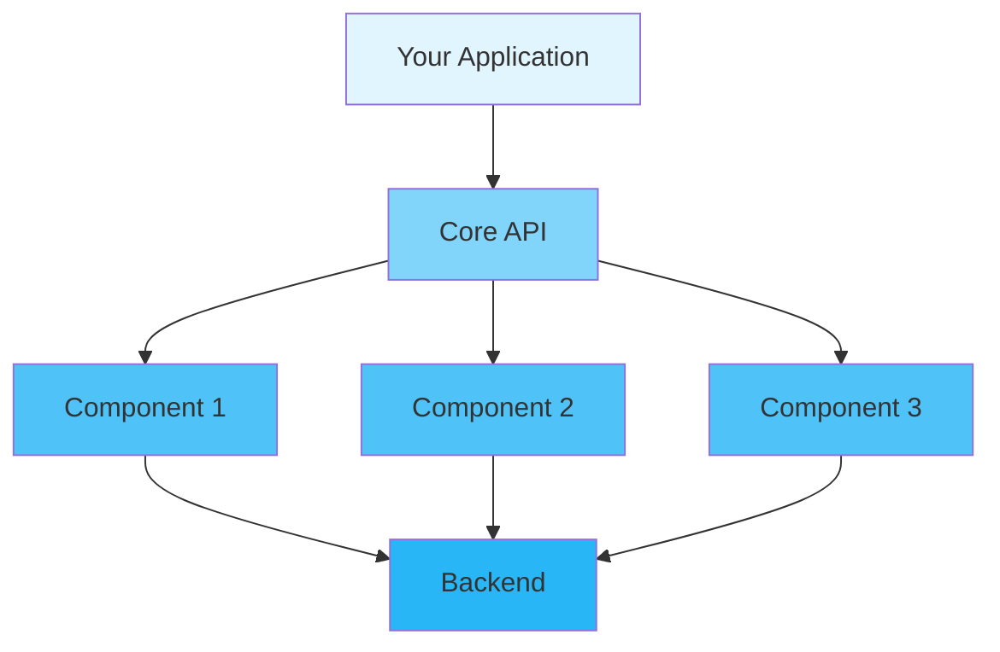

<div align="center">

# 📖 User Guide

### Complete Guide to Using Inklog

[🏠 Home](../README.md) • [📚 Docs](README.md) • [🎯 Examples](../examples/) • [❓ FAQ](FAQ.md)

---

</div>

## 📋 Table of Contents

- [Introduction](#introduction)
- [Getting Started](#getting-started)
  - [Prerequisites](#prerequisites)
  - [Installation](#installation)
  - [First Steps](#first-steps)
- [Core Concepts](#core-concepts)
- [Basic Usage](#basic-usage)
  - [Initialization](#initialization)
  - [Configuration](#configuration)
  - [Basic Operations](#basic-operations)
- [Advanced Usage](#advanced-usage)
  - [Custom Configuration](#custom-configuration)
  - [Performance Tuning](#performance-tuning)
  - [Error Handling](#error-handling)
- [Best Practices](#best-practices)
- [Common Patterns](#common-patterns)
- [Troubleshooting](#troubleshooting)
- [Next Steps](#next-steps)

---

## Introduction

<div align="center">

### 🎯 What You'll Learn

</div>

<table>
<tr>
<td width="25%" align="center">
<br>
<b>Quick Start</b><br>
Get up and running in 5 minutes
</td>
<td width="25%" align="center">
<br>
<b>Configuration</b><br>
Customize to your needs
</td>
<td width="25%" align="center">
<br>
<b>Best Practices</b><br>
Learn the right way
</td>
<td width="25%" align="center">
<br>
<b>Advanced Topics</b><br>
Master the details
</td>
</tr>
</table>

**Inklog** is designed to help you implement enterprise-grade logging infrastructure. This guide will walk you through everything from basic setup to advanced usage patterns.

> 💡 **Tip**: This guide assumes basic knowledge of Rust. If you're new to Rust, check out the [Rust Book](https://doc.rust-lang.org/book/) first.

---

## Getting Started

### Prerequisites

Before you begin, ensure you have the following installed:

<table>
<tr>
<td width="50%">

**Required**
- ✅ Rust 1.75+ (stable)
- ✅ Cargo (comes with Rust)
- ✅ Git

</td>
<td width="50%">

**Optional**
- 🔧 IDE with Rust support
- 🔧 Docker (for containerized deployment)
- 🔧 [Additional tool]

</td>
</tr>
</table>

<details>
<summary><b>🔍 Verify Your Installation</b></summary>

```bash
# Check Rust version
rustc --version
# Expected: rustc 1.75.0 (or higher)

# Check Cargo version
cargo --version
# Expected: cargo 1.75.0 (or higher)

# Check Git version
git --version
# Expected: git version 2.x.x
```

</details>

### Installation

<div align="center">

#### Choose Your Installation Method

</div>

<table>
<tr>
<td width="50%">

**📦 Using Cargo (Recommended)**

```bash
# Add to Cargo.toml
[dependencies]
project-name = "1.0"

# Or install via command
cargo add project-name
```

</td>
<td width="50%">

**🐙 From Source**

```bash
git clone https://github.com/user/project-name
cd project-name
cargo build --release
```

</td>
</tr>
</table>

<details>
<summary><b>🌐 Other Installation Methods</b></summary>

**Using Docker**
```bash
docker pull project-name:latest
docker run -it project-name
```

**Using Homebrew (macOS)**
```bash
brew install project-name
```

**Using Chocolatey (Windows)**
```powershell
choco install project-name
```

</details>

### First Steps

Let's verify your installation with a simple "Hello World":

```rust
use inklog::{LoggerManager, InklogConfig};

fn main() -> Result<(), Box<dyn std::error::Error>> {
    // Initialize the logger
    let _logger = LoggerManager::new().await?;
    
    println!("✅ Inklog is ready!");
    
    Ok(())
}
```

<details>
<summary><b>🎬 Run the Example</b></summary>

```bash
# Create a new project
cargo new hello-inklog
cd hello-inklog

# Add dependency
cargo add inklog

# Copy the code above to src/main.rs

# Run it!
cargo run
```

**Expected Output:**
```
✅ Project Name is ready!
```

</details>

---

## Core Concepts

Understanding these core concepts will help you use the library effectively.

<div align="center">

### 🧩 Key Components

</div>



### 1️⃣ Concept One: [Name]

**What it is:** Brief description of the concept.

**Why it matters:** Explanation of importance.

**Example:**
```rust
// Demonstration code
let example = ConceptOne::new();
```

<details>
<summary><b>📚 Learn More</b></summary>

Detailed explanation of the concept, including:
- How it works internally
- When to use it
- Common pitfalls
- Related concepts

</details>

### 2️⃣ Concept Two: [Name]

**What it is:** Brief description.

**Key Features:**
- ✅ Feature A
- ✅ Feature B
- ✅ Feature C

**Example:**
```rust
let concept = ConceptTwo::builder()
    .option_a(value)
    .option_b(value)
    .build()?;
```

### 3️⃣ Concept Three: [Name]

<table>
<tr>
<td width="50%">

**Traditional Approach**
```rust
// Old way
let result = old_method(data);
```

</td>
<td width="50%">

**Our Approach**
```rust
// Better way
let result = new_method(data)?;
```

</td>
</tr>
</table>

---

## Basic Usage

### Initialization

Every application must initialize the library before use:

```rust
use inklog::{LoggerManager, InklogConfig};

fn main() -> Result<(), Box<dyn std::error::Error>> {
    // Simple initialization
    let _logger = LoggerManager::new().await?;
    
    // Or with custom config
    let config = InklogConfig::default();
    let _logger = LoggerManager::with_config(config).await?;
    
    Ok(())
}
```

<div align="center">

| Method | Use Case | Performance | Complexity |
|--------|----------|-------------|------------|
| `LoggerManager::new()` | Quick start, development | ⚡ Fast | 🟢 Simple |
| `LoggerManager::with_config()` | Production, custom needs | ⚡⚡ Optimized | 🟡 Moderate |

</div>

### Configuration

<details open>
<summary><b>⚙️ Configuration Options</b></summary>

```rust
use inklog::InklogConfig;

let config = InklogConfig {
    global: inklog::config::GlobalConfig {
        level: "debug".to_string(),
        masking_enabled: true,
        ..Default::default()
    },
    performance: inklog::config::PerformanceConfig {
        channel_capacity: 5000,
        worker_threads: 4,
        ..Default::default()
    },
    ..Default::default()
};

let _logger = LoggerManager::with_config(config).await?;
```

</details>

<table>
<tr>
<th>Option</th>
<th>Type</th>
<th>Default</th>
<th>Description</th>
</tr>
<tr>
<td><code>level</code></td>
<td>String</td>
<td>"info"</td>
<td>Log level (trace/debug/info/warn/error)</td>
</tr>
<tr>
<td><code>format</code></td>
<td>String</td>
<td>"{timestamp} [{level}] {target} - {message}"</td>
<td>Log message format</td>
</tr>
<tr>
<td><code>masking_enabled</code></td>
<td>Boolean</td>
<td>true</td>
<td>Enable data masking</td>
</tr>
<tr>
<td><code>channel_capacity</code></td>
<td>Integer</td>
<td>10000</td>
<td>Log channel capacity</td>
</tr>
<tr>
<td><code>worker_threads</code></td>
<td>Integer</td>
<td>3</td>
<td>Number of worker threads</td>
</tr>
</table>

### Basic Operations

<div align="center">

#### 📝 CRUD Operations

</div>

<table>
<tr>
<td width="50%">

**Create Log Entry**
```rust
use inklog::LoggerManager;

let _logger = LoggerManager::new().await?;
log::info!("User logged in: {}", user_id);
log::warn!("High memory usage: {}%", memory_usage);
log::error!("Database connection failed: {}", error);
```

**Read Logs**
```rust
// Logs are automatically written to configured sinks
// Console, file, database, or S3 based on configuration
```

</td>
<td width="50%">

**Update Configuration**
```rust
let mut config = InklogConfig::default();
config.global.level = "debug".to_string();
config.file_sink.as_mut().unwrap().compress = true;

let _logger = LoggerManager::with_config(config).await?;
```

**Delete Logs**
```rust
// Logs are automatically cleaned up based on retention policies
// Manual cleanup through configuration or archive service
```

</td>
</tr>
</table>

<details>
<summary><b>🎯 Complete Example</b></summary>

```rust
use inklog::{LoggerManager, InklogConfig};

fn main() -> Result<(), Box<dyn std::error::Error>> {
    let config = InklogConfig::default();
    let _logger = LoggerManager::with_config(config).await?;
    
    // Create log entries
    log::info!("User {} logged in", "user-123");
    log::warn!("System memory usage: {}%", 85);
    log::error!("Failed to connect to database");
    
    println!("✅ All logs processed");
    
    Ok(())
}
```

</details>

---

## Advanced Usage

### Custom Configuration

For production environments, you'll want fine-grained control:

```rust
use inklog::{LoggerManager, InklogConfig};

fn main() -> Result<(), Box<dyn std::error::Error>> {
    // Production configuration
    let mut config = InklogConfig::default();
    config.global.level = "info".to_string();
    config.global.masking_enabled = true;
    
    // Enable file sink with compression
    config.file_sink = Some(inklog::config::FileSinkConfig {
        enabled: true,
        path: "logs/app.log".into(),
        compress: true,
        encryption: false,
        ..Default::default()
    });
    
    // Performance tuning
    config.performance.channel_capacity = 20000;
    config.performance.worker_threads = num_cpus::get();
    
    let _logger = LoggerManager::with_config(config).await?;
    
    // Enable metrics and monitoring
    log::info!("Application started with production config");
    
    Ok(())
}
```

<details>
<summary><b>🎛️ Performance Profiles</b></summary>

| Profile | Use Case | Throughput | Latency | Memory |
|--------|----------|-----------|---------|--------|
| **LowLatency** | Real-time logging | Medium | ⚡ Very Low | High |
| **HighThroughput** | High-volume logging | ⚡ Very High | Medium | Medium |
| **Balanced** | General purpose | High | Low | Medium |
| **LowMemory** | Resource-constrained | Low | Medium | ⚡ Very Low |

</details>

### Performance Tuning

<div align="center">

#### ⚡ Optimization Strategies

</div>

**1. Channel Capacity**

```rust
let config = InklogConfig {
    performance: inklog::config::PerformanceConfig {
        channel_capacity: 20000,  // Increase buffer size
        worker_threads: 4,
        ..Default::default()
    },
    ..Default::default()
};
```

**2. Batch Operations**

<table>
<tr>
<td width="50%">

❌ **Inefficient**
```rust
for item in items {
    process_one(item)?;
}
```

</td>
<td width="50%">

✅ **Efficient**
```rust
process_batch(&items)?;
```

</td>
</tr>
</table>

**3. Async Processing**

```rust
use inklog::LoggerManager;

#[tokio::main]
async fn main() -> Result<(), Box<dyn std::error::Error>> {
    let _logger = LoggerManager::new().await?;
    
    // Logging is non-blocking
    log::info!("This won't block your application");
    
    // Continue with async work
    tokio::spawn(async {
        // Background processing
        process_data().await;
    });
    
    Ok(())
}
```

### Error Handling

<div align="center">

#### 🚨 Handling Errors Gracefully

</div>

```rust
use inklog::InklogError;

fn handle_logging() -> Result<(), InklogError> {
    match LoggerManager::new() {
        Ok(logger) => {
            println!("✅ Logger initialized");
            // Use logger
            Ok(())
        }
        Err(InklogError::ConfigError(msg)) => {
            eprintln!("⚠️ Configuration error: {}", msg);
            // Use default config
            Ok(())
        }
        Err(e) => {
            eprintln!("❌ Failed to initialize: {}", e);
            Err(e)
        }
    }
}
```

<details>
<summary><b>📋 Error Types</b></summary>

| Error Type | Description | Recovery Strategy |
|------------|-------------|-------------------|
| `ConfigError` | Invalid configuration | Use default config |
| `IoError` | File system issues | Check permissions |
| `DatabaseError` | Database connection issues | Retry with backoff |
| `S3Error` | AWS S3 issues | Check credentials |
| `EncryptionError` | Encryption failures | Use unencrypted mode |

</details>

---

## Best Practices

<div align="center">

### 🌟 Follow These Guidelines

</div>

### ✅ DO's

<table>
<tr>
<td width="50%">

**Initialize Early**
```rust
fn main() {
    // Initialize at the start
    let _logger = inklog::LoggerManager::new();
    
    // Then use the logger
    do_work();
}
```

</td>
<td width="50%">

**Use Builder Pattern**
```rust
let config = InklogConfig {
    global: inklog::config::GlobalConfig {
        level: "debug".to_string(),
        ..Default::default()
    },
    ..Default::default()
};
```

</td>
</tr>
<tr>
<td width="50%">

**Handle Errors Properly**
```rust
match logging_result {
    Ok(log_count) => process_success(log_count),
    Err(e) => handle_logging_error(e),
}
```

</td>
<td width="50%">

**Clean Up Resources**
```rust
{
    let logger = LoggerManager::new().unwrap();
    use_logger(&logger)?;
    // Auto-cleanup on scope exit
}
```

</td>
</tr>
</table>

### ❌ DON'Ts

<table>
<tr>
<td width="50%">

**Don't Ignore Errors**
```rust
// ❌ Bad
let _ = initialize_logger();

// ✅ Good
initialize_logger()?;
```

</td>
<td width="50%">

**Don't Block Async Context**
```rust
// ❌ Bad (in async fn)
thread::sleep(duration);

// ✅ Good
tokio::time::sleep(duration).await;
```

</td>
</tr>
</table>

### 💡 Tips and Tricks

> **🔥 Performance Tip**: Enable release mode optimizations for production:
> ```bash
> cargo build --release
> ```

> **🔒 Security Tip**: Enable encryption for sensitive log data:
> ```rust
> config.file_sink.as_mut().unwrap().encryption = true;
> ```

> **📊 Monitoring Tip**: Enable HTTP metrics endpoint:
> ```rust
> config.http_server = Some(HttpServerConfig {
>     enabled: true,
>     port: 9090,
>     ..Default::default()
> });
> ```

---

## Common Patterns

### Pattern 1: Structured Logging

```rust
use inklog::LoggerManager;
use serde::Serialize;

#[derive(Serialize)]
struct RequestContext {
    user_id: String,
    ip_address: String,
    user_agent: String,
}

fn handle_request(request: RequestContext) {
    let _logger = LoggerManager::new().unwrap();
    
    log::info!(
        "Request processed",
        user_id = %request.user_id,
        ip = %request.ip_address,
        agent = %request.user_agent
    );
}
```

### Pattern 2: Multi-Sink Logging

```rust
use inklog::{LoggerManager, InklogConfig};

fn setup_multi_sink() -> Result<(), Box<dyn std::error::Error>> {
    let config = InklogConfig {
        console_sink: Some(inklog::config::ConsoleSinkConfig {
            enabled: true,
            colored: true,
            ..Default::default()
        }),
        file_sink: Some(inklog::config::FileSinkConfig {
            enabled: true,
            path: "logs/app.log".into(),
            ..Default::default()
        }),
        database_sink: Some(inklog::config::DatabaseSinkConfig {
            enabled: true,
            url: "postgres://localhost/logs".to_string(),
            ..Default::default()
        }),
        ..Default::default()
    };
    
    let _logger = LoggerManager::with_config(config).await?;
    Ok(())
}
```

### Pattern 3: Conditional Logging

```rust
use inklog::LoggerManager;

fn conditional_logging() {
    let _logger = LoggerManager::new().unwrap();
    
    // Only log debug in development
    if cfg!(debug_assertions) {
        log::debug!("Detailed debug information");
    }
    
    // Log based on environment
    if std::env::var("ENVIRONMENT").unwrap_or_default() == "production" {
        log::info!("Production event");
    }
    
    // Conditional structured logging
    let should_log_details = std::env::var("LOG_DETAILS").unwrap_or_default() == "true";
    if should_log_details {
        log::info!(
            "Detailed request info",
            method = "POST",
            path = "/api/users",
            status = 200
        );
    }
}
```

---

## Troubleshooting

<details>
<summary><b>❓ Problem: Logger initialization fails</b></summary>

**Solution:**
```rust
// Use default configuration on error
let logger = match LoggerManager::new() {
    Ok(logger) => logger,
    Err(e) => {
        eprintln!("Failed to initialize logger: {}, using console only", e);
        // Fallback to basic console logging
        LoggerManager::with_config(InklogConfig::default()).unwrap()
    }
};
```

</details>

<details>
<summary><b>❓ Problem: File sink not writing logs</b></summary>

**Common Causes:**

1. **File permissions issue:**
   ```bash
   # Check directory permissions
   ls -la logs/
   chmod 755 logs/
   ```

2. **Disk space full:**
   ```bash
   df -h
   ```

3. **Incorrect path configuration:**
   ```rust
   // Ensure parent directory exists
   let path = PathBuf::from("logs/app.log");
   if let Some(parent) = path.parent() {
       std::fs::create_dir_all(parent)?;
   }
   ```

**Solution:**
```rust
let config = InklogConfig {
    file_sink: Some(FileSinkConfig {
        enabled: true,
        path: "logs/app.log".into(),
        ..Default::default()
    }),
    ..Default::default()
};

// Validate before using
config.validate()?;
let _logger = LoggerManager::with_config(config).await?;
```

</details>

<details>
<summary><b>❓ Problem: Database sink connection issues</b></summary>

**Solution:**
```rust
// Test database connection first
use sea_orm::Database;

let db_conn = Database::connect(&config.database_sink.url).await;
match db_conn {
    Ok(conn) => {
        println!("Database connection successful");
        // Proceed with logger initialization
    }
    Err(e) => {
        eprintln!("Database connection failed: {}", e);
        // Disable database sink temporarily
        let mut config = config;
        config.database_sink.as_mut().unwrap().enabled = false;
    }
}
```

**Common fixes:**
- Check database URL format
- Verify database is running
- Check network connectivity
- Validate credentials

</details>

<div align="center">

**💬 Still need help?** [Open an issue](../../issues) or [join our Discord](https://discord.gg/project)

</div>

---

## Next Steps

<div align="center">

### 🎯 Continue Your Journey

</div>

<table>
<tr>
<td width="33%" align="center">
<a href="docs/config-reference.md">
<br>
<b>📚 Config Reference</b>
</a><br>
Detailed configuration options
</td>
<td width="33%" align="center">
<a href="docs/troubleshooting.md">
<br>
<b>🔧 Troubleshooting</b>
</a><br>
Common issues and solutions
</td>
<td width="33%" align="center">
<a href="../examples/">
<br>
<b>💻 Examples</b>
</a><br>
Real-world code samples
</td>
</tr>
</table>

---

<div align="center">

**[📖 API Reference](https://docs.rs/project-name)** • **[❓ FAQ](FAQ.md)** • **[🐛 Report Issue](../../issues)**

Made with ❤️ by the Project Team

[⬆ Back to Top](#-user-guide)

</div>